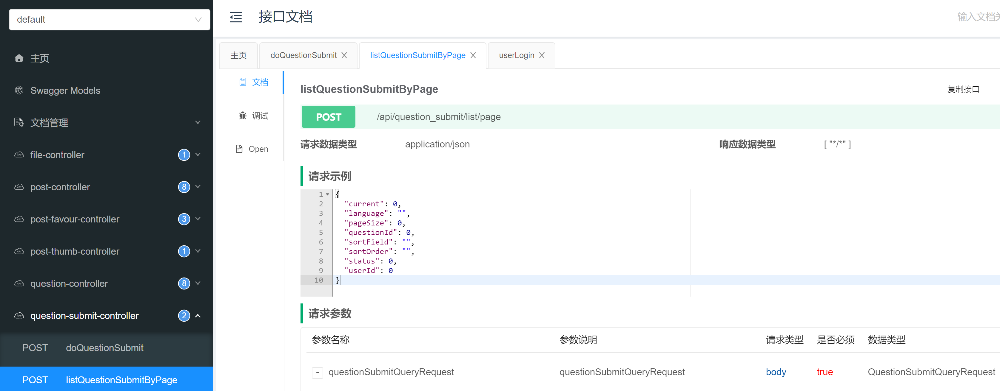

# OJ在线判题系统

基于 Vue 3 + Spring Boot + Spring Cloud 微服务 + Docker 的 **编程题目在线评测系统** （简称 OJ）。

在系统前台，管理员可以创建、管理题目；用户可以自由搜索题目、阅读题目、编写并提交代码。

在系统后端，能够根据管理员设定的题目测试用例在 **代码\**\**沙箱** 中对代码进行编译、运行、判断输出是否正确。

其中，代码沙箱可以作为独立服务，提供给其他开发者使用。

## 技术选型

### 前端

- Vue 3
- Vue-CLI 脚手架
- Vuex 状态管理
- Arco Design 组件库
- 前端工程化：ESLint + Prettier + TypeScript
- ⭐️ 手写前端项目模板（通用布局、权限管理、状态管理、菜单生成）
- ⭐️ Markdown 富文本编辑器
- ⭐️ Monaco Editor 代码编辑器
- ⭐️ OpenAPI 前端代码生成

### 后端

- ⭐️ Java Spring Cloud + Spring Cloud Alibaba 微服务
  - Nacos 注册中心
  - OpenFeign 客户端调用
  - GateWay 网关
  - 聚合接口文档
- Java Spring Boot（万用后端模板）
- Java 进程控制
- ⭐️ Java 安全管理器
- ⭐️ Docker 代码沙箱实现
- ⭐️ 虚拟机 + 远程开发
- MySQL 数据库
- MyBatis-Plus 及 MyBatis X 自动生成
- Redis 分布式 Session
- ⭐️ RabbitMQ 消息队列
- ⭐️ 多种设计模式
  - 策略模式
  - 工厂模式
  - 代理模式
  - 模板方法模式
- 其他：部分并发编程、JVM 小知识

## 第一章：项目诞生

### 项目介绍 | OJ 系统常用概念

用于在线评测编程题的系统，能够根据用户提交的代码、出题人预先设置的题目输入和输出用例，进行编译代码、运行代码、判断代码运行结果是否正确。


### 项目介绍 | 企业项目开发流程

1. 项目介绍、项目调研、需求分析
2. 核心业务流程
3. 项目要做的功能（功能模块）
4. 技术选型（技术预研）
5. 项目初始化
6. 项目开发
7. 测试
8. 优化
9. 代码提交、代码审核
10. 产品验收
11. 上线


### 项目介绍 | 主流 OJ 系统调研

github上面找一些OJ的系统看看，可以参照参照他们的功能。

比如判题，他们的逻辑，有哪些特点，功能等等。


### 项目介绍 | 核心实现模块介绍

#### 实现核心

##### 1）权限校验

谁能提代码，谁不能提代码

##### **2）代码沙箱（安全沙箱）**

用户代码藏毒：写个木马文件、修改系统权限

沙箱：隔离的、安全的环境，用户的代码不会影响到沙箱之外的系统的运行

资源分配：系统的内存就 2 个 G，用户疯狂占用资源占满你的内存，其他人就用不了了。所以要限制用户程序的占用资源。

##### 3）判题规则

题目用例的比对，结果的验证

##### 4）任务调度

服务器资源有限，用户要排队，按照顺序去依次执行判题，而不是直接拒绝


### 项目介绍 | 核心业务流程（2 种作图）


判题服务：获取题目信息、预计的输入输出结果，返回给主业务后端：用户的答案是否正确

代码沙箱：只负责运行代码，给出结果，不管什么结果是正确的。


### 项目介绍 | 系统功能梳理

##### 功能

1. 题目模块
   1. 创建题目（管理员）
   2. 删除题目（管理员）
   3. 修改题目（管理员）
   4. 搜索题目（用户）
   5. 在线做题
   6. 提交题目代码
2. 用户模块
   1. 注册
   2. 登录
3. 判题模块
   1. 提交判题（结果是否正确与错误）
   2. 错误处理（内存溢出、安全性、超时）
   3. 自主实现 代码沙箱（安全沙箱）
   4. 开放接口（提供一个独立的新服务）


### 项目介绍 | 系统架构设计（架构设计图）


### OJ 系统实现方案（5 种方案讲解）

#### 主流的 OJ 系统实现方案

开发原则：能用别人现成的，就不要自己写

##### 1、用现成的 OJ 系统

网上有很多开源的 OJ 项目，比如青岛 OJ、HustOJ 等，可以直接下载开源代码自己部署。

比较推荐的是 judge0，这是一个非常成熟的商业 OJ 项目，支持 60 多种编程语言！

> 代码：https://github.com/judge0/judge0

##### 2、用现成的服务

如果你不希望完整部署一套大而全的代码，只是想复用他人已经实现的、最复杂的判题逻辑，那么可以直接使用现成的 **判题 API** 、或者现成的 **代码沙箱** 等服务。

比如 judge0 提供的判题 API，非常方便易用。只需要通过 HTTP 调用 submissions 判题接口，把用户的代码、输入值、预期的执行结果作为请求参数发送给 judge0 的服务器，它就能自动帮你编译执行程序，并且返回程序的运行结果。

如下图，发送了一段打印 "hello world" 的程序，得到了程序执行的时间、状态等：


> API 的作用：接受代码、返回执行结果

Judge0 API 地址：https://rapidapi.com/judge0-official/api/judge0-ce

官方文档：https://ce.judge0.com/#submissions-submission-post

###### 流程

1. 先注册
2. 再开通订阅
3. 然后测试 language 接口
4. 测试执行代码接口 submissions

示例接口参数：

```json
{
  "source_code": "#include <stdio.h>\n\nint main(void) {\n  char name[10];\n  scanf(\"%s\", name);\n  printf(\"hello, %s\n\", name);\n  return 0;\n}",
  "language_id": "4",
  "stdin": "Judge0",
  "expected_output": "hello, Judge0"
}
复制代码
```

预期返回：

```json
{
  "source_code": "includestdiohintmainvoidcharname10scanfsnameprintfhellosname\nreturn0=\n",
  "language_id": 76,
  "stdin": "Judgew==\n",
  "expected_output": "helloJudge0=\n",
  "stdout": null,
  "status_id": 6,
  "created_at": "2023-07-27T13:50:30.433Z",
  "finished_at": "2023-07-27T13:50:31.022Z",
  "time": null,
  "memory": null,
  "stderr": null,
  "token": "8be000ad-2edb-4262-b367-7095a694e028",
  "number_of_runs": 1,
  "cpu_time_limit": "5.0",
  "cpu_extra_time": "1.0",
  "wall_time_limit": "10.0",
  "memory_limit": 128000,
  "stack_limit": 64000,
  "max_processes_and_or_threads": 60,
  "enable_per_process_and_thread_time_limit": false,
  "enable_per_process_and_thread_memory_limit": false,
  "max_file_size": 1024,
  "compile_output": "bWFpbi5jcHA6MToxOiBlcnJvcjogc291cmNlIGZpbGUgaXMgbm90IHZhbGlk\nIFVURi04Cjw4QT53JTxCOT48VSswNUVDPjxCNT7YqDw4Nj4p7ZmoPEE3PjxC\nRT48ODg+PDlEPnI8VSswMDE2PjxBQj48OUQ+PEE5Pjw5RT48RDc+SzxVKzAw\nMUM+anfsnak8OUU+PEE2PjxCOD48QTc+PEI1PjxGOD5ePDk2PlosPDlEPjxB\nOT48OUU+PEFEPjxFQj5uPEFFPn0KXgptYWluLmNwcDoxOjI6IGVycm9yOiB1\nbmtub3duIHR5cGUgbmFtZSAndycKPDhBPnclPEI5PjxVKzA1RUM+PEI1Ptio\nPDg2Pintmag8QTc+PEJFPjw4OD48OUQ+cjxVKzAwMTY+PEFCPjw5RD48QTk+\nPDlFPjxENz5LPFUrMDAxQz5qd+ydqTw5RT48QTY+PEI4PjxBNz48QjU+PEY4\nPl48OTY+Wiw8OUQ+PEE5Pjw5RT48QUQ+PEVCPm48QUU+fQogICAgXgptYWlu\nLmNwcDoxOjM6IGVycm9yOiBleHBlY3RlZCB1bnF1YWxpZmllZC1pZAo8OEE+\ndyU8Qjk+PFUrMDVFQz48QjU+2Kg8ODY+Ke2ZqDxBNz48QkU+PDg4Pjw5RD5y\nPFUrMDAxNj48QUI+PDlEPjxBOT48OUU+PEQ3Pks8VSswMDFDPmp37J2pPDlF\nPjxBNj48Qjg+PEE3PjxCNT48Rjg+Xjw5Nj5aLDw5RD48QTk+PDlFPjxBRD48\nRUI+bjxBRT59CiAgICAgXgptYWluLmNwcDoxOjQ6IGVycm9yOiBzb3VyY2Ug\nZmlsZSBpcyBub3QgdmFsaWQgVVRGLTgKPDhBPnclPEI5PjxVKzA1RUM+PEI1\nPtioPDg2Pintmag8QTc+PEJFPjw4OD48OUQ+cjxVKzAwMTY+PEFCPjw5RD48\nQTk+PDlFPjxENz5LPFUrMDAxQz5qd+ydqTw5RT48QTY+PEI4PjxBNz48QjU+\nPEY4Pl48OTY+Wiw8OUQ+PEE5Pjw5RT48QUQ+PEVCPm48QUU+fQogICAgICBe\nCm1haW4uY3BwOjE6NzogZXJyb3I6IHNvdXJjZSBmaWxlIGlzIG5vdCB2YWxp\nZCBVVEYtOAo8OEE+dyU8Qjk+PFUrMDVFQz48QjU+2Kg8ODY+Ke2ZqDxBNz48\nQkU+PDg4Pjw5RD5yPFUrMDAxNj48QUI+PDlEPjxBOT48OUU+PEQ3Pks8VSsw\nMDFDPmp37J2pPDlFPjxBNj48Qjg+PEE3PjxCNT48Rjg+Xjw5Nj5aLDw5RD48\nQTk+PDlFPjxBRD48RUI+bjxBRT59CiAgICAgICAgICAgICAgICAgIF4KbWFp\nbi5jcHA6MToxMDogZXJyb3I6IHNvdXJjZSBmaWxlIGlzIG5vdCB2YWxpZCBV\nVEYtOAo8OEE+dyU8Qjk+PFUrMDVFQz48QjU+2Kg8ODY+Ke2ZqDxBNz48QkU+\nPDg4Pjw5RD5yPFUrMDAxNj48QUI+PDlEPjxBOT48OUU+PEQ3Pks8VSswMDFD\nPmp37J2pPDlFPjxBNj48Qjg+PEE3PjxCNT48Rjg+Xjw5Nj5aLDw5RD48QTk+\nPDlFPjxBRD48RUI+bjxBRT59CiAgICAgICAgICAgICAgICAgICAgICAgXgpt\nYWluLmNwcDoxOjE1OiBlcnJvcjogc291cmNlIGZpbGUgaXMgbm90IHZhbGlk\nIFVURi04Cjw4QT53JTxCOT48VSswNUVDPjxCNT7YqDw4Nj4p7ZmoPEE3PjxC\nRT48ODg+PDlEPnI8VSswMDE2PjxBQj48OUQ+PEE5Pjw5RT48RDc+SzxVKzAw\nMUM+anfsnak8OUU+PEE2PjxCOD48QTc+PEI1PjxGOD5ePDk2PlosPDlEPjxB\nOT48OUU+PEFEPjxFQj5uPEFFPn0KICAgICAgICAgICAgICAgICAgICAgICAg\nICAgICAgXgptYWluLmNwcDoxOjE2OiBlcnJvcjogc291cmNlIGZpbGUgaXMg\nbm90IHZhbGlkIFVURi04Cjw4QT53JTxCOT48VSswNUVDPjxCNT7YqDw4Nj4p\n7ZmoPEE3PjxCRT48ODg+PDlEPnI8VSswMDE2PjxBQj48OUQ+PEE5Pjw5RT48\nRDc+SzxVKzAwMUM+anfsnak8OUU+PEE2PjxCOD48QTc+PEI1PjxGOD5ePDk2\nPlosPDlEPjxBOT48OUU+PEFEPjxFQj5uPEFFPn0KICAgICAgICAgICAgICAg\nICAgICAgICAgICAgICAgICAgIF4KbWFpbi5jcHA6MToxNzogZXJyb3I6IHNv\ndXJjZSBmaWxlIGlzIG5vdCB2YWxpZCBVVEYtOAo8OEE+dyU8Qjk+PFUrMDVF\nQz48QjU+2Kg8ODY+Ke2ZqDxBNz48QkU+PDg4Pjw5RD5yPFUrMDAxNj48QUI+\nPDlEPjxBOT48OUU+PEQ3Pks8VSswMDFDPmp37J2pPDlFPjxBNj48Qjg+PEE3\nPjxCNT48Rjg+Xjw5Nj5aLDw5RD48QTk+PDlFPjxBRD48RUI+bjxBRT59CiAg\nICAgICAgICAgICAgICAgICAgICAgICAgICAgICAgICAgICAgXgptYWluLmNw\ncDoxOjE4OiBlcnJvcjogc291cmNlIGZpbGUgaXMgbm90IHZhbGlkIFVURi04\nCjw4QT53JTxCOT48VSswNUVDPjxCNT7YqDw4Nj4p7ZmoPEE3PjxCRT48ODg+\nPDlEPnI8VSswMDE2PjxBQj48OUQ+PEE5Pjw5RT48RDc+SzxVKzAwMUM+anfs\nnak8OUU+PEE2PjxCOD48QTc+PEI1PjxGOD5ePDk2PlosPDlEPjxBOT48OUU+\nPEFEPjxFQj5uPEFFPn0KICAgICAgICAgICAgICAgICAgICAgICAgICAgICAg\nICAgICAgICAgICAgXgptYWluLmNwcDoxOjIxOiBlcnJvcjogc291cmNlIGZp\nbGUgaXMgbm90IHZhbGlkIFVURi04Cjw4QT53JTxCOT48VSswNUVDPjxCNT7Y\nqDw4Nj4p7ZmoPEE3PjxCRT48ODg+PDlEPnI8VSswMDE2PjxBQj48OUQ+PEE5\nPjw5RT48RDc+SzxVKzAwMUM+anfsnak8OUU+PEE2PjxCOD48QTc+PEI1PjxG\nOD5ePDk2PlosPDlEPjxBOT48OUU+PEFEPjxFQj5uPEFFPn0KICAgICAgICAg\nICAgICAgICAgICAgICAgICAgICAgICAgICAgICAgICAgICAgICAgICAgICAg\nIF4KbWFpbi5jcHA6MToyMjogZXJyb3I6IHNvdXJjZSBmaWxlIGlzIG5vdCB2\nYWxpZCBVVEYtOAo8OEE+dyU8Qjk+PFUrMDVFQz48QjU+2Kg8ODY+Ke2ZqDxB\nNz48QkU+PDg4Pjw5RD5yPFUrMDAxNj48QUI+PDlEPjxBOT48OUU+PEQ3Pks8\nVSswMDFDPmp37J2pPDlFPjxBNj48Qjg+PEE3PjxCNT48Rjg+Xjw5Nj5aLDw5\nRD48QTk+PDlFPjxBRD48RUI+bjxBRT59CiAgICAgICAgICAgICAgICAgICAg\nICAgICAgICAgICAgICAgICAgICAgICAgICAgICAgICAgICAgICAgXgptYWlu\nLmNwcDoxOjIzOiBlcnJvcjogc291cmNlIGZpbGUgaXMgbm90IHZhbGlkIFVU\nRi04Cjw4QT53JTxCOT48VSswNUVDPjxCNT7YqDw4Nj4p7ZmoPEE3PjxCRT48\nODg+PDlEPnI8VSswMDE2PjxBQj48OUQ+PEE5Pjw5RT48RDc+SzxVKzAwMUM+\nanfsnak8OUU+PEE2PjxCOD48QTc+PEI1PjxGOD5ePDk2PlosPDlEPjxBOT48\nOUU+PEFEPjxFQj5uPEFFPn0KICAgICAgICAgICAgICAgICAgICAgICAgICAg\nICAgICAgICAgICAgICAgICAgICAgICAgICAgICAgICAgICAgXgptYWluLmNw\ncDoxOjI0OiBlcnJvcjogc291cmNlIGZpbGUgaXMgbm90IHZhbGlkIFVURi04\nCjw4QT53JTxCOT48VSswNUVDPjxCNT7YqDw4Nj4p7ZmoPEE3PjxCRT48ODg+\nPDlEPnI8VSswMDE2PjxBQj48OUQ+PEE5Pjw5RT48RDc+SzxVKzAwMUM+anfs\nnak8OUU+PEE2PjxCOD48QTc+PEI1PjxGOD5ePDk2PlosPDlEPjxBOT48OUU+\nPEFEPjxFQj5uPEFFPn0KICAgICAgICAgICAgICAgICAgICAgICAgICAgICAg\nICAgICAgICAgICAgICAgICAgICAgICAgICAgICAgICAgICAgIF4KbWFpbi5j\ncHA6MToyNTogZXJyb3I6IHNvdXJjZSBmaWxlIGlzIG5vdCB2YWxpZCBVVEYt\nOAo8OEE+dyU8Qjk+PFUrMDVFQz48QjU+2Kg8ODY+Ke2ZqDxBNz48QkU+PDg4\nPjw5RD5yPFUrMDAxNj48QUI+PDlEPjxBOT48OUU+PEQ3Pks8VSswMDFDPmp3\n7J2pPDlFPjxBNj48Qjg+PEE3PjxCNT48Rjg+Xjw5Nj5aLDw5RD48QTk+PDlF\nPjxBRD48RUI+bjxBRT59CiAgICAgICAgICAgICAgICAgICAgICAgICAgICAg\nICAgICAgICAgICAgICAgICAgICAgICAgICAgICAgICAgICAgICAgICAgXgpt\nYWluLmNwcDoxOjMzOiBlcnJvcjogc291cmNlIGZpbGUgaXMgbm90IHZhbGlk\nIFVURi04Cjw4QT53JTxCOT48VSswNUVDPjxCNT7YqDw4Nj4p7ZmoPEE3PjxC\nRT48ODg+PDlEPnI8VSswMDE2PjxBQj48OUQ+PEE5Pjw5RT48RDc+SzxVKzAw\nMUM+anfsnak8OUU+PEE2PjxCOD48QTc+PEI1PjxGOD5ePDk2PlosPDlEPjxB\nOT48OUU+PEFEPjxFQj5uPEFFPn0KICAgICAgICAgICAgICAgICAgICAgICAg\nICAgICAgICAgICAgICAgICAgICAgICAgICAgICAgICAgICAgICAgICAgICAg\nICAgICAgICAgICAgICAgICAgIF4KbWFpbi5jcHA6MTozNDogZXJyb3I6IHNv\ndXJjZSBmaWxlIGlzIG5vdCB2YWxpZCBVVEYtOAo8OEE+dyU8Qjk+PFUrMDVF\nQz48QjU+2Kg8ODY+Ke2ZqDxBNz48QkU+PDg4Pjw5RD5yPFUrMDAxNj48QUI+\nPDlEPjxBOT48OUU+PEQ3Pks8VSswMDFDPmp37J2pPDlFPjxBNj48Qjg+PEE3\nPjxCNT48Rjg+Xjw5Nj5aLDw5RD48QTk+PDlFPjxBRD48RUI+bjxBRT59CiAg\nICAgICAgICAgICAgICAgICAgICAgICAgICAgICAgICAgICAgICAgICAgICAg\nICAgICAgICAgICAgICAgICAgICAgICAgICAgICAgICAgICAgICAgICAgICAg\nXgptYWluLmNwcDoxOjM1OiBlcnJvcjogc291cmNlIGZpbGUgaXMgbm90IHZh\nbGlkIFVURi04Cjw4QT53JTxCOT48VSswNUVDPjxCNT7YqDw4Nj4p7ZmoPEE3\nPjxCRT48ODg+PDlEPnI8VSswMDE2PjxBQj48OUQ+PEE5Pjw5RT48RDc+SzxV\nKzAwMUM+anfsnak8OUU+PEE2PjxCOD48QTc+PEI1PjxGOD5ePDk2PlosPDlE\nPjxBOT48OUU+PEFEPjxFQj5uPEFFPn0KICAgICAgICAgICAgICAgICAgICAg\nICAgICAgICAgICAgICAgICAgICAgICAgICAgICAgICAgICAgICAgICAgICAg\nICAgICAgICAgICAgICAgICAgICAgICAgICAgICAgXgptYWluLmNwcDoxOjM2\nOiBlcnJvcjogc291cmNlIGZpbGUgaXMgbm90IHZhbGlkIFVURi04Cjw4QT53\nJTxCOT48VSswNUVDPjxCNT7YqDw4Nj4p7ZmoPEE3PjxCRT48ODg+PDlEPnI8\nVSswMDE2PjxBQj48OUQ+PEE5Pjw5RT48RDc+SzxVKzAwMUM+anfsnak8OUU+\nPEE2PjxCOD48QTc+PEI1PjxGOD5ePDk2PlosPDlEPjxBOT48OUU+PEFEPjxF\nQj5uPEFFPn0KICAgICAgICAgICAgICAgICAgICAgICAgICAgICAgICAgICAg\nICAgICAgICAgICAgICAgICAgICAgICAgICAgICAgICAgICAgICAgICAgICAg\nICAgICAgICAgICAgICAgICAgIF4KZmF0YWwgZXJyb3I6IHRvbyBtYW55IGVy\ncm9ycyBlbWl0dGVkLCBzdG9wcGluZyBub3cgWy1mZXJyb3ItbGltaXQ9XQoy\nMCBlcnJvcnMgZ2VuZXJhdGVkLgo=\n",
  "exit_code": null,
  "exit_signal": null,
  "message": null,
  "wall_time": null,
  "compiler_options": null,
  "command_line_arguments": null,
  "redirect_stderr_to_stdout": false,
  "callback_url": null,
  "additional_files": null,
  "enable_network": false,
  "status": {
    "id": 6,
    "description": "Compilation Error"
  },
  "language": {
    "id": 76,
    "name": "C++ (Clang 7.0.1)"
  }
}
复制代码
```

##### 3、自主开发

这种方式就不多说了，判题服务和代码沙箱都要自己实现，适合学习，但不适用于商业项目。我这次带大家做的 OJ 系统，就选择了自主开发，主打一个学习。

##### 4、把 AI 来当做代码沙箱

现在 AI 的能力已经十分强大了，我们可以把各种本来很复杂的功能直接交给 AI 来实现。

比如把 AI 当做代码沙箱，我们直接扔给他一段代码、输入参数，问他能否得到预期的结果，就实现了在线判题逻辑！

如下图：


之前带大家做的 [智能 BI 项目](https://www.code-nav.cn/course/1790980531403927553) ，就是把 AI 当做了智能数据分析师，来生成图表和分析结论。

只要你脑洞够大，AI + 编程 = 无限的可能~

##### 5、移花接木

这种方式最有意思、也最 “缺德”。很多同学估计想不到。

那就是可以通过让程序来操作模拟浏览器的方式，用别人已经开发好的 OJ 系统来帮咱们判题。

比如使用 Puppeteer + 无头浏览器，把咱们系统用户提交的代码，像人一样输入到别人的 OJ 网页中，让程序点击提交按钮，并且等别人的 OJ 系统返回判题结果后，再把这个结果返回给我们自己的用户。

这种方式的缺点就是把核心流程交给了别人，如果别人服务挂了，你的服务也就挂了；而且别人 OJ 系统不支持的题目，可能你也支持不了。


### 前端项目初始化 | Vue-CLI 初始项目搭建

#### 确认环境

nodeJS 版本：v18.16.0 或 16

检测命令：

```shell
node -v
复制代码
```

切换和管理 node 版本的工具：https://github.com/nvm-sh/nvm

npm 版本：9.5.1

```shell
npm -v
复制代码
```

#### 初始化

使用 vue-cli 脚手架：https://cli.vuejs.org/zh/

安装脚手架工具：

```shell
npm install -g @vue/cli
```

检测是否安装成功：

```shell
vue -V
```

如果找不到命令，那么建议去重新到安装 npm，重新帮你配置环境变量。

创建项目：

```shell
vue create yuoj-frontend
```

运行项目，能运行就成功了

#### 前端工程化配置

脚手架已经帮我们配置了代码美化、自动校验、格式化插件等，无需再自行配置

但是需要在 webstorm 里开启代码美化插件：


在 vue 文件中执行格式化快捷键，不报错，表示配置工程化成功

脚手架自动整合了 vue-router

#### 自己整合

代码规范：https://eslint.org/docs/latest/use/getting-started

代码美化：https://prettier.io/docs/en/install.html

直接整合：https://github.com/prettier/eslint-plugin-prettier#recommended-configuration（包括了 https://github.com/prettier/eslint-config-prettier#installation）


### 前端项目初始化 | 组件库引入

#### 引入组件

> Vue Router 路由组件已自动引入，无需再引入：https://router.vuejs.org/zh/introduction.html

组件库：https://arco.design/vue

快速上手：https://arco.design/vue/docs/start

执行安装：

```shell
npm install --save-dev @arco-design/web-vue
```

改变 main.ts：

```typescript
import { createApp } from "vue";
import App from "./App.vue";
import ArcoVue from "@arco-design/web-vue";
import "@arco-design/web-vue/dist/arco.css";
import router from "./router";
import store from "./store";

createApp(App).use(ArcoVue).use(store).use(router).mount("#app");
```

引入一个组件，如果显示出来，就表示引入成功

#### 项目通用布局

新建一个布局， 在 app.vue 中引入

app.vue 代码如下：

```typescript
<div id="app">
  <BasicLayout />
</div>
复制代码
```

选用 arco design 的 layout 组件（https://arco.design/vue/component/layout）

先把上中下布局编排好，然后再填充内容：


#### 实现通用路由菜单

菜单组件：https://arco.design/vue/component/menu

目标：根据路由配置信息，自动生成菜单内容。实现更通用、更自动的菜单配置。

步骤：

1）提取通用路由文件

2）菜单组件读取路由，动态渲染菜单项

3）绑定跳转事件

4）同步路由的更新到菜单项高亮

同步高亮原理：首先点击菜单项 => 触发点击事件，跳转更新路由 => 更新路由后，同步去更新菜单栏的高亮状态。

使用 Vue Router 的 afterEach 路由钩子实现：

```javascript
const router = useRouter();

// 默认主页
const selectedKeys = ref(["/"]);

// 路由跳转后，更新选中的菜单项
router.afterEach((to, from, failure) => {
  selectedKeys.value = [to.path];
});
复制代码
```

#### 全局状态管理

vuex：https://vuex.vuejs.org/zh/guide/（vue-cli 脚手架已自动引入）

什么是全局状态管理？

所有页面全局共享的变量，而不是局限在某一个页面中。

适合作为全局状态的数据：已登录用户信息（每个页面几乎都要用）

Vuex 的本质：给你提供了一套增删改查全局变量的 API，只不过可能多了一些功能（比如时间旅行）


可以直接参考购物车示例：https://github.com/vuejs/vuex/tree/main/examples/classic/shopping-cart

state：存储的状态信息，比如用户信息

mutation（尽量同步）：定义了对变量进行增删改（更新）的方法

actions（支持异步）：执行异步操作，并且触发 mutation 的更改（actions 调用 mutation）

modules（模块）：把一个大的 state（全局变量）划分为多个小模块，比如 user 专门存用户的状态信息

##### 实现

先在 store 目录下定义 user 模块，存储用户信息：

```typescript
// initial state
import { StoreOptions } from "vuex";

export default {
  namespaced: true,
  state: () => ({
    loginUser: {
      userName: "未登录",
    },
  }),
  actions: {
    getLoginUser({ commit, state }, payload) {
      commit("updateUser", { userName: "鱼皮" });
    },
  },
  mutations: {
    updateUser(state, payload) {
      state.loginUser = payload;
    },
  },
} as StoreOptions<any>;

复制代码
```

然后在 store 目录下定义 index.ts 文件，导入 user 模块：

```typescript
import { createStore } from "vuex";
import user from "./user";

export default createStore({
  mutations: {},
  actions: {},
  modules: {
    user,
  },
});
```

在 Vue 页面中可以获取已存储的状态变量：

```tsx
const store = useStore();
store.state.user?.loginUser
```

在 Vue 页面中可以修改状态变量：

> 使用 dispatch 来调用之前定义好的 actions

```typescript
store.dispatch("user/getLoginUser", {
  userName: "鱼皮",
});
```

#### 全局权限管理

目标：能够直接以一套通用的机制，去定义哪个页面需要那些权限。而不用每个页面独立去判断权限，提高效率。

思路：

1. 在路由配置文件， 定义某个路由的访问权限
2. 在全局页面组件 app.vue 中，绑定一个全局路由监听。每次访问页面时，根据用户要访问页面的路由信息，先判断用户是否有对应的访问权限。
3. 如果有，跳转到原页面；如果没有，拦截或跳转到 401 鉴权或登录页

示例代码如下：

```typescript
const router = useRouter();
const store = useStore();

router.beforeEach((to, from, next) => {
  // 仅管理员可见，判断当前用户是否有权限
  if (to.meta?.access === "canAdmin") {
    if (store.state.user.loginUser?.role !== "admin") {
      next("/noAuth");
      return;
    }
  }
  next();
});
```

#### 优化页面布局

1、底部 footer 布局优化

2、优化 content、globalHeader 的样式

3、优化导航栏用户名称的换行

##### 通用导航栏组件 - 根据配置控制菜单的显隐

1）routes.ts 给路由新增一个标志位，用于判断路由是否显隐

```javascript
  {
    path: "/hide",
    name: "隐藏页面",
    component: HomeView,
    meta: {
      hideInMenu: true,
    },
  },
```

2）不要用 v-for + v-if 去条件渲染元素，这样会先循环所有的元素，导致性能的浪费

推荐：先过滤只需要展示的元素数组

```typescript
// 展示在菜单的路由数组
const visibleRoutes = routes.filter((item, index) => {
  if (item.meta?.hideInMenu) {
    return false;
  }
  return true;
});
```

#### 根据权限隐藏菜单

需求：只有具有权限的菜单，才对用户可见

原理：类似上面的控制路由显示隐藏，只要判断用户没有这个权限，就直接过滤掉

1）新建 access 目录，专门用一个文件来定义权限

```typescript
/**
 * 权限定义
 */
const ACCESS_ENUM = {
  NOT_LOGIN: "notLogin",
  USER: "user",
  ADMIN: "admin",
};

export default ACCESS_ENUM;
```

2）定义一个公用的权限校验方法

为什么？因为菜单组件中要判断权限、权限拦截也要用到权限判断功能，所以抽离成公共方法

创建 checkAccess.ts 文件，专门定义检测权限的函数：

```typescript
import ACCESS_ENUM from "@/access/accessEnum";

/**
 * 检查权限（判断当前登录用户是否具有某个权限）
 * @param loginUser 当前登录用户
 * @param needAccess 需要有的权限
 * @return boolean 有无权限
 */
const checkAccess = (loginUser: any, needAccess = ACCESS_ENUM.NOT_LOGIN) => {
  // 获取当前登录用户具有的权限（如果没有 loginUser，则表示未登录）
  const loginUserAccess = loginUser?.userRole ?? ACCESS_ENUM.NOT_LOGIN;
  if (needAccess === ACCESS_ENUM.NOT_LOGIN) {
    return true;
  }
  // 如果用户登录才能访问
  if (needAccess === ACCESS_ENUM.USER) {
    // 如果用户没登录，那么表示无权限
    if (loginUserAccess === ACCESS_ENUM.NOT_LOGIN) {
      return false;
    }
  }
  // 如果需要管理员权限
  if (needAccess === ACCESS_ENUM.ADMIN) {
    // 如果不为管理员，表示无权限
    if (loginUserAccess !== ACCESS_ENUM.ADMIN) {
      return false;
    }
  }
  return true;
};

export default checkAccess;
```

3）修改 GlobalHeader 动态菜单组件，根据权限来过滤菜单

注意，这里使用计算属性，是为了当登录用户信息发生变更时，触发菜单栏的重新渲染，展示新增权限的菜单项

```typescript
const visibleRoutes = computed(() => {
  return routes.filter((item, index) => {
    if (item.meta?.hideInMenu) {
      return false;
    }
    // 根据权限过滤菜单
    if (
      !checkAccess(store.state.user.loginUser, item?.meta?.access as string)
    ) {
      return false;
    }
    return true;
  });
});
```

#### 全局项目入口

app.vue 中预留一个可以编写全局初始化逻辑的代码：

```typescript
/**
 * 全局初始化函数，有全局单次调用的代码，都可以写到这里
 */
const doInit = () => {
  console.log("hello 欢迎来到我的项目");
};

onMounted(() => {
  doInit();
});
```

### 后端项目初始化

先把通用的后端框架跑起来。

1）从星球代码库下载 springboot-init 万用模板（已经在本地的话直接复制）

2）`ctrl+shift+R`全局替换 springboot-init 为项目名（yuoj-backend）

3）全局替换springbootinit 包名为新的包名（yuoj）

4）修改 springbootinit 文件夹的名称为新的包名对应的名称（yuoj）

5）本地新建数据库，直接执行 sql/create_table.sql 脚本，修改库名为 yuoj，执行即可

6）改 application.yml 配置，修改 MySQL 数据库的连接库名、账号密码，端口号（8121）

#### 初始化模板讲解

1）先阅读 README.md

2）sql/create_table.sql 定义了数据库的初始化建库建表语句

3）sql/post_es_mapping.json 帖子表在 ES 中的建表语句

4）aop：用于全局权限校验、全局日志记录

5）common：万用的类，比如通用响应类

6）config：用于接收 application.yml 中的参数，初始化一些客户端的配置类（比如对象存储客户端）

7）constant：定义常量

8）controller：接受请求

9）esdao：类似 mybatis 的 mapper，用于操作 ES

10）exception：异常处理相关

11）job：任务相关（定时任务、单次任务）

12）manager：服务层（一般是定义一些公用的服务、对接第三方 API 等）

13）mapper：mybatis 的数据访问层，用于操作数据库

14）model：数据模型、实体类、包装类、枚举值

15）service：服务层，用于编写业务逻辑

16）utils：工具类，各种各样公用的方法

17）wxmp：公众号相关的包

18）test：单元测试

19）MainApplication：项目启动入口

20）Dockerfile：用于构建 Docker 镜像

### 前后端联调

问：前端和后端怎么连接起来的？ 接口 / 请求

答：前端发送请求调用后端接口

1）安装请求工具类 Axios

官方文档：https://axios-http.com/docs/intro

代码：

```shell
npm install axios
```

2）编写调用后端的代码

传统情况下，每个请求都要单独编写代码。至少得写一个请求路径

完全不用！！！

直接自动生成即可：https://github.com/ferdikoomen/openapi-typescript-codegen

首先安装：

```shell
npm install openapi-typescript-codegen --save-dev
```

然后执行命令生成代码：

```shell
openapi --input http://localhost:8121/api/v2/api-docs --output ./generated --client axios
```

3）直接使用生成的 Service 代码，直接调用函数发送请求即可，比如获取登录信息

```typescript
typescript复制代码// 从远程请求获取登录信息
const res = await UserControllerService.getLoginUserUsingGet();
if (res.code === 0) {
  commit("updateUser", res.data);
} else {
  commit("updateUser", {
    ...state.loginUser,
    userRole: ACCESS_ENUM.NOT_LOGIN,
  });
}
```

如果想要自定义请求参数，怎么办？

1）使用代码生成器提供的全局参数修改对象：

```javascript
javascript复制代码export const OpenAPI: OpenAPIConfig = {
    BASE: 'http://localhost:3000/api',
    VERSION: '2.0',
    WITH_CREDENTIALS: false,
    CREDENTIALS: 'include',
    TOKEN: undefined,
    USERNAME: undefined,
    PASSWORD: undefined,
    HEADERS: undefined,
    ENCODE_PATH: undefined,
};
```

文档：https://github.com/ferdikoomen/openapi-typescript-codegen/blob/master/docs/openapi-object.md

2）直接定义 axios 请求库的全局参数，比如全局请求响应拦截器

文档：https://axios-http.com/docs/interceptors

示例代码：

```typescript
// Add a request interceptor
import axios from "axios";

axios.interceptors.request.use(
  function (config) {
    // Do something before request is sent
    return config;
  },
  function (error) {
    // Do something with request error
    return Promise.reject(error);
  }
);

// Add a response interceptor
axios.interceptors.response.use(
  function (response) {
    console.log("响应", response);
    // Any status code that lie within the range of 2xx cause this function to trigger
    // Do something with response data
    return response;
  },
  function (error) {
    // Any status codes that falls outside the range of 2xx cause this function to trigger
    // Do something with response error
    return Promise.reject(error);
  }
);
```

###  用户自动登录

#### 自动登录

1）在 store\user.ts 编写获取远程登陆用户信息的代码：

```typescript
actions: {
    async getLoginUser({ commit, state }, payload) {
      // 从远程请求获取登录信息
      const res = await UserControllerService.getLoginUserUsingGet();
      if (res.code === 0) {
        commit("updateUser", res.data);
      } else {
        commit("updateUser", {
          ...state.loginUser,
          userRole: ACCESS_ENUM.NOT_LOGIN,
        });
      }
    },
  },
```

2）在哪里去触发 getLoginUser 函数的执行？应当在一个全局的位置

有很多选择：

1. 路由拦截 ✔
2. 全局页面入口 app.vue
3. 全局通用布局（所有页面都共享的组件）

此处选择第一种方案，可以直接在全局权限管理的路由拦截中判断用户是否已经登录了。

#### 全局权限管理优化

1）新建 access\index.ts 文件，把原有的路由拦截、权限校验逻辑放在独立的文件中

优势：只要不引入、就不会开启、不会对项目有影响

2）编写权限管理和自动登录逻辑

如果没登陆过，自动登录：

```typescript

  const loginUser = store.state.user.loginUser;
  // 如果之前没登陆过，自动登录
  if (!loginUser || !loginUser.userRole) {
    // 加 await 是为了等用户登录成功之后，再执行后续的代码
    await store.dispatch("user/getLoginUser");
  }
```

如果用户访问的页面不需要登录，是否需要强制跳转到登录页？

答：不需要

access\index.ts 示例代码：

```typescript
import router from "@/router";
import store from "@/store";
import ACCESS_ENUM from "@/access/accessEnum";
import checkAccess from "@/access/checkAccess";

router.beforeEach(async (to, from, next) => {
  console.log("登陆用户信息", store.state.user.loginUser);
  const loginUser = store.state.user.loginUser;
  // // 如果之前没登陆过，自动登录
  if (!loginUser || !loginUser.userRole) {
    // 加 await 是为了等用户登录成功之后，再执行后续的代码
    await store.dispatch("user/getLoginUser");
  }
  const needAccess = (to.meta?.access as string) ?? ACCESS_ENUM.NOT_LOGIN;
  // 要跳转的页面必须要登陆
  if (needAccess !== ACCESS_ENUM.NOT_LOGIN) {
    // 如果没登陆，跳转到登录页面
    if (!loginUser || !loginUser.userRole) {
      next(`/user/login?redirect=${to.fullPath}`);
      return;
    }
    // 如果已经登陆了，但是权限不足，那么跳转到无权限页面
    if (!checkAccess(loginUser, needAccess)) {
      next("/noAuth");
      return;
    }
  }
  next();
});
```

### 支持多套布局

1）在 routes 路由文件中新建一套用户路由，使用 vue-router 自带的子路由机制，实现布局和嵌套路由

```typescript
export const routes: Array<RouteRecordRaw> = [
  {
    path: "/user",
    name: "用户",
    component: UserLayout,
    children: [
      {
        path: "/user/login",
        name: "用户登录",
        component: UserLoginView,
      },
      {
        path: "/user/register",
        name: "用户注册",
        component: UserRegisterView,
      },
    ],
  },
]
```

2）新建 UserLayout、UserLoginView、UserRegisterView 页面，并且在 routes 中引入

3）在 app.vue 根页面文件，根据路由去区分多套布局

```typescript
<template v-if="route.path.startsWith('/user')">
      <router-view />
    </template>
    <template v-else>
      <BasicLayout />
    </template>
```

注意，当前这种 app.vue 中通过 if else 区分布局的方式，不是最优雅的，理想情况下是直接读取 routes.ts，在这个文件中定义多套布局，然后自动使用页面布局。

小扩展：你可以尝试实现上面的思路，并且根据嵌套路由生成嵌套的子菜单。

如下图：


### 登陆页面开发

登陆页面的核心是表单，只需要从组件库中找到表单组件，修改表单字段名称和后端完全匹配就足够了。

界面示例代码：

```html
<template>
  <div id="userLoginView">
    <h2 style="margin-bottom: 16px">用户登录</h2>
    <a-form
      style="max-width: 480px; margin: 0 auto"
      label-align="left"
      auto-label-width
      :model="form"
      @submit="handleSubmit"
    >
      <a-form-item field="userAccount" label="账号">
        <a-input v-model="form.userAccount" placeholder="请输入账号" />
      </a-form-item>
      <a-form-item field="userPassword" tooltip="密码不少于 8 位" label="密码">
        <a-input-password
          v-model="form.userPassword"
          placeholder="请输入密码"
        />
      </a-form-item>
      <a-form-item>
        <a-button type="primary" html-type="submit" style="width: 120px">
          登录
        </a-button>
      </a-form-item>
    </a-form>
  </div>
</template>

<script setup lang="ts">
import { reactive } from "vue";
import { UserControllerService, UserLoginRequest } from "../../../generated";
import message from "@arco-design/web-vue/es/message";
import { useRouter } from "vue-router";
import { useStore } from "vuex";

/**
 * 表单信息
 */
const form = reactive({
  userAccount: "",
  userPassword: "",
} as UserLoginRequest);

const router = useRouter();
const store = useStore();

/**
 * 提交表单
 * @param data
 */
const handleSubmit = async () => {
  const res = await UserControllerService.userLoginUsingPost(form);
  // 登录成功，跳转到主页
  if (res.code === 0) {
    await store.dispatch("user/getLoginUser");
    router.push({
      path: "/",
      replace: true,
    });
  } else {
    message.error("登陆失败，" + res.message);
  }
};
</script>

```

## 本期成果

前端通用页面布局：


登陆页面：


后端接口文档：


## 第二章：单体项目开发

### 系统功能的梳理

1. 用户模块
   1. 注册（后端已实现）
   2. 登录（后端已实现，前端已实现）
2. 题目模块
   1. 创建题目（管理员）
   2. 删除题目（管理员）
   3. 修改题目（管理员）
   4. 搜索题目（用户）
   5. 在线做题（题目详情页）
3. 判题模块
   1. 提交判题（结果是否正确与错误）
   2. 错误处理（内存溢出、安全性、超时）
   3. **自主实现** 代码沙箱（安全沙箱）
   4. 开放接口（提供一个独立的新服务）

### 库表设计

#### 用户表

只有管理员才能发布和管理题目，普通用户只能看题

```sql
-- 用户表
create table if not exists user
(
    id           bigint auto_increment comment 'id' primary key,
    userAccount  varchar(256)                           not null comment '账号',
    userPassword varchar(512)                           not null comment '密码',
    unionId      varchar(256)                           null comment '微信开放平台id',
    mpOpenId     varchar(256)                           null comment '公众号openId',
    userName     varchar(256)                           null comment '用户昵称',
    userAvatar   varchar(1024)                          null comment '用户头像',
    userProfile  varchar(512)                           null comment '用户简介',
    userRole     varchar(256) default 'user'            not null comment '用户角色：user/admin/ban',
    createTime   datetime     default CURRENT_TIMESTAMP not null comment '创建时间',
    updateTime   datetime     default CURRENT_TIMESTAMP not null on update CURRENT_TIMESTAMP comment '更新时间',
    isDelete     tinyint      default 0                 not null comment '是否删除',
    index idx_unionId (unionId)
) comment '用户' collate = utf8mb4_unicode_ci;
```

#### 题目表

题目标题

题目内容：存放题目的介绍、输入输出提示、描述、具体的详情

题目标签（json 数组字符串）：栈、队列、链表、简单、中等、困难

题目答案：管理员 / 用户设置的标准答案

提交数、通过题目的人数等：便于分析统计（可以考虑根据通过率自动给题目打难易度标签）

判题相关字段：

> 如果说题目不是很复杂，用例文件大小不大的话，可以直接存在数据库表里 但是如果用例文件比较大，> 512 KB 建议单独存放在一个文件中，数据库中只保存文件 url（类似存储用户头像）

- 输入用例：1、2
- 输出用例：3、4
- 时间限制
- 内存限制

judgeConfig 判题配置（json 对象）：

- 时间限制 timeLimit
- 内存限制 memoryLimit

judgeCase 判题用例（json 数组）

- 每一个元素是：一个输入用例对应一个输出用例

```json
[
  {
    "input": "1 2",
    "output": "3 4"
  },
  {
    "input": "1 3",
    "output": "2 4"
  }
]
```

------

存 json 的好处：便于扩展，只需要改变对象内部的字段，而不用修改数据库表（可能会影响数据库）

```json
{
  "timeLimit": 1000,
  "memoryLimit": 1000,
  "stackLimit": 1000
}
```

存 json 的前提：

1. 你不需要根据某个字段去倒查这条数据
2. 你的字段含义相关，属于同一类的值
3. 你的字段存储空间占用不能太大

------

其他扩展字段：

- 通过率
- 判题类型

代码：

```sql
-- 题目表
create table if not exists question
(
    id         bigint auto_increment comment 'id' primary key,
    title      varchar(512)                       null comment '标题',
    content    text                               null comment '内容',
    tags       varchar(1024)                      null comment '标签列表（json 数组）',
    answer     text                               null comment '题目答案',
    submitNum  int  default 0 not null comment '题目提交数',
    acceptedNum  int  default 0 not null comment '题目通过数',
    judgeCase text null comment '判题用例（json 数组）',
    judgeConfig text null comment '判题配置（json 对象）',
    thumbNum   int      default 0                 not null comment '点赞数',
    favourNum  int      default 0                 not null comment '收藏数',
    userId     bigint                             not null comment '创建用户 id',
    createTime datetime default CURRENT_TIMESTAMP not null comment '创建时间',
    updateTime datetime default CURRENT_TIMESTAMP not null on update CURRENT_TIMESTAMP comment '更新时间',
    isDelete   tinyint  default 0                 not null comment '是否删除',
    index idx_userId (userId)
) comment '题目' collate = utf8mb4_unicode_ci;
```

#### 题目提交表

哪个用户提交了哪道题目，存放判题结果等

提交用户 id：userId

题目 id：questionId

语言：language

用户的代码：code

判题状态：status（0 - 待判题、1 - 判题中、2 - 成功、3 - 失败）

判题信息（判题过程中得到的一些信息，比如程序的失败原因、程序执行消耗的时间、空间）：

judgeInfo（json 对象）

```json
{
  "message": "程序执行信息",
  "time": 1000, // 单位为 ms
  "memory": 1000, // 单位为 kb
}
```

判题信息枚举值：

- Accepted 成功
- Wrong Answer 答案错误
- [Compile Error](http://poj.org/showcompileinfo?solution_id=24259830) 编译错误
- Memory Limit Exceeded 内存溢出
- Time Limit Exceeded 超时
- Presentation Error 展示错误
- Output Limit Exceeded 输出溢出
- Waiting 等待中
- Dangerous Operation 危险操作
- Runtime Error 运行错误（用户程序的问题）
- System Error 系统错误（做系统人的问题）

```sql
-- 题目提交表
create table if not exists question_submit
(
    id         bigint auto_increment comment 'id' primary key,
    language   varchar(128)                       not null comment '编程语言',
    code       text                               not null comment '用户代码',
    judgeInfo  text                               null comment '判题信息（json 对象）',
    status     int      default 0                 not null comment '判题状态（0 - 待判题、1 - 判题中、2 - 成功、3 - 失败）',
    questionId bigint                             not null comment '题目 id',
    userId     bigint                             not null comment '创建用户 id',
    createTime datetime default CURRENT_TIMESTAMP not null comment '创建时间',
    updateTime datetime default CURRENT_TIMESTAMP not null on update CURRENT_TIMESTAMP comment '更新时间',
    isDelete   tinyint  default 0                 not null comment '是否删除',
    index idx_questionId (questionId),
    index idx_userId (userId)
) comment '题目提交';
```

#### 小知识 - 数据库索引

什么情况下适合加索引？如何选择给哪个字段加索引？

答：首先从业务出发，无论是单个索引、还是联合索引，都要从你实际的查询语句、字段枚举值的区分度、字段的类型考虑（where 条件指定的字段）

比如：where userId = 1 and questionId = 2

可以选择根据 userId 和 questionId 分别建立索引（需要分别根据这两个字段单独查询）；也可以选择给这两个字段建立联合索引（所查询的字段是绑定在一起的）。

原则上：能不用索引就不用索引；能用单个索引就别用联合 / 多个索引；不要给没区分度的字段加索引（比如性别，就男 / 女）。因为索引也是要占用空间的。

### 后端接口开发

#### 后端开发流程

1）根据功能设计库表

2）自动生成对数据库基本的增删改查（mapper 和 service 层的基本功能）

3）编写 Controller 层，实现基本的增删改查和权限校验（复制粘贴）

4）去根据业务定制开发新的功能 / 编写新的代码

### 代码生成方法

1）安装 MyBatisX 插件

2）根据项目去调整生成配置，建议生成代码到独立的包，不要影响老的项目


3）把代码从生成包中移到实际项目对应目录中

4）找相似的代码去复制 Controller

- 单表去复制单表 Controller（比如 question => post）
- 关联表去复制关联表（比如 question_submit => post_thumb ）

5）复制实体类相关的 DTO、VO、枚举值字段（用于接受前端请求、或者业务间传递信息）

复制之后，调整需要的字段

updateRequest 和 editRequest 的区别：前者是给管理员更新用的，可以指定更多字段；后者是给普通用户试用的，只能指定部分字段。

6）为了更方便地处理 json 字段中的某个字段，需要给对应的 json 字段编写独立的类，比如 judgeConfig、judgeInfo、judgeCase。

示例代码：

```java
/**
 * 题目用例
 */
@Data
public class JudgeCase {

    /**
     * 输入用例
     */
    private String input;

    /**
     * 输出用例
     */
    private String output;
}
```

小知识：什么情况下要加业务前缀？什么情况下不加？

加业务前缀的好处，防止多个表都有类似的类，产生冲突；不加的前提，因为可能这个类是多个业务之间共享的，能够复用的。

定义 VO 类：作用是专门给前端返回对象，可以节约网络传输大小、或者过滤字段（脱敏）、保证安全性。

比如 judgeCase、answer 字段，一定要删，不能直接给用户答案。

7）校验 Controller 层的代码，看看除了要调用的方法缺失外，还有无报错

```java
package com.yupi.oj.controller;

import cn.hutool.json.JSONUtil;
import com.baomidou.mybatisplus.extension.plugins.pagination.Page;
import com.yupi.oj.annotation.AuthCheck;
import com.yupi.oj.common.BaseResponse;
import com.yupi.oj.common.DeleteRequest;
import com.yupi.oj.common.ErrorCode;
import com.yupi.oj.common.ResultUtils;
import com.yupi.oj.constant.UserConstant;
import com.yupi.oj.exception.BusinessException;
import com.yupi.oj.exception.ThrowUtils;
import com.yupi.oj.model.dto.question.QuestionAddRequest;
import com.yupi.oj.model.dto.question.QuestionEditRequest;
import com.yupi.oj.model.dto.question.QuestionQueryRequest;
import com.yupi.oj.model.dto.question.QuestionUpdateRequest;
import com.yupi.oj.model.entity.Question;
import com.yupi.oj.model.entity.User;
import com.yupi.oj.model.vo.QuestionVO;
import com.yupi.oj.service.QuestionService;
import com.yupi.oj.service.UserService;
import lombok.extern.slf4j.Slf4j;
import org.springframework.beans.BeanUtils;
import org.springframework.web.bind.annotation.*;

import javax.annotation.Resource;
import javax.servlet.http.HttpServletRequest;
import java.util.List;

/**
 * 题目接口
 *
 * @author YY
 */
@RestController
@RequestMapping("/question")
@Slf4j
public class QuestionController {

    @Resource
    private QuestionService questionService;

    @Resource
    private UserService userService;

    // region 增删改查

    /**
     * 创建
     *
     * @param questionAddRequest
     * @param request
     * @return
     */
    @PostMapping("/add")
    public BaseResponse<Long> addQuestion(@RequestBody QuestionAddRequest questionAddRequest, HttpServletRequest request) {
        if (questionAddRequest == null) {
            throw new BusinessException(ErrorCode.PARAMS_ERROR);
        }
        Question question = new Question();
        BeanUtils.copyProperties(questionAddRequest, question);
        List<String> tags = questionAddRequest.getTags();
        if (tags != null) {
            question.setTags(JSONUtil.toJsonStr(tags));
        }
//        questionService.validQuestion(question, true);
        User loginUser = userService.getLoginUser(request);
        question.setUserId(loginUser.getId());
        question.setFavourNum(0);
        question.setThumbNum(0);
        boolean result = questionService.save(question);
        ThrowUtils.throwIf(!result, ErrorCode.OPERATION_ERROR);
        long newQuestionId = question.getId();
        return ResultUtils.success(newQuestionId);
    }

    /**
     * 删除
     *
     * @param deleteRequest
     * @param request
     * @return
     */
    @PostMapping("/delete")
    public BaseResponse<Boolean> deleteQuestion(@RequestBody DeleteRequest deleteRequest, HttpServletRequest request) {
        if (deleteRequest == null || deleteRequest.getId() <= 0) {
            throw new BusinessException(ErrorCode.PARAMS_ERROR);
        }
        User user = userService.getLoginUser(request);
        long id = deleteRequest.getId();
        // 判断是否存在
        Question oldQuestion = questionService.getById(id);
        ThrowUtils.throwIf(oldQuestion == null, ErrorCode.NOT_FOUND_ERROR);
        // 仅本人或管理员可删除
        if (!oldQuestion.getUserId().equals(user.getId()) && !userService.isAdmin(request)) {
            throw new BusinessException(ErrorCode.NO_AUTH_ERROR);
        }
        boolean b = questionService.removeById(id);
        return ResultUtils.success(b);
    }

    /**
     * 更新（仅管理员）
     *
     * @param questionUpdateRequest
     * @return
     */
    @PostMapping("/update")
    @AuthCheck(mustRole = UserConstant.ADMIN_ROLE)
    public BaseResponse<Boolean> updateQuestion(@RequestBody QuestionUpdateRequest questionUpdateRequest) {
        if (questionUpdateRequest == null || questionUpdateRequest.getId() <= 0) {
            throw new BusinessException(ErrorCode.PARAMS_ERROR);
        }
        Question question = new Question();
        BeanUtils.copyProperties(questionUpdateRequest, question);
        List<String> tags = questionUpdateRequest.getTags();
        if (tags != null) {
            question.setTags(JSONUtil.toJsonStr(tags));
        }
        // 参数校验
        questionService.validQuestion(question, false);
        long id = questionUpdateRequest.getId();
        // 判断是否存在
        Question oldQuestion = questionService.getById(id);
        ThrowUtils.throwIf(oldQuestion == null, ErrorCode.NOT_FOUND_ERROR);
        boolean result = questionService.updateById(question);
        return ResultUtils.success(result);
    }

    /**
     * 根据 id 获取
     *
     * @param id
     * @return
     */
    @GetMapping("/get/vo")
    public BaseResponse<QuestionVO> getQuestionVOById(long id, HttpServletRequest request) {
        if (id <= 0) {
            throw new BusinessException(ErrorCode.PARAMS_ERROR);
        }
        Question question = questionService.getById(id);
        if (question == null) {
            throw new BusinessException(ErrorCode.NOT_FOUND_ERROR);
        }
        return ResultUtils.success(questionService.getQuestionVO(question, request));
    }

    /**
     * 分页获取列表（仅管理员）
     *
     * @param questionQueryRequest
     * @return
     */
    @PostMapping("/list/page")
    @AuthCheck(mustRole = UserConstant.ADMIN_ROLE)
    public BaseResponse<Page<Question>> listQuestionByPage(@RequestBody QuestionQueryRequest questionQueryRequest) {
        long current = questionQueryRequest.getCurrent();
        long size = questionQueryRequest.getPageSize();
        Page<Question> questionPage = questionService.page(new Page<>(current, size),
                questionService.getQueryWrapper(questionQueryRequest));
        return ResultUtils.success(questionPage);
    }

    /**
     * 分页获取列表（封装类）
     *
     * @param questionQueryRequest
     * @param request
     * @return
     */
    @PostMapping("/list/page/vo")
    public BaseResponse<Page<QuestionVO>> listQuestionVOByPage(@RequestBody QuestionQueryRequest questionQueryRequest,
                                                       HttpServletRequest request) {
        long current = questionQueryRequest.getCurrent();
        long size = questionQueryRequest.getPageSize();
        // 限制爬虫
        ThrowUtils.throwIf(size > 20, ErrorCode.PARAMS_ERROR);
        Page<Question> questionPage = questionService.page(new Page<>(current, size),
                questionService.getQueryWrapper(questionQueryRequest));
        return ResultUtils.success(questionService.getQuestionVOPage(questionPage, request));
    }

    /**
     * 分页获取当前用户创建的资源列表
     *
     * @param questionQueryRequest
     * @param request
     * @return
     */
    @PostMapping("/my/list/page/vo")
    public BaseResponse<Page<QuestionVO>> listMyQuestionVOByPage(@RequestBody QuestionQueryRequest questionQueryRequest,
                                                         HttpServletRequest request) {
        if (questionQueryRequest == null) {
            throw new BusinessException(ErrorCode.PARAMS_ERROR);
        }
        User loginUser = userService.getLoginUser(request);
        questionQueryRequest.setUserId(loginUser.getId());
        long current = questionQueryRequest.getCurrent();
        long size = questionQueryRequest.getPageSize();
        // 限制爬虫
        ThrowUtils.throwIf(size > 20, ErrorCode.PARAMS_ERROR);
        Page<Question> questionPage = questionService.page(new Page<>(current, size),
                questionService.getQueryWrapper(questionQueryRequest));
        return ResultUtils.success(questionService.getQuestionVOPage(questionPage, request));
    }

    // endregion

    /**
     * 分页搜索（从 ES 查询，封装类）
     *
     * @param questionQueryRequest
     * @param request
     * @return
     */
    @PostMapping("/search/page/vo")
    public BaseResponse<Page<QuestionVO>> searchQuestionVOByPage(@RequestBody QuestionQueryRequest questionQueryRequest,
                                                         HttpServletRequest request) {
        long size = questionQueryRequest.getPageSize();
        // 限制爬虫
        ThrowUtils.throwIf(size > 20, ErrorCode.PARAMS_ERROR);
        Page<Question> questionPage = new Page<>();
        return ResultUtils.success(questionService.getQuestionVOPage(questionPage, request));
    }

    /**
     * 编辑（用户）
     *
     * @param questionEditRequest
     * @param request
     * @return
     */
    @PostMapping("/edit")
    public BaseResponse<Boolean> editQuestion(@RequestBody QuestionEditRequest questionEditRequest, HttpServletRequest request) {
        if (questionEditRequest == null || questionEditRequest.getId() <= 0) {
            throw new BusinessException(ErrorCode.PARAMS_ERROR);
        }
        Question question = new Question();
        BeanUtils.copyProperties(questionEditRequest, question);
        List<String> tags = questionEditRequest.getTags();
        if (tags != null) {
            question.setTags(JSONUtil.toJsonStr(tags));
        }
        // 参数校验
        questionService.validQuestion(question, false);
        User loginUser = userService.getLoginUser(request);
        long id = questionEditRequest.getId();
        // 判断是否存在
        Question oldQuestion = questionService.getById(id);
        ThrowUtils.throwIf(oldQuestion == null, ErrorCode.NOT_FOUND_ERROR);
        // 仅本人或管理员可编辑
        if (!oldQuestion.getUserId().equals(loginUser.getId()) && !userService.isAdmin(loginUser)) {
            throw new BusinessException(ErrorCode.NO_AUTH_ERROR);
        }
        boolean result = questionService.updateById(question);
        return ResultUtils.success(result);
    }

}

```

```
package com.yupi.oj.controller;

import com.baomidou.mybatisplus.extension.plugins.pagination.Page;
import com.yupi.oj.annotation.AuthCheck;
import com.yupi.oj.common.BaseResponse;
import com.yupi.oj.common.ErrorCode;
import com.yupi.oj.common.ResultUtils;
import com.yupi.oj.constant.UserConstant;
import com.yupi.oj.exception.BusinessException;
import com.yupi.oj.model.dto.question.QuestionQueryRequest;
import com.yupi.oj.model.dto.questionsubmit.QuestionSubmitAddRequest;
import com.yupi.oj.model.dto.questionsubmit.QuestionSubmitQueryRequest;
import com.yupi.oj.model.entity.Question;
import com.yupi.oj.model.entity.QuestionSubmit;
import com.yupi.oj.model.entity.User;
import com.yupi.oj.model.vo.QuestionSubmitVO;
import com.yupi.oj.service.QuestionSubmitService;
import com.yupi.oj.service.UserService;
import lombok.extern.slf4j.Slf4j;
import org.springframework.web.bind.annotation.PostMapping;
import org.springframework.web.bind.annotation.RequestBody;
import org.springframework.web.bind.annotation.RequestMapping;
import org.springframework.web.bind.annotation.RestController;

import javax.annotation.Resource;
import javax.servlet.http.HttpServletRequest;

/**
 * 题目提交接口
 *
 * @author YY
 */
@RestController
@RequestMapping("/question_submit")
@Slf4j
public class QuestionSubmitController {

    @Resource
    private QuestionSubmitService questionSubmitService;

    @Resource
    private UserService userService;

    /**
     * 提交题目
     *
     * @param questionSubmitAddRequest
     * @param request
     * @return 提交记录的 id
     */
    @PostMapping("/")
    public BaseResponse<Long> doQuestionSubmit(@RequestBody QuestionSubmitAddRequest questionSubmitAddRequest,
            HttpServletRequest request) {
        if (questionSubmitAddRequest == null || questionSubmitAddRequest.getQuestionId() <= 0) {
            throw new BusinessException(ErrorCode.PARAMS_ERROR);
        }
        // 登录才能点赞
        final User loginUser = userService.getLoginUser(request);
        long questionSubmitId = questionSubmitService.doQuestionSubmit(questionSubmitAddRequest, loginUser);
        return ResultUtils.success(questionSubmitId);
    }

    /**
     * 分页获取题目提交列表（除了管理员外，普通用户只能看到非答案、提交代码等公开信息）
     *
     * @param questionSubmitQueryRequest
     * @param request
     * @return
     */
    @PostMapping("/list/page")
    public BaseResponse<Page<QuestionSubmitVO>> listQuestionSubmitByPage(@RequestBody QuestionSubmitQueryRequest questionSubmitQueryRequest,
                                                                         HttpServletRequest request) {
        long current = questionSubmitQueryRequest.getCurrent();
        long size = questionSubmitQueryRequest.getPageSize();
        // 从数据库中查询原始的题目提交分页信息
        Page<QuestionSubmit> questionSubmitPage = questionSubmitService.page(new Page<>(current, size),
                questionSubmitService.getQueryWrapper(questionSubmitQueryRequest));
        final User loginUser = userService.getLoginUser(request);
        // 返回脱敏信息
        return ResultUtils.success(questionSubmitService.getQuestionSubmitVOPage(questionSubmitPage, loginUser));
    }


}

```

8）实现 Service 层的代码，从对应的已经编写好的实现类复制粘贴，全局替换（比如 question => post）

```java
package com.yupi.oj.service;

import com.baomidou.mybatisplus.core.conditions.query.QueryWrapper;
import com.baomidou.mybatisplus.extension.plugins.pagination.Page;
import com.yupi.oj.model.dto.question.QuestionQueryRequest;
import com.yupi.oj.model.entity.Question;
import com.baomidou.mybatisplus.extension.service.IService;
import com.yupi.oj.model.vo.QuestionVO;

import javax.servlet.http.HttpServletRequest;

/**
* @author YY
* @description 针对表【question(题目)】的数据库操作Service
* @createDate 2024-08-30 20:18:54
*/
public interface QuestionService extends IService<Question> {
    /**
     * 校验
     *
     * @param question
     * @param add
     */
    void validQuestion(Question question, boolean add);

    /**
     * 获取查询条件
     *
     * @param questionQueryRequest
     * @return
     */
    QueryWrapper<Question> getQueryWrapper(QuestionQueryRequest questionQueryRequest);

    /**
     * 获取题目封装
     *
     * @param question
     * @param request
     * @return
     */
    QuestionVO getQuestionVO(Question question, HttpServletRequest request);

    /**
     * 分页获取题目封装
     *
     * @param questionPage
     * @param request
     * @return
     */
    Page<QuestionVO> getQuestionVOPage(Page<Question> questionPage, HttpServletRequest request);
}

```

```java
package com.yupi.oj.service.impl;

import com.baomidou.mybatisplus.core.conditions.query.QueryWrapper;
import com.baomidou.mybatisplus.extension.plugins.pagination.Page;
import com.baomidou.mybatisplus.extension.service.impl.ServiceImpl;
import com.yupi.oj.common.ErrorCode;
import com.yupi.oj.constant.CommonConstant;
import com.yupi.oj.exception.BusinessException;
import com.yupi.oj.exception.ThrowUtils;
import com.yupi.oj.model.dto.question.QuestionQueryRequest;
import com.yupi.oj.model.entity.Question;
import com.yupi.oj.model.entity.User;
import com.yupi.oj.model.vo.QuestionVO;
import com.yupi.oj.model.vo.UserVO;
import com.yupi.oj.service.QuestionService;
import com.yupi.oj.mapper.QuestionMapper;
import com.yupi.oj.service.UserService;
import com.yupi.oj.utils.SqlUtils;
import org.apache.commons.collections4.CollectionUtils;
import org.apache.commons.lang3.ObjectUtils;
import org.apache.commons.lang3.StringUtils;
import org.springframework.stereotype.Service;

import javax.annotation.Resource;
import javax.servlet.http.HttpServletRequest;
import java.util.List;
import java.util.Map;
import java.util.Set;
import java.util.stream.Collectors;

/**
* @author YY
* @description 针对表【question(题目)】的数据库操作Service实现
* @createDate 2024-08-30 20:18:54
*/
@Service
public class QuestionServiceImpl extends ServiceImpl<QuestionMapper, Question>
    implements QuestionService{

    @Resource
    private UserService userService;

    /**
     * 校验题目是否合法
     * @param question
     * @param add
     */
    @Override
    public void validQuestion(Question question, boolean add) {
        if (question == null) {
            throw new BusinessException(ErrorCode.PARAMS_ERROR);
        }
        String title = question.getTitle();
        String content = question.getContent();
        String tags = question.getTags();
        String answer = question.getAnswer();
        String judgeCase = question.getJudgeCase();
        String judgeConfig = question.getJudgeConfig();
        // 创建时，参数不能为空
        if (add) {
            ThrowUtils.throwIf(StringUtils.isAnyBlank(title, content, tags), ErrorCode.PARAMS_ERROR);
        }
        // 有参数则校验
        if (StringUtils.isNotBlank(title) && title.length() > 80) {
            throw new BusinessException(ErrorCode.PARAMS_ERROR, "标题过长");
        }
        if (StringUtils.isNotBlank(content) && content.length() > 8192) {
            throw new BusinessException(ErrorCode.PARAMS_ERROR, "内容过长");
        }
        if (StringUtils.isNotBlank(answer) && answer.length() > 8192) {
            throw new BusinessException(ErrorCode.PARAMS_ERROR, "答案过长");
        }
        if (StringUtils.isNotBlank(judgeCase) && judgeCase.length() > 8192) {
            throw new BusinessException(ErrorCode.PARAMS_ERROR, "判题用例过长");
        }
        if (StringUtils.isNotBlank(judgeConfig) && judgeConfig.length() > 8192) {
            throw new BusinessException(ErrorCode.PARAMS_ERROR, "判题配置过长");
        }
    }

    /**
     * 获取查询包装类（用户根据哪些字段查询，根据前端传来的请求对象，得到 mybatis 框架支持的查询 QueryWrapper 类）
     *
     * @param questionQueryRequest
     * @return
     */
    @Override
    public QueryWrapper<Question> getQueryWrapper(QuestionQueryRequest questionQueryRequest) {
        QueryWrapper<Question> queryWrapper = new QueryWrapper<>();
        if (questionQueryRequest == null) {
            return queryWrapper;
        }
        Long id = questionQueryRequest.getId();
        String title = questionQueryRequest.getTitle();
        String content = questionQueryRequest.getContent();
        List<String> tags = questionQueryRequest.getTags();
        String answer = questionQueryRequest.getAnswer();
        Long userId = questionQueryRequest.getUserId();
        String sortField = questionQueryRequest.getSortField();
        String sortOrder = questionQueryRequest.getSortOrder();

        // 拼接查询条件
        queryWrapper.like(StringUtils.isNotBlank(title), "title", title);
        queryWrapper.like(StringUtils.isNotBlank(content), "content", content);
        queryWrapper.like(StringUtils.isNotBlank(answer), "answer", answer);
        if (CollectionUtils.isNotEmpty(tags)) {
            for (String tag : tags) {
                queryWrapper.like("tags", "\"" + tag + "\"");
            }
        }
        queryWrapper.eq(ObjectUtils.isNotEmpty(id), "id", id);
        queryWrapper.eq(ObjectUtils.isNotEmpty(userId), "userId", userId);
        queryWrapper.eq("isDelete", false);
        queryWrapper.orderBy(SqlUtils.validSortField(sortField), sortOrder.equals(CommonConstant.SORT_ORDER_ASC),
                sortField);
        return queryWrapper;
    }

    @Override
    public QuestionVO getQuestionVO(Question question, HttpServletRequest request) {
        QuestionVO questionVO = QuestionVO.objToVo(question);
        // 1. 关联查询用户信息
        Long userId = question.getUserId();
        User user = null;
        if (userId != null && userId > 0) {
            user = userService.getById(userId);
        }
        UserVO userVO = userService.getUserVO(user);
        questionVO.setUserVO(userVO);
        return questionVO;
    }

    @Override
    public Page<QuestionVO> getQuestionVOPage(Page<Question> questionPage, HttpServletRequest request) {
        List<Question> questionList = questionPage.getRecords();
        Page<QuestionVO> questionVOPage = new Page<>(questionPage.getCurrent(), questionPage.getSize(), questionPage.getTotal());
        if (CollectionUtils.isEmpty(questionList)) {
            return questionVOPage;
        }
        // 1. 关联查询用户信息
        Set<Long> userIdSet = questionList.stream().map(Question::getUserId).collect(Collectors.toSet());
        Map<Long, List<User>> userIdUserListMap = userService.listByIds(userIdSet).stream()
                .collect(Collectors.groupingBy(User::getId));
        // 填充信息
        List<QuestionVO> questionVOList = questionList.stream().map(question -> {
            QuestionVO questionVO = QuestionVO.objToVo(question);
            Long userId = question.getUserId();
            User user = null;
            if (userIdUserListMap.containsKey(userId)) {
                user = userIdUserListMap.get(userId).get(0);
            }
            questionVO.setUserVO(userService.getUserVO(user));
            return questionVO;
        }).collect(Collectors.toList());
        questionVOPage.setRecords(questionVOList);
        return questionVOPage;
    }
}


```

```java
package com.yupi.oj.service;

import com.baomidou.mybatisplus.core.conditions.query.QueryWrapper;
import com.baomidou.mybatisplus.extension.plugins.pagination.Page;
import com.yupi.oj.model.dto.questionsubmit.QuestionSubmitAddRequest;
import com.yupi.oj.model.dto.questionsubmit.QuestionSubmitQueryRequest;
import com.yupi.oj.model.entity.QuestionSubmit;
import com.baomidou.mybatisplus.extension.service.IService;
import com.yupi.oj.model.entity.User;
import com.yupi.oj.model.vo.QuestionSubmitVO;

/**
* @author YY
* @description 针对表【question_submit(题目提交)】的数据库操作Service
* @createDate 2024-08-30 20:19:43
*/
public interface QuestionSubmitService extends IService<QuestionSubmit> {
    /**
     * 题目提交
     *
     * @param questionSubmitAddRequest 题目提交信息
     * @param loginUser
     * @return
     */
    long doQuestionSubmit(QuestionSubmitAddRequest questionSubmitAddRequest, User loginUser);

    /**
     * 获取查询条件
     *
     * @param questionSubmitQueryRequest
     * @return
     */
    QueryWrapper<QuestionSubmit> getQueryWrapper(QuestionSubmitQueryRequest questionSubmitQueryRequest);

    /**
     * 获取题目封装
     *
     * @param questionSubmit
     * @param loginUser
     * @return
     */
    QuestionSubmitVO getQuestionSubmitVO(QuestionSubmit questionSubmit, User loginUser);

    /**
     * 分页获取题目封装
     *
     * @param questionSubmitPage
     * @param loginUser
     * @return
     */
    Page<QuestionSubmitVO> getQuestionSubmitVOPage(Page<QuestionSubmit> questionSubmitPage, User loginUser);
}

```

```java
package com.yupi.oj.service.impl;

import com.baomidou.mybatisplus.core.conditions.query.QueryWrapper;
import com.baomidou.mybatisplus.extension.plugins.pagination.Page;
import com.baomidou.mybatisplus.extension.service.impl.ServiceImpl;
import com.yupi.oj.common.ErrorCode;
import com.yupi.oj.constant.CommonConstant;
import com.yupi.oj.exception.BusinessException;
import com.yupi.oj.model.dto.questionsubmit.QuestionSubmitAddRequest;
import com.yupi.oj.model.dto.questionsubmit.QuestionSubmitQueryRequest;
import com.yupi.oj.model.entity.Question;
import com.yupi.oj.model.entity.QuestionSubmit;
import com.yupi.oj.model.entity.User;
import com.yupi.oj.model.enums.QuestionSubmitLanguageEnum;
import com.yupi.oj.model.enums.QuestionSubmitStatusEnum;
import com.yupi.oj.model.vo.QuestionSubmitVO;
import com.yupi.oj.service.QuestionService;
import com.yupi.oj.service.QuestionSubmitService;
import com.yupi.oj.mapper.QuestionSubmitMapper;
import com.yupi.oj.service.UserService;
import com.yupi.oj.utils.SqlUtils;
import org.apache.commons.collections4.CollectionUtils;
import org.apache.commons.lang3.ObjectUtils;
import org.apache.commons.lang3.StringUtils;
import org.springframework.stereotype.Service;

import javax.annotation.Resource;
import java.util.List;
import java.util.stream.Collectors;

/**
* @author YY
* @description 针对表【question_submit(题目提交)】的数据库操作Service实现
* @createDate 2024-08-30 20:19:43
*/
@Service
public class QuestionSubmitServiceImpl extends ServiceImpl<QuestionSubmitMapper, QuestionSubmit>
    implements QuestionSubmitService{
    @Resource
    private QuestionService questionService;

    @Resource
    private UserService userService;

    /**
     * 提交题目
     *
     * @param questionSubmitAddRequest
     * @param loginUser
     * @return
     */
    @Override
    public long doQuestionSubmit(QuestionSubmitAddRequest questionSubmitAddRequest, User loginUser) {
        // 校验编程语言是否合法
        String language = questionSubmitAddRequest.getLanguage();
        QuestionSubmitLanguageEnum languageEnum = QuestionSubmitLanguageEnum.getEnumByValue(language);
        if (languageEnum == null) {
            throw new BusinessException(ErrorCode.PARAMS_ERROR, "编程语言错误");
        }
        long questionId = questionSubmitAddRequest.getQuestionId();
        // 判断实体是否存在，根据类别获取实体
        Question question = questionService.getById(questionId);
        if (question == null) {
            throw new BusinessException(ErrorCode.NOT_FOUND_ERROR);
        }
        // 是否已提交题目
        long userId = loginUser.getId();
        // 每个用户串行提交题目
        QuestionSubmit questionSubmit = new QuestionSubmit();
        questionSubmit.setUserId(userId);
        questionSubmit.setQuestionId(questionId);
        questionSubmit.setCode(questionSubmitAddRequest.getCode());
        questionSubmit.setLanguage(language);
        // 设置初始状态
        questionSubmit.setStatus(QuestionSubmitStatusEnum.WAITING.getValue());
        questionSubmit.setJudgeInfo("{}");
        boolean save = this.save(questionSubmit);
        if (!save){
            throw new BusinessException(ErrorCode.SYSTEM_ERROR, "数据插入失败");
        }
        return questionSubmit.getId();
    }


    /**
     * 获取查询包装类（用户根据哪些字段查询，根据前端传来的请求对象，得到 mybatis 框架支持的查询 QueryWrapper 类）
     *
     * @param questionSubmitQueryRequest
     * @return
     */
    @Override
    public QueryWrapper<QuestionSubmit> getQueryWrapper(QuestionSubmitQueryRequest questionSubmitQueryRequest) {
        QueryWrapper<QuestionSubmit> queryWrapper = new QueryWrapper<>();
        if (questionSubmitQueryRequest == null) {
            return queryWrapper;
        }
        String language = questionSubmitQueryRequest.getLanguage();
        Integer status = questionSubmitQueryRequest.getStatus();
        Long questionId = questionSubmitQueryRequest.getQuestionId();
        Long userId = questionSubmitQueryRequest.getUserId();
        String sortField = questionSubmitQueryRequest.getSortField();
        String sortOrder = questionSubmitQueryRequest.getSortOrder();

        // 拼接查询条件
        queryWrapper.eq(StringUtils.isNotBlank(language), "language", language);
        queryWrapper.eq(ObjectUtils.isNotEmpty(userId), "userId", userId);
        queryWrapper.eq(ObjectUtils.isNotEmpty(questionId), "questionId", questionId);
        queryWrapper.eq(QuestionSubmitStatusEnum.getEnumByValue(status) != null, "status", status);
        queryWrapper.eq("isDelete", false);
        queryWrapper.orderBy(SqlUtils.validSortField(sortField), sortOrder.equals(CommonConstant.SORT_ORDER_ASC),
                sortField);
        return queryWrapper;
    }

    @Override
    public QuestionSubmitVO getQuestionSubmitVO(QuestionSubmit questionSubmit, User loginUser) {
        QuestionSubmitVO questionSubmitVO = QuestionSubmitVO.objToVo(questionSubmit);
        // 脱敏：仅本人和管理员能看见自己（提交 userId 和登录用户 id 不同）提交的代码
        long userId = loginUser.getId();
        // 处理脱敏
        if (userId != questionSubmit.getUserId() && !userService.isAdmin(loginUser)) {
            questionSubmitVO.setCode(null);
        }
        return questionSubmitVO;
    }

    @Override
    public Page<QuestionSubmitVO> getQuestionSubmitVOPage(Page<QuestionSubmit> questionSubmitPage, User loginUser) {
        List<QuestionSubmit> questionSubmitList = questionSubmitPage.getRecords();
        Page<QuestionSubmitVO> questionSubmitVOPage = new Page<>(questionSubmitPage.getCurrent(), questionSubmitPage.getSize(), questionSubmitPage.getTotal());
        if (CollectionUtils.isEmpty(questionSubmitList)) {
            return questionSubmitVOPage;
        }
        List<QuestionSubmitVO> questionSubmitVOList = questionSubmitList.stream()
                .map(questionSubmit -> getQuestionSubmitVO(questionSubmit, loginUser))
                .collect(Collectors.toList());
        questionSubmitVOPage.setRecords(questionSubmitVOList);
        return questionSubmitVOPage;
    }
}
```

9）编写 QuestionVO 的 json / 对象转换工具类

10）用同样的方法，编写 questionSubmit 提交类，这次参考 postThumb 相关文件

10）编写枚举类

参考代码：

```java
package com.yupi.yuoj.model.enums;

import org.apache.commons.lang3.ObjectUtils;

import java.util.Arrays;
import java.util.List;
import java.util.stream.Collectors;

/**
 * 题目提交编程语言枚举
 *
 * @author <a href="https://github.com/liyupi">程序员鱼皮</a>
 * @from <a href="https://yupi.icu">编程导航知识星球</a>
 */
public enum QuestionSubmitLanguageEnum {

    JAVA("java", "java"),
    CPLUSPLUS("c++", "c++"),
    GOLANG("golang", "golang");

    private final String text;

    private final String value;

    QuestionSubmitLanguageEnum(String text, String value) {
        this.text = text;
        this.value = value;
    }

    /**
     * 获取值列表
     *
     * @return
     */
    public static List<String> getValues() {
        return Arrays.stream(values()).map(item -> item.value).collect(Collectors.toList());
    }

    /**
     * 根据 value 获取枚举
     *
     * @param value
     * @return
     */
    public static QuestionSubmitLanguageEnum getEnumByValue(String value) {
        if (ObjectUtils.isEmpty(value)) {
            return null;
        }
        for (QuestionSubmitLanguageEnum anEnum : QuestionSubmitLanguageEnum.values()) {
            if (anEnum.value.equals(value)) {
                return anEnum;
            }
        }
        return null;
    }

    public String getValue() {
        return value;
    }

    public String getText() {
        return text;
    }
}
```

编写好基本代码后，记得通过 Swagger 或者编写单元测试去验证。

#### 小知识

为了防止用户按照 id 顺序爬取题目，建议把 id 的生成规则改为 ASSIGN_ID 而不是从 1 开始自增，示例代码如下：

```java
/**
* id
*/
@TableId(type = IdType.ASSIGN_ID)
private Long id;
```

#### 查询提交信息接口

功能：能够根据用户 id、或者题目 id、编程语言、题目状态，去查询提交记录

注意事项：

仅本人和管理员能看见自己（提交 userId 和登录用户 id 不同）提交的代码

实现方案：先查询，再根据权限去脱敏

核心代码：

```java
    /**
     * 分页获取题目提交列表（除了管理员外，普通用户只能看到非答案、提交代码等公开信息）
     *
     * @param questionSubmitQueryRequest
     * @param request
     * @return
     */
    @PostMapping("/list/page")
    public BaseResponse<Page<QuestionSubmitVO>> listQuestionSubmitByPage(@RequestBody QuestionSubmitQueryRequest questionSubmitQueryRequest,
                                                                         HttpServletRequest request) {
        long current = questionSubmitQueryRequest.getCurrent();
        long size = questionSubmitQueryRequest.getPageSize();
        // 从数据库中查询原始的题目提交分页信息
        Page<QuestionSubmit> questionSubmitPage = questionSubmitService.page(new Page<>(current, size),
                questionSubmitService.getQueryWrapper(questionSubmitQueryRequest));
        final User loginUser = userService.getLoginUser(request);
        // 返回脱敏信息
        return ResultUtils.success(questionSubmitService.getQuestionSubmitVOPage(questionSubmitPage, loginUser));
    }
```


```java
@Override
public QuestionSubmitVO getQuestionSubmitVO(QuestionSubmit questionSubmit, User loginUser) {
    QuestionSubmitVO questionSubmitVO = QuestionSubmitVO.objToVo(questionSubmit);
    // 脱敏：仅本人和管理员能看见自己（提交 userId 和登录用户 id 不同）提交的代码
    long userId = loginUser.getId();
    // 处理脱敏
    if (userId != questionSubmit.getUserId() && !userService.isAdmin(loginUser)) {
        questionSubmitVO.setCode(null);
    }
    return questionSubmitVO;
}
```



## 第三章：前端页面开发

### 计划

以开发前端页面为主：

1）用户注册页面

2）创建题目页面（管理员）

3）题目管理页面（管理员）

- 查看（搜索）
- 删除
- 修改
- 快捷创建

4）题目列表页（用户）

5）题目详情页（在线做题页）

- 判题状态的查看

6）题目提交列表页

### 接入要用到的组件

先接入可能用到的组件，再去写页面，避免因为后续依赖冲突、整合组件失败带来的返工。

#### Markdown 编辑器

为什么用 Markdown？

一套通用的文本编辑语法，可以在各大网站上统一标准、渲染出统一的样式，比较简单易学。

推荐的 Md 编辑器：https://github.com/bytedance/bytemd

阅读官方文档，下载编辑器主体、以及 gfm（表格支持）插件、highlight 代码高亮插件

```shell
npm i @bytemd/vue-next
npm i @bytemd/plugin-highlight @bytemd/plugin-gfm
```

引入css

```js
import 'bytemd/dist/index.css'
```

新建 MdEditor 组件，编写代码：

```vue
<template>
  <Editor
    :value="value"
    :mode="mode"
    :plugins="plugins"
    @change="handleChange"
  />
</template>

<script setup lang="ts">
import gfm from "@bytemd/plugin-gfm";
import highlight from "@bytemd/plugin-highlight";
import { Editor, Viewer } from "@bytemd/vue-next";
import { ref, withDefaults, defineProps } from "vue";

/**
 * 定义组件属性类型
 */
interface Props {
  value: string;
  mode?: string;
  handleChange: (v: string) => void;
}

const plugins = [
  gfm(),
  highlight(),
  // Add more plugins here
];

/**
 * 给组件指定初始值
 */
const props = withDefaults(defineProps<Props>(), {
  value: () => "",
  mode: () => "split",
  handleChange: (v: string) => {
    console.log(v);
  },
});
</script>

<style>
.bytemd-toolbar-icon.bytemd-tippy.bytemd-tippy-right:last-child {
  display: none;
}
</style>

```

隐藏编辑器中不需要的操作图标（比如 GitHub 图标）：

```css
.bytemd-toolbar-icon.bytemd-tippy.bytemd-tippy-right:last-child {
    display: none;
}
```

要把 MdEditor 当前输入的值暴露给父组件，便于父组件去使用，同时也是提高组件的通用性，需要定义属性，把 value 和 handleChange 事件交给父组件去管理：

MdEditor 示例代码：

```vue
/**
 * 定义组件属性类型
 */
interface Props {
  value: string;
  handleChange: (v: string) => void;
}

/**
 * 给组件指定初始值
 */
const props = withDefaults(defineProps<Props>(), {
  value: () => "",
  handleChange: (v: string) => {
    console.log(v);
  },
});
```

#### 代码编辑器

微软官方编辑器：https://github.com/microsoft/monaco-editor

官方提供的整合教程：https://github.com/microsoft/monaco-editor/blob/main/docs/integrate-esm.md

1）安装编辑器

```shell
npm install monaco-editor
```

2）vue-cli 项目（webpack 项目）整合 monaco-editor。

先安装 monaco-editor-webpack-plugin（https://github.com/microsoft/monaco-editor/blob/main/webpack-plugin/README.md）：

```shell
npm install monaco-editor-webpack-plugin
```

在 vue.config.js 中配置 webpack 插件：

全量加载：

```typescript
const { defineConfig } = require("@vue/cli-service");
const MonacoWebpackPlugin = require("monaco-editor-webpack-plugin");

module.exports = defineConfig({
  transpileDependencies: true,
  chainWebpack(config) {
    config.plugin("monaco").use(new MonacoWebpackPlugin());
  },
});
```

按需加载：

```typescript
const MonacoWebpackPlugin = require('monaco-editor-webpack-plugin')
module.exports = {
  chainWebpack: config => {
    config.plugin('monaco-editor').use(MonacoWebpackPlugin, [
      {
        // Languages are loaded on demand at runtime
        languages: ['json', 'go', 'css', 'html', 'java', 'javascript', 'less', 'markdown', 'mysql', 'php', 'python', 'scss', 'shell', 'redis', 'sql', 'typescript', 'xml'], // ['abap', 'apex', 'azcli', 'bat', 'cameligo', 'clojure', 'coffee', 'cpp', 'csharp', 'csp', 'css', 'dart', 'dockerfile', 'ecl', 'fsharp', 'go', 'graphql', 'handlebars', 'hcl', 'html', 'ini', 'java', 'javascript', 'json', 'julia', 'kotlin', 'less', 'lexon', 'lua', 'm3', 'markdown', 'mips', 'msdax', 'mysql', 'objective-c', 'pascal', 'pascaligo', 'perl', 'pgsql', 'php', 'postiats', 'powerquery', 'powershell', 'pug', 'python', 'r', 'razor', 'redis', 'redshift', 'restructuredtext', 'ruby', 'rust', 'sb', 'scala', 'scheme', 'scss', 'shell', 'solidity', 'sophia', 'sql', 'st', 'swift', 'systemverilog', 'tcl', 'twig', 'typescript', 'vb', 'xml', 'yaml'],

        features: ['format', 'find', 'contextmenu', 'gotoError', 'gotoLine', 'gotoSymbol', 'hover' , 'documentSymbols'] //['accessibilityHelp', 'anchorSelect', 'bracketMatching', 'caretOperations', 'clipboard', 'codeAction', 'codelens', 'colorPicker', 'comment', 'contextmenu', 'coreCommands', 'cursorUndo', 'dnd', 'documentSymbols', 'find', 'folding', 'fontZoom', 'format', 'gotoError', 'gotoLine', 'gotoSymbol', 'hover', 'iPadShowKeyboard', 'inPlaceReplace', 'indentation', 'inlineHints', 'inspectTokens', 'linesOperations', 'linkedEditing', 'links', 'multicursor', 'parameterHints', 'quickCommand', 'quickHelp', 'quickOutline', 'referenceSearch', 'rename', 'smartSelect', 'snippets', 'suggest', 'toggleHighContrast', 'toggleTabFocusMode', 'transpose', 'unusualLineTerminators', 'viewportSemanticTokens', 'wordHighlighter', 'wordOperations', 'wordPartOperations']
      }
    ])
  }
}
```

如何使用 Monaco Editor？查看示例教程：

https://microsoft.github.io/monaco-editor/playground.html?source=v0.40.0#example-creating-the-editor-hello-world

整合教程参考：[http://chart.zhenglinglu.cn/pages/2244bd/#%E5%9C%A8-vue-%E4%B8%AD%E4%BD%BF%E7%94%A8](http://chart.zhenglinglu.cn/pages/2244bd/#在-vue-中使用)

注意，monaco editor 在读写值的时候，要使用 toRaw(编辑器实例）的语法来执行操作，否则会卡死。

示例整合代码如下：

```vue
<template>
  <div id="code-editor" ref="codeEditorRef" style="min-height: 400px" />
  {{ value }}
  <a-button @click="fillValue">填充值</a-button>
</template>

<script setup lang="ts">
import * as monaco from "monaco-editor";
import { onMounted, ref, toRaw } from "vue";

const codeEditorRef = ref();
const codeEditor = ref();
const value = ref("hello world");

const fillValue = () => {
  if (!codeEditor.value) {
    return;
  }
  // 改变值
  toRaw(codeEditor.value).setValue("新的值");
};

onMounted(() => {
  if (!codeEditorRef.value) {
    return;
  }
  // Hover on each property to see its docs!
  codeEditor.value = monaco.editor.create(codeEditorRef.value, {
    value: value.value,
    language: "java",
    automaticLayout: true,
    colorDecorators: true,
    minimap: {
      enabled: true,
    },
    readOnly: false,
    theme: "vs-dark",
    // lineNumbers: "off",
    // roundedSelection: false,
    // scrollBeyondLastLine: false,
  });

  // 编辑 监听内容变化
  codeEditor.value.onDidChangeModelContent(() => {
    console.log("目前内容为：", toRaw(codeEditor.value).getValue());
  });
});
</script>

<style scoped></style>
```

通 Md 编辑器一样，也要接受父组件的传值，把显示的输入交给父组件去控制，从而能够让父组件实时得到用户输入的代码：

```vue
/**
 * 定义组件属性类型
 */
interface Props {
  value: string;
  handleChange: (v: string) => void;
}

/**
 * 给组件指定初始值
 */
const props = withDefaults(defineProps<Props>(), {
  value: () => "",
  handleChange: (v: string) => {
    console.log(v);
  },
});
```

> 项目扩展：用 diff editor 对比用户代码和标准答案的区别

## 第三章：代码沙箱实现

1. 代码沙箱 Java 原生实现 | 执行原理
2. 代码沙箱 Java 原生实现 | 核心流程开发
3. 代码沙箱 Java 原生实现 | Java 程序漏洞讲解（6 种）1792126029868675074_0.5884965412749805
4. Java 程序安全控制 | 超时控制
5. Java 程序安全控制 | 资源控制
6. Java 程序安全控制 | 权限控制1792126029868675074_0.052430622393497606
7. Java 程序安全控制 | 安全管理器
8. Java 程序安全控制 | 环境隔离
9. Docker 从入门到实战 | Docker 入门讲解1792126029868675074_0.6615329024240846
10. Docker 从入门到实战 | 虚拟机 + 远程开发环境搭建
11. Docker 从入门到实战 | Docker 命令实操
12. Docker 从入门到实战 | Java 操作 Docker1792126029868675074_0.22564454281685564
13. 代码沙箱 Docker 实现 | 核心流程实现
14. 代码沙箱 Docker 实现 | Docker 容器安全性
15. 代码沙箱优化 | 模板方法模式1792126029868675074_0.3642563585422103
16. 代码沙箱开放 API（API 安全性）
17. 1792126029868675074_0.25354232083944694

### 第四章：项目微服务化

1. 微服务入门 | 基本概念
2. 微服务入门 | 微服务实现技术
3. 微服务入门 | Spring Cloud Alibaba 入门1792126029868675074_0.9738830200070288
4. 微服务改造 | Redis Session 分布式登录
5. 微服务改造 | 服务划分
6. 微服务改造 | 路由划分1792126029868675074_0.04387696949488884
7. 微服务改造 | Nacos 注册中心
8. 微服务改造 | Maven 子父工程生成
9. 微服务改造 | 代码依赖同步1792126029868675074_0.4807395383143567
10. 微服务改造 | Open Feign 服务内部调用
11. Gateway 微服务网关 | 接口路由
12. Gateway 微服务网关 | 聚合文档1792126029868675074_0.49257791703635956
13. Gateway 微服务网关 | 跨域解决
14. Gateway 微服务网关 | 权限校验
15. 消息队列解耦 | RabbitMQ 项目异步化改造