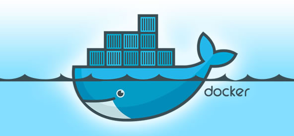

# OJ在线判题系统

基于 Vue 3 + Spring Boot + Spring Cloud 微服务 + Docker 的 **编程题目在线评测系统** （简称 OJ）。

在系统前台，管理员可以创建、管理题目；用户可以自由搜索题目、阅读题目、编写并提交代码。

在系统后端，能够根据管理员设定的题目测试用例在 **代码\**\**沙箱** 中对代码进行编译、运行、判断输出是否正确。

其中，代码沙箱可以作为独立服务，提供给其他开发者使用。

## 技术选型

### 前端

- Vue 3
- Vue-CLI 脚手架
- Vuex 状态管理
- Arco Design 组件库
- 前端工程化：ESLint + Prettier + TypeScript
- ⭐️ 手写前端项目模板（通用布局、权限管理、状态管理、菜单生成）
- ⭐️ Markdown 富文本编辑器
- ⭐️ Monaco Editor 代码编辑器
- ⭐️ OpenAPI 前端代码生成

### 后端

- ⭐️ Java Spring Cloud + Spring Cloud Alibaba 微服务
  - Nacos 注册中心
  - OpenFeign 客户端调用
  - GateWay 网关
  - 聚合接口文档
- Java Spring Boot（万用后端模板）
- Java 进程控制
- ⭐️ Java 安全管理器
- ⭐️ Docker 代码沙箱实现
- ⭐️ 虚拟机 + 远程开发
- MySQL 数据库
- MyBatis-Plus 及 MyBatis X 自动生成
- Redis 分布式 Session
- ⭐️ RabbitMQ 消息队列
- ⭐️ 多种设计模式
  - 策略模式
  - 工厂模式
  - 代理模式
  - 模板方法模式
- 其他：部分并发编程、JVM 小知识

## 第一章：项目诞生

### 项目介绍 | OJ 系统常用概念

用于在线评测编程题的系统，能够根据用户提交的代码、出题人预先设置的题目输入和输出用例，进行编译代码、运行代码、判断代码运行结果是否正确。


### 项目介绍 | 企业项目开发流程

1. 项目介绍、项目调研、需求分析
2. 核心业务流程
3. 项目要做的功能（功能模块）
4. 技术选型（技术预研）
5. 项目初始化
6. 项目开发
7. 测试
8. 优化
9. 代码提交、代码审核
10. 产品验收
11. 上线


### 项目介绍 | 主流 OJ 系统调研

github上面找一些OJ的系统看看，可以参照参照他们的功能。

比如判题，他们的逻辑，有哪些特点，功能等等。


### 项目介绍 | 核心实现模块介绍

#### 实现核心

##### 1）权限校验

谁能提代码，谁不能提代码

##### **2）代码沙箱（安全沙箱）**

用户代码藏毒：写个木马文件、修改系统权限

沙箱：隔离的、安全的环境，用户的代码不会影响到沙箱之外的系统的运行

资源分配：系统的内存就 2 个 G，用户疯狂占用资源占满你的内存，其他人就用不了了。所以要限制用户程序的占用资源。

##### 3）判题规则

题目用例的比对，结果的验证

##### 4）任务调度

服务器资源有限，用户要排队，按照顺序去依次执行判题，而不是直接拒绝


### 项目介绍 | 核心业务流程（2 种作图）


判题服务：获取题目信息、预计的输入输出结果，返回给主业务后端：用户的答案是否正确

代码沙箱：只负责运行代码，给出结果，不管什么结果是正确的。


### 项目介绍 | 系统功能梳理

##### 功能

1. 题目模块
   1. 创建题目（管理员）
   2. 删除题目（管理员）
   3. 修改题目（管理员）
   4. 搜索题目（用户）
   5. 在线做题
   6. 提交题目代码
2. 用户模块
   1. 注册
   2. 登录
3. 判题模块
   1. 提交判题（结果是否正确与错误）
   2. 错误处理（内存溢出、安全性、超时）
   3. 自主实现 代码沙箱（安全沙箱）
   4. 开放接口（提供一个独立的新服务）


### 项目介绍 | 系统架构设计（架构设计图）


### OJ 系统实现方案（5 种方案讲解）

#### 主流的 OJ 系统实现方案

开发原则：能用别人现成的，就不要自己写

##### 1、用现成的 OJ 系统

网上有很多开源的 OJ 项目，比如青岛 OJ、HustOJ 等，可以直接下载开源代码自己部署。

比较推荐的是 judge0，这是一个非常成熟的商业 OJ 项目，支持 60 多种编程语言！

> 代码：https://github.com/judge0/judge0

##### 2、用现成的服务

如果你不希望完整部署一套大而全的代码，只是想复用他人已经实现的、最复杂的判题逻辑，那么可以直接使用现成的 **判题 API** 、或者现成的 **代码沙箱** 等服务。

比如 judge0 提供的判题 API，非常方便易用。只需要通过 HTTP 调用 submissions 判题接口，把用户的代码、输入值、预期的执行结果作为请求参数发送给 judge0 的服务器，它就能自动帮你编译执行程序，并且返回程序的运行结果。

如下图，发送了一段打印 "hello world" 的程序，得到了程序执行的时间、状态等：


> API 的作用：接受代码、返回执行结果

Judge0 API 地址：https://rapidapi.com/judge0-official/api/judge0-ce

官方文档：https://ce.judge0.com/#submissions-submission-post

###### 流程

1. 先注册
2. 再开通订阅
3. 然后测试 language 接口
4. 测试执行代码接口 submissions

示例接口参数：

```json
{
  "source_code": "#include <stdio.h>\n\nint main(void) {\n  char name[10];\n  scanf(\"%s\", name);\n  printf(\"hello, %s\n\", name);\n  return 0;\n}",
  "language_id": "4",
  "stdin": "Judge0",
  "expected_output": "hello, Judge0"
}
复制代码
```

预期返回：

```json
{
  "source_code": "includestdiohintmainvoidcharname10scanfsnameprintfhellosname\nreturn0=\n",
  "language_id": 76,
  "stdin": "Judgew==\n",
  "expected_output": "helloJudge0=\n",
  "stdout": null,
  "status_id": 6,
  "created_at": "2023-07-27T13:50:30.433Z",
  "finished_at": "2023-07-27T13:50:31.022Z",
  "time": null,
  "memory": null,
  "stderr": null,
  "token": "8be000ad-2edb-4262-b367-7095a694e028",
  "number_of_runs": 1,
  "cpu_time_limit": "5.0",
  "cpu_extra_time": "1.0",
  "wall_time_limit": "10.0",
  "memory_limit": 128000,
  "stack_limit": 64000,
  "max_processes_and_or_threads": 60,
  "enable_per_process_and_thread_time_limit": false,
  "enable_per_process_and_thread_memory_limit": false,
  "max_file_size": 1024,
  "compile_output": "bWFpbi5jcHA6MToxOiBlcnJvcjogc291cmNlIGZpbGUgaXMgbm90IHZhbGlk\nIFVURi04Cjw4QT53JTxCOT48VSswNUVDPjxCNT7YqDw4Nj4p7ZmoPEE3PjxC\nRT48ODg+PDlEPnI8VSswMDE2PjxBQj48OUQ+PEE5Pjw5RT48RDc+SzxVKzAw\nMUM+anfsnak8OUU+PEE2PjxCOD48QTc+PEI1PjxGOD5ePDk2PlosPDlEPjxB\nOT48OUU+PEFEPjxFQj5uPEFFPn0KXgptYWluLmNwcDoxOjI6IGVycm9yOiB1\nbmtub3duIHR5cGUgbmFtZSAndycKPDhBPnclPEI5PjxVKzA1RUM+PEI1Ptio\nPDg2Pintmag8QTc+PEJFPjw4OD48OUQ+cjxVKzAwMTY+PEFCPjw5RD48QTk+\nPDlFPjxENz5LPFUrMDAxQz5qd+ydqTw5RT48QTY+PEI4PjxBNz48QjU+PEY4\nPl48OTY+Wiw8OUQ+PEE5Pjw5RT48QUQ+PEVCPm48QUU+fQogICAgXgptYWlu\nLmNwcDoxOjM6IGVycm9yOiBleHBlY3RlZCB1bnF1YWxpZmllZC1pZAo8OEE+\ndyU8Qjk+PFUrMDVFQz48QjU+2Kg8ODY+Ke2ZqDxBNz48QkU+PDg4Pjw5RD5y\nPFUrMDAxNj48QUI+PDlEPjxBOT48OUU+PEQ3Pks8VSswMDFDPmp37J2pPDlF\nPjxBNj48Qjg+PEE3PjxCNT48Rjg+Xjw5Nj5aLDw5RD48QTk+PDlFPjxBRD48\nRUI+bjxBRT59CiAgICAgXgptYWluLmNwcDoxOjQ6IGVycm9yOiBzb3VyY2Ug\nZmlsZSBpcyBub3QgdmFsaWQgVVRGLTgKPDhBPnclPEI5PjxVKzA1RUM+PEI1\nPtioPDg2Pintmag8QTc+PEJFPjw4OD48OUQ+cjxVKzAwMTY+PEFCPjw5RD48\nQTk+PDlFPjxENz5LPFUrMDAxQz5qd+ydqTw5RT48QTY+PEI4PjxBNz48QjU+\nPEY4Pl48OTY+Wiw8OUQ+PEE5Pjw5RT48QUQ+PEVCPm48QUU+fQogICAgICBe\nCm1haW4uY3BwOjE6NzogZXJyb3I6IHNvdXJjZSBmaWxlIGlzIG5vdCB2YWxp\nZCBVVEYtOAo8OEE+dyU8Qjk+PFUrMDVFQz48QjU+2Kg8ODY+Ke2ZqDxBNz48\nQkU+PDg4Pjw5RD5yPFUrMDAxNj48QUI+PDlEPjxBOT48OUU+PEQ3Pks8VSsw\nMDFDPmp37J2pPDlFPjxBNj48Qjg+PEE3PjxCNT48Rjg+Xjw5Nj5aLDw5RD48\nQTk+PDlFPjxBRD48RUI+bjxBRT59CiAgICAgICAgICAgICAgICAgIF4KbWFp\nbi5jcHA6MToxMDogZXJyb3I6IHNvdXJjZSBmaWxlIGlzIG5vdCB2YWxpZCBV\nVEYtOAo8OEE+dyU8Qjk+PFUrMDVFQz48QjU+2Kg8ODY+Ke2ZqDxBNz48QkU+\nPDg4Pjw5RD5yPFUrMDAxNj48QUI+PDlEPjxBOT48OUU+PEQ3Pks8VSswMDFD\nPmp37J2pPDlFPjxBNj48Qjg+PEE3PjxCNT48Rjg+Xjw5Nj5aLDw5RD48QTk+\nPDlFPjxBRD48RUI+bjxBRT59CiAgICAgICAgICAgICAgICAgICAgICAgXgpt\nYWluLmNwcDoxOjE1OiBlcnJvcjogc291cmNlIGZpbGUgaXMgbm90IHZhbGlk\nIFVURi04Cjw4QT53JTxCOT48VSswNUVDPjxCNT7YqDw4Nj4p7ZmoPEE3PjxC\nRT48ODg+PDlEPnI8VSswMDE2PjxBQj48OUQ+PEE5Pjw5RT48RDc+SzxVKzAw\nMUM+anfsnak8OUU+PEE2PjxCOD48QTc+PEI1PjxGOD5ePDk2PlosPDlEPjxB\nOT48OUU+PEFEPjxFQj5uPEFFPn0KICAgICAgICAgICAgICAgICAgICAgICAg\nICAgICAgXgptYWluLmNwcDoxOjE2OiBlcnJvcjogc291cmNlIGZpbGUgaXMg\nbm90IHZhbGlkIFVURi04Cjw4QT53JTxCOT48VSswNUVDPjxCNT7YqDw4Nj4p\n7ZmoPEE3PjxCRT48ODg+PDlEPnI8VSswMDE2PjxBQj48OUQ+PEE5Pjw5RT48\nRDc+SzxVKzAwMUM+anfsnak8OUU+PEE2PjxCOD48QTc+PEI1PjxGOD5ePDk2\nPlosPDlEPjxBOT48OUU+PEFEPjxFQj5uPEFFPn0KICAgICAgICAgICAgICAg\nICAgICAgICAgICAgICAgICAgIF4KbWFpbi5jcHA6MToxNzogZXJyb3I6IHNv\ndXJjZSBmaWxlIGlzIG5vdCB2YWxpZCBVVEYtOAo8OEE+dyU8Qjk+PFUrMDVF\nQz48QjU+2Kg8ODY+Ke2ZqDxBNz48QkU+PDg4Pjw5RD5yPFUrMDAxNj48QUI+\nPDlEPjxBOT48OUU+PEQ3Pks8VSswMDFDPmp37J2pPDlFPjxBNj48Qjg+PEE3\nPjxCNT48Rjg+Xjw5Nj5aLDw5RD48QTk+PDlFPjxBRD48RUI+bjxBRT59CiAg\nICAgICAgICAgICAgICAgICAgICAgICAgICAgICAgICAgICAgXgptYWluLmNw\ncDoxOjE4OiBlcnJvcjogc291cmNlIGZpbGUgaXMgbm90IHZhbGlkIFVURi04\nCjw4QT53JTxCOT48VSswNUVDPjxCNT7YqDw4Nj4p7ZmoPEE3PjxCRT48ODg+\nPDlEPnI8VSswMDE2PjxBQj48OUQ+PEE5Pjw5RT48RDc+SzxVKzAwMUM+anfs\nnak8OUU+PEE2PjxCOD48QTc+PEI1PjxGOD5ePDk2PlosPDlEPjxBOT48OUU+\nPEFEPjxFQj5uPEFFPn0KICAgICAgICAgICAgICAgICAgICAgICAgICAgICAg\nICAgICAgICAgICAgXgptYWluLmNwcDoxOjIxOiBlcnJvcjogc291cmNlIGZp\nbGUgaXMgbm90IHZhbGlkIFVURi04Cjw4QT53JTxCOT48VSswNUVDPjxCNT7Y\nqDw4Nj4p7ZmoPEE3PjxCRT48ODg+PDlEPnI8VSswMDE2PjxBQj48OUQ+PEE5\nPjw5RT48RDc+SzxVKzAwMUM+anfsnak8OUU+PEE2PjxCOD48QTc+PEI1PjxG\nOD5ePDk2PlosPDlEPjxBOT48OUU+PEFEPjxFQj5uPEFFPn0KICAgICAgICAg\nICAgICAgICAgICAgICAgICAgICAgICAgICAgICAgICAgICAgICAgICAgICAg\nIF4KbWFpbi5jcHA6MToyMjogZXJyb3I6IHNvdXJjZSBmaWxlIGlzIG5vdCB2\nYWxpZCBVVEYtOAo8OEE+dyU8Qjk+PFUrMDVFQz48QjU+2Kg8ODY+Ke2ZqDxB\nNz48QkU+PDg4Pjw5RD5yPFUrMDAxNj48QUI+PDlEPjxBOT48OUU+PEQ3Pks8\nVSswMDFDPmp37J2pPDlFPjxBNj48Qjg+PEE3PjxCNT48Rjg+Xjw5Nj5aLDw5\nRD48QTk+PDlFPjxBRD48RUI+bjxBRT59CiAgICAgICAgICAgICAgICAgICAg\nICAgICAgICAgICAgICAgICAgICAgICAgICAgICAgICAgICAgICAgXgptYWlu\nLmNwcDoxOjIzOiBlcnJvcjogc291cmNlIGZpbGUgaXMgbm90IHZhbGlkIFVU\nRi04Cjw4QT53JTxCOT48VSswNUVDPjxCNT7YqDw4Nj4p7ZmoPEE3PjxCRT48\nODg+PDlEPnI8VSswMDE2PjxBQj48OUQ+PEE5Pjw5RT48RDc+SzxVKzAwMUM+\nanfsnak8OUU+PEE2PjxCOD48QTc+PEI1PjxGOD5ePDk2PlosPDlEPjxBOT48\nOUU+PEFEPjxFQj5uPEFFPn0KICAgICAgICAgICAgICAgICAgICAgICAgICAg\nICAgICAgICAgICAgICAgICAgICAgICAgICAgICAgICAgICAgXgptYWluLmNw\ncDoxOjI0OiBlcnJvcjogc291cmNlIGZpbGUgaXMgbm90IHZhbGlkIFVURi04\nCjw4QT53JTxCOT48VSswNUVDPjxCNT7YqDw4Nj4p7ZmoPEE3PjxCRT48ODg+\nPDlEPnI8VSswMDE2PjxBQj48OUQ+PEE5Pjw5RT48RDc+SzxVKzAwMUM+anfs\nnak8OUU+PEE2PjxCOD48QTc+PEI1PjxGOD5ePDk2PlosPDlEPjxBOT48OUU+\nPEFEPjxFQj5uPEFFPn0KICAgICAgICAgICAgICAgICAgICAgICAgICAgICAg\nICAgICAgICAgICAgICAgICAgICAgICAgICAgICAgICAgICAgIF4KbWFpbi5j\ncHA6MToyNTogZXJyb3I6IHNvdXJjZSBmaWxlIGlzIG5vdCB2YWxpZCBVVEYt\nOAo8OEE+dyU8Qjk+PFUrMDVFQz48QjU+2Kg8ODY+Ke2ZqDxBNz48QkU+PDg4\nPjw5RD5yPFUrMDAxNj48QUI+PDlEPjxBOT48OUU+PEQ3Pks8VSswMDFDPmp3\n7J2pPDlFPjxBNj48Qjg+PEE3PjxCNT48Rjg+Xjw5Nj5aLDw5RD48QTk+PDlF\nPjxBRD48RUI+bjxBRT59CiAgICAgICAgICAgICAgICAgICAgICAgICAgICAg\nICAgICAgICAgICAgICAgICAgICAgICAgICAgICAgICAgICAgICAgICAgXgpt\nYWluLmNwcDoxOjMzOiBlcnJvcjogc291cmNlIGZpbGUgaXMgbm90IHZhbGlk\nIFVURi04Cjw4QT53JTxCOT48VSswNUVDPjxCNT7YqDw4Nj4p7ZmoPEE3PjxC\nRT48ODg+PDlEPnI8VSswMDE2PjxBQj48OUQ+PEE5Pjw5RT48RDc+SzxVKzAw\nMUM+anfsnak8OUU+PEE2PjxCOD48QTc+PEI1PjxGOD5ePDk2PlosPDlEPjxB\nOT48OUU+PEFEPjxFQj5uPEFFPn0KICAgICAgICAgICAgICAgICAgICAgICAg\nICAgICAgICAgICAgICAgICAgICAgICAgICAgICAgICAgICAgICAgICAgICAg\nICAgICAgICAgICAgICAgICAgIF4KbWFpbi5jcHA6MTozNDogZXJyb3I6IHNv\ndXJjZSBmaWxlIGlzIG5vdCB2YWxpZCBVVEYtOAo8OEE+dyU8Qjk+PFUrMDVF\nQz48QjU+2Kg8ODY+Ke2ZqDxBNz48QkU+PDg4Pjw5RD5yPFUrMDAxNj48QUI+\nPDlEPjxBOT48OUU+PEQ3Pks8VSswMDFDPmp37J2pPDlFPjxBNj48Qjg+PEE3\nPjxCNT48Rjg+Xjw5Nj5aLDw5RD48QTk+PDlFPjxBRD48RUI+bjxBRT59CiAg\nICAgICAgICAgICAgICAgICAgICAgICAgICAgICAgICAgICAgICAgICAgICAg\nICAgICAgICAgICAgICAgICAgICAgICAgICAgICAgICAgICAgICAgICAgICAg\nXgptYWluLmNwcDoxOjM1OiBlcnJvcjogc291cmNlIGZpbGUgaXMgbm90IHZh\nbGlkIFVURi04Cjw4QT53JTxCOT48VSswNUVDPjxCNT7YqDw4Nj4p7ZmoPEE3\nPjxCRT48ODg+PDlEPnI8VSswMDE2PjxBQj48OUQ+PEE5Pjw5RT48RDc+SzxV\nKzAwMUM+anfsnak8OUU+PEE2PjxCOD48QTc+PEI1PjxGOD5ePDk2PlosPDlE\nPjxBOT48OUU+PEFEPjxFQj5uPEFFPn0KICAgICAgICAgICAgICAgICAgICAg\nICAgICAgICAgICAgICAgICAgICAgICAgICAgICAgICAgICAgICAgICAgICAg\nICAgICAgICAgICAgICAgICAgICAgICAgICAgICAgXgptYWluLmNwcDoxOjM2\nOiBlcnJvcjogc291cmNlIGZpbGUgaXMgbm90IHZhbGlkIFVURi04Cjw4QT53\nJTxCOT48VSswNUVDPjxCNT7YqDw4Nj4p7ZmoPEE3PjxCRT48ODg+PDlEPnI8\nVSswMDE2PjxBQj48OUQ+PEE5Pjw5RT48RDc+SzxVKzAwMUM+anfsnak8OUU+\nPEE2PjxCOD48QTc+PEI1PjxGOD5ePDk2PlosPDlEPjxBOT48OUU+PEFEPjxF\nQj5uPEFFPn0KICAgICAgICAgICAgICAgICAgICAgICAgICAgICAgICAgICAg\nICAgICAgICAgICAgICAgICAgICAgICAgICAgICAgICAgICAgICAgICAgICAg\nICAgICAgICAgICAgICAgICAgIF4KZmF0YWwgZXJyb3I6IHRvbyBtYW55IGVy\ncm9ycyBlbWl0dGVkLCBzdG9wcGluZyBub3cgWy1mZXJyb3ItbGltaXQ9XQoy\nMCBlcnJvcnMgZ2VuZXJhdGVkLgo=\n",
  "exit_code": null,
  "exit_signal": null,
  "message": null,
  "wall_time": null,
  "compiler_options": null,
  "command_line_arguments": null,
  "redirect_stderr_to_stdout": false,
  "callback_url": null,
  "additional_files": null,
  "enable_network": false,
  "status": {
    "id": 6,
    "description": "Compilation Error"
  },
  "language": {
    "id": 76,
    "name": "C++ (Clang 7.0.1)"
  }
}
复制代码
```

##### 3、自主开发

这种方式就不多说了，判题服务和代码沙箱都要自己实现，适合学习，但不适用于商业项目。我这次带大家做的 OJ 系统，就选择了自主开发，主打一个学习。

##### 4、把 AI 来当做代码沙箱

现在 AI 的能力已经十分强大了，我们可以把各种本来很复杂的功能直接交给 AI 来实现。

比如把 AI 当做代码沙箱，我们直接扔给他一段代码、输入参数，问他能否得到预期的结果，就实现了在线判题逻辑！

如下图：


之前带大家做的 [智能 BI 项目](https://www.code-nav.cn/course/1790980531403927553) ，就是把 AI 当做了智能数据分析师，来生成图表和分析结论。

只要你脑洞够大，AI + 编程 = 无限的可能~

##### 5、移花接木

这种方式最有意思、也最 “缺德”。很多同学估计想不到。

那就是可以通过让程序来操作模拟浏览器的方式，用别人已经开发好的 OJ 系统来帮咱们判题。

比如使用 Puppeteer + 无头浏览器，把咱们系统用户提交的代码，像人一样输入到别人的 OJ 网页中，让程序点击提交按钮，并且等别人的 OJ 系统返回判题结果后，再把这个结果返回给我们自己的用户。

这种方式的缺点就是把核心流程交给了别人，如果别人服务挂了，你的服务也就挂了；而且别人 OJ 系统不支持的题目，可能你也支持不了。


### 前端项目初始化 | Vue-CLI 初始项目搭建

#### 确认环境

nodeJS 版本：v18.16.0 或 16

检测命令：

```shell
node -v
复制代码
```

切换和管理 node 版本的工具：https://github.com/nvm-sh/nvm

npm 版本：9.5.1

```shell
npm -v
复制代码
```

#### 初始化

使用 vue-cli 脚手架：https://cli.vuejs.org/zh/

安装脚手架工具：

```shell
npm install -g @vue/cli
```

检测是否安装成功：

```shell
vue -V
```

如果找不到命令，那么建议去重新到安装 npm，重新帮你配置环境变量。

创建项目：

```shell
vue create yuoj-frontend
```

运行项目，能运行就成功了

#### 前端工程化配置

脚手架已经帮我们配置了代码美化、自动校验、格式化插件等，无需再自行配置

但是需要在 webstorm 里开启代码美化插件：


在 vue 文件中执行格式化快捷键，不报错，表示配置工程化成功

脚手架自动整合了 vue-router

#### 自己整合

代码规范：https://eslint.org/docs/latest/use/getting-started

代码美化：https://prettier.io/docs/en/install.html

直接整合：https://github.com/prettier/eslint-plugin-prettier#recommended-configuration（包括了 https://github.com/prettier/eslint-config-prettier#installation）


### 前端项目初始化 | 组件库引入

#### 引入组件

> Vue Router 路由组件已自动引入，无需再引入：https://router.vuejs.org/zh/introduction.html

组件库：https://arco.design/vue

快速上手：https://arco.design/vue/docs/start

执行安装：

```shell
npm install --save-dev @arco-design/web-vue
```

改变 main.ts：

```typescript
import { createApp } from "vue";
import App from "./App.vue";
import ArcoVue from "@arco-design/web-vue";
import "@arco-design/web-vue/dist/arco.css";
import router from "./router";
import store from "./store";

createApp(App).use(ArcoVue).use(store).use(router).mount("#app");
```

引入一个组件，如果显示出来，就表示引入成功

#### 项目通用布局

新建一个布局， 在 app.vue 中引入

app.vue 代码如下：

```typescript
<div id="app">
  <BasicLayout />
</div>
复制代码
```

选用 arco design 的 layout 组件（https://arco.design/vue/component/layout）

先把上中下布局编排好，然后再填充内容：


#### 实现通用路由菜单

菜单组件：https://arco.design/vue/component/menu

目标：根据路由配置信息，自动生成菜单内容。实现更通用、更自动的菜单配置。

步骤：

1）提取通用路由文件

2）菜单组件读取路由，动态渲染菜单项

3）绑定跳转事件

4）同步路由的更新到菜单项高亮

同步高亮原理：首先点击菜单项 => 触发点击事件，跳转更新路由 => 更新路由后，同步去更新菜单栏的高亮状态。

使用 Vue Router 的 afterEach 路由钩子实现：

```javascript
const router = useRouter();

// 默认主页
const selectedKeys = ref(["/"]);

// 路由跳转后，更新选中的菜单项
router.afterEach((to, from, failure) => {
  selectedKeys.value = [to.path];
});
复制代码
```

#### 全局状态管理

vuex：https://vuex.vuejs.org/zh/guide/（vue-cli 脚手架已自动引入）

什么是全局状态管理？

所有页面全局共享的变量，而不是局限在某一个页面中。

适合作为全局状态的数据：已登录用户信息（每个页面几乎都要用）

Vuex 的本质：给你提供了一套增删改查全局变量的 API，只不过可能多了一些功能（比如时间旅行）


可以直接参考购物车示例：https://github.com/vuejs/vuex/tree/main/examples/classic/shopping-cart

state：存储的状态信息，比如用户信息

mutation（尽量同步）：定义了对变量进行增删改（更新）的方法

actions（支持异步）：执行异步操作，并且触发 mutation 的更改（actions 调用 mutation）

modules（模块）：把一个大的 state（全局变量）划分为多个小模块，比如 user 专门存用户的状态信息

##### 实现

先在 store 目录下定义 user 模块，存储用户信息：

```typescript
// initial state
import { StoreOptions } from "vuex";

export default {
  namespaced: true,
  state: () => ({
    loginUser: {
      userName: "未登录",
    },
  }),
  actions: {
    getLoginUser({ commit, state }, payload) {
      commit("updateUser", { userName: "鱼皮" });
    },
  },
  mutations: {
    updateUser(state, payload) {
      state.loginUser = payload;
    },
  },
} as StoreOptions<any>;

复制代码
```

然后在 store 目录下定义 index.ts 文件，导入 user 模块：

```typescript
import { createStore } from "vuex";
import user from "./user";

export default createStore({
  mutations: {},
  actions: {},
  modules: {
    user,
  },
});
```

在 Vue 页面中可以获取已存储的状态变量：

```tsx
const store = useStore();
store.state.user?.loginUser
```

在 Vue 页面中可以修改状态变量：

> 使用 dispatch 来调用之前定义好的 actions

```typescript
store.dispatch("user/getLoginUser", {
  userName: "鱼皮",
});
```

#### 全局权限管理

目标：能够直接以一套通用的机制，去定义哪个页面需要那些权限。而不用每个页面独立去判断权限，提高效率。

思路：

1. 在路由配置文件， 定义某个路由的访问权限
2. 在全局页面组件 app.vue 中，绑定一个全局路由监听。每次访问页面时，根据用户要访问页面的路由信息，先判断用户是否有对应的访问权限。
3. 如果有，跳转到原页面；如果没有，拦截或跳转到 401 鉴权或登录页

示例代码如下：

```typescript
const router = useRouter();
const store = useStore();

router.beforeEach((to, from, next) => {
  // 仅管理员可见，判断当前用户是否有权限
  if (to.meta?.access === "canAdmin") {
    if (store.state.user.loginUser?.role !== "admin") {
      next("/noAuth");
      return;
    }
  }
  next();
});
```

#### 优化页面布局

1、底部 footer 布局优化

2、优化 content、globalHeader 的样式

3、优化导航栏用户名称的换行

##### 通用导航栏组件 - 根据配置控制菜单的显隐

1）routes.ts 给路由新增一个标志位，用于判断路由是否显隐

```javascript
  {
    path: "/hide",
    name: "隐藏页面",
    component: HomeView,
    meta: {
      hideInMenu: true,
    },
  },
```

2）不要用 v-for + v-if 去条件渲染元素，这样会先循环所有的元素，导致性能的浪费

推荐：先过滤只需要展示的元素数组

```typescript
// 展示在菜单的路由数组
const visibleRoutes = routes.filter((item, index) => {
  if (item.meta?.hideInMenu) {
    return false;
  }
  return true;
});
```

#### 根据权限隐藏菜单

需求：只有具有权限的菜单，才对用户可见

原理：类似上面的控制路由显示隐藏，只要判断用户没有这个权限，就直接过滤掉

1）新建 access 目录，专门用一个文件来定义权限

```typescript
/**
 * 权限定义
 */
const ACCESS_ENUM = {
  NOT_LOGIN: "notLogin",
  USER: "user",
  ADMIN: "admin",
};

export default ACCESS_ENUM;
```

2）定义一个公用的权限校验方法

为什么？因为菜单组件中要判断权限、权限拦截也要用到权限判断功能，所以抽离成公共方法

创建 checkAccess.ts 文件，专门定义检测权限的函数：

```typescript
import ACCESS_ENUM from "@/access/accessEnum";

/**
 * 检查权限（判断当前登录用户是否具有某个权限）
 * @param loginUser 当前登录用户
 * @param needAccess 需要有的权限
 * @return boolean 有无权限
 */
const checkAccess = (loginUser: any, needAccess = ACCESS_ENUM.NOT_LOGIN) => {
  // 获取当前登录用户具有的权限（如果没有 loginUser，则表示未登录）
  const loginUserAccess = loginUser?.userRole ?? ACCESS_ENUM.NOT_LOGIN;
  if (needAccess === ACCESS_ENUM.NOT_LOGIN) {
    return true;
  }
  // 如果用户登录才能访问
  if (needAccess === ACCESS_ENUM.USER) {
    // 如果用户没登录，那么表示无权限
    if (loginUserAccess === ACCESS_ENUM.NOT_LOGIN) {
      return false;
    }
  }
  // 如果需要管理员权限
  if (needAccess === ACCESS_ENUM.ADMIN) {
    // 如果不为管理员，表示无权限
    if (loginUserAccess !== ACCESS_ENUM.ADMIN) {
      return false;
    }
  }
  return true;
};

export default checkAccess;
```

3）修改 GlobalHeader 动态菜单组件，根据权限来过滤菜单

注意，这里使用计算属性，是为了当登录用户信息发生变更时，触发菜单栏的重新渲染，展示新增权限的菜单项

```typescript
const visibleRoutes = computed(() => {
  return routes.filter((item, index) => {
    if (item.meta?.hideInMenu) {
      return false;
    }
    // 根据权限过滤菜单
    if (
      !checkAccess(store.state.user.loginUser, item?.meta?.access as string)
    ) {
      return false;
    }
    return true;
  });
});
```

#### 全局项目入口

app.vue 中预留一个可以编写全局初始化逻辑的代码：

```typescript
/**
 * 全局初始化函数，有全局单次调用的代码，都可以写到这里
 */
const doInit = () => {
  console.log("hello 欢迎来到我的项目");
};

onMounted(() => {
  doInit();
});
```

### 后端项目初始化

先把通用的后端框架跑起来。

1）从星球代码库下载 springboot-init 万用模板（已经在本地的话直接复制）

2）`ctrl+shift+R`全局替换 springboot-init 为项目名（yuoj-backend）

3）全局替换springbootinit 包名为新的包名（yuoj）

4）修改 springbootinit 文件夹的名称为新的包名对应的名称（yuoj）

5）本地新建数据库，直接执行 sql/create_table.sql 脚本，修改库名为 yuoj，执行即可

6）改 application.yml 配置，修改 MySQL 数据库的连接库名、账号密码，端口号（8121）

#### 初始化模板讲解

1）先阅读 README.md

2）sql/create_table.sql 定义了数据库的初始化建库建表语句

3）sql/post_es_mapping.json 帖子表在 ES 中的建表语句

4）aop：用于全局权限校验、全局日志记录

5）common：万用的类，比如通用响应类

6）config：用于接收 application.yml 中的参数，初始化一些客户端的配置类（比如对象存储客户端）

7）constant：定义常量

8）controller：接受请求

9）esdao：类似 mybatis 的 mapper，用于操作 ES

10）exception：异常处理相关

11）job：任务相关（定时任务、单次任务）

12）manager：服务层（一般是定义一些公用的服务、对接第三方 API 等）

13）mapper：mybatis 的数据访问层，用于操作数据库

14）model：数据模型、实体类、包装类、枚举值

15）service：服务层，用于编写业务逻辑

16）utils：工具类，各种各样公用的方法

17）wxmp：公众号相关的包

18）test：单元测试

19）MainApplication：项目启动入口

20）Dockerfile：用于构建 Docker 镜像

### 前后端联调

问：前端和后端怎么连接起来的？ 接口 / 请求

答：前端发送请求调用后端接口

1）安装请求工具类 Axios

官方文档：https://axios-http.com/docs/intro

代码：

```shell
npm install axios
```

2）编写调用后端的代码

传统情况下，每个请求都要单独编写代码。至少得写一个请求路径

完全不用！！！

直接自动生成即可：https://github.com/ferdikoomen/openapi-typescript-codegen

首先安装：

```shell
npm install openapi-typescript-codegen --save-dev
```

然后执行命令生成代码：

```shell
openapi --input http://localhost:8121/api/v2/api-docs --output ./generated --client axios
```

3）直接使用生成的 Service 代码，直接调用函数发送请求即可，比如获取登录信息

```typescript
typescript复制代码// 从远程请求获取登录信息
const res = await UserControllerService.getLoginUserUsingGet();
if (res.code === 0) {
  commit("updateUser", res.data);
} else {
  commit("updateUser", {
    ...state.loginUser,
    userRole: ACCESS_ENUM.NOT_LOGIN,
  });
}
```

如果想要自定义请求参数，怎么办？

1）使用代码生成器提供的全局参数修改对象：

```javascript
javascript复制代码export const OpenAPI: OpenAPIConfig = {
    BASE: 'http://localhost:3000/api',
    VERSION: '2.0',
    WITH_CREDENTIALS: false,
    CREDENTIALS: 'include',
    TOKEN: undefined,
    USERNAME: undefined,
    PASSWORD: undefined,
    HEADERS: undefined,
    ENCODE_PATH: undefined,
};
```

文档：https://github.com/ferdikoomen/openapi-typescript-codegen/blob/master/docs/openapi-object.md

2）直接定义 axios 请求库的全局参数，比如全局请求响应拦截器

文档：https://axios-http.com/docs/interceptors

示例代码：

```typescript
// Add a request interceptor
import axios from "axios";

axios.interceptors.request.use(
  function (config) {
    // Do something before request is sent
    return config;
  },
  function (error) {
    // Do something with request error
    return Promise.reject(error);
  }
);

// Add a response interceptor
axios.interceptors.response.use(
  function (response) {
    console.log("响应", response);
    // Any status code that lie within the range of 2xx cause this function to trigger
    // Do something with response data
    return response;
  },
  function (error) {
    // Any status codes that falls outside the range of 2xx cause this function to trigger
    // Do something with response error
    return Promise.reject(error);
  }
);
```

###  用户自动登录

#### 自动登录

1）在 store\user.ts 编写获取远程登陆用户信息的代码：

```typescript
actions: {
    async getLoginUser({ commit, state }, payload) {
      // 从远程请求获取登录信息
      const res = await UserControllerService.getLoginUserUsingGet();
      if (res.code === 0) {
        commit("updateUser", res.data);
      } else {
        commit("updateUser", {
          ...state.loginUser,
          userRole: ACCESS_ENUM.NOT_LOGIN,
        });
      }
    },
  },
```

2）在哪里去触发 getLoginUser 函数的执行？应当在一个全局的位置

有很多选择：

1. 路由拦截 ✔
2. 全局页面入口 app.vue
3. 全局通用布局（所有页面都共享的组件）

此处选择第一种方案，可以直接在全局权限管理的路由拦截中判断用户是否已经登录了。

#### 全局权限管理优化

1）新建 access\index.ts 文件，把原有的路由拦截、权限校验逻辑放在独立的文件中

优势：只要不引入、就不会开启、不会对项目有影响

2）编写权限管理和自动登录逻辑

如果没登陆过，自动登录：

```typescript

  const loginUser = store.state.user.loginUser;
  // 如果之前没登陆过，自动登录
  if (!loginUser || !loginUser.userRole) {
    // 加 await 是为了等用户登录成功之后，再执行后续的代码
    await store.dispatch("user/getLoginUser");
  }
```

如果用户访问的页面不需要登录，是否需要强制跳转到登录页？

答：不需要

access\index.ts 示例代码：

```typescript
import router from "@/router";
import store from "@/store";
import ACCESS_ENUM from "@/access/accessEnum";
import checkAccess from "@/access/checkAccess";

router.beforeEach(async (to, from, next) => {
  console.log("登陆用户信息", store.state.user.loginUser);
  const loginUser = store.state.user.loginUser;
  // // 如果之前没登陆过，自动登录
  if (!loginUser || !loginUser.userRole) {
    // 加 await 是为了等用户登录成功之后，再执行后续的代码
    await store.dispatch("user/getLoginUser");
  }
  const needAccess = (to.meta?.access as string) ?? ACCESS_ENUM.NOT_LOGIN;
  // 要跳转的页面必须要登陆
  if (needAccess !== ACCESS_ENUM.NOT_LOGIN) {
    // 如果没登陆，跳转到登录页面
    if (!loginUser || !loginUser.userRole) {
      next(`/user/login?redirect=${to.fullPath}`);
      return;
    }
    // 如果已经登陆了，但是权限不足，那么跳转到无权限页面
    if (!checkAccess(loginUser, needAccess)) {
      next("/noAuth");
      return;
    }
  }
  next();
});
```

### 支持多套布局

1）在 routes 路由文件中新建一套用户路由，使用 vue-router 自带的子路由机制，实现布局和嵌套路由

```typescript
export const routes: Array<RouteRecordRaw> = [
  {
    path: "/user",
    name: "用户",
    component: UserLayout,
    children: [
      {
        path: "/user/login",
        name: "用户登录",
        component: UserLoginView,
      },
      {
        path: "/user/register",
        name: "用户注册",
        component: UserRegisterView,
      },
    ],
  },
]
```

2）新建 UserLayout、UserLoginView、UserRegisterView 页面，并且在 routes 中引入

3）在 app.vue 根页面文件，根据路由去区分多套布局

```typescript
<template v-if="route.path.startsWith('/user')">
      <router-view />
    </template>
    <template v-else>
      <BasicLayout />
    </template>
```

注意，当前这种 app.vue 中通过 if else 区分布局的方式，不是最优雅的，理想情况下是直接读取 routes.ts，在这个文件中定义多套布局，然后自动使用页面布局。

小扩展：你可以尝试实现上面的思路，并且根据嵌套路由生成嵌套的子菜单。

如下图：


### 登陆页面开发

登陆页面的核心是表单，只需要从组件库中找到表单组件，修改表单字段名称和后端完全匹配就足够了。

界面示例代码：

```html
<template>
  <div id="userLoginView">
    <h2 style="margin-bottom: 16px">用户登录</h2>
    <a-form
      style="max-width: 480px; margin: 0 auto"
      label-align="left"
      auto-label-width
      :model="form"
      @submit="handleSubmit"
    >
      <a-form-item field="userAccount" label="账号">
        <a-input v-model="form.userAccount" placeholder="请输入账号" />
      </a-form-item>
      <a-form-item field="userPassword" tooltip="密码不少于 8 位" label="密码">
        <a-input-password
          v-model="form.userPassword"
          placeholder="请输入密码"
        />
      </a-form-item>
      <a-form-item>
        <a-button type="primary" html-type="submit" style="width: 120px">
          登录
        </a-button>
      </a-form-item>
    </a-form>
  </div>
</template>

<script setup lang="ts">
import { reactive } from "vue";
import { UserControllerService, UserLoginRequest } from "../../../generated";
import message from "@arco-design/web-vue/es/message";
import { useRouter } from "vue-router";
import { useStore } from "vuex";

/**
 * 表单信息
 */
const form = reactive({
  userAccount: "",
  userPassword: "",
} as UserLoginRequest);

const router = useRouter();
const store = useStore();

/**
 * 提交表单
 * @param data
 */
const handleSubmit = async () => {
  const res = await UserControllerService.userLoginUsingPost(form);
  // 登录成功，跳转到主页
  if (res.code === 0) {
    await store.dispatch("user/getLoginUser");
    router.push({
      path: "/",
      replace: true,
    });
  } else {
    message.error("登陆失败，" + res.message);
  }
};
</script>

```

## 本期成果

前端通用页面布局：


登陆页面：


后端接口文档：


## 第二章：单体项目开发

### 系统功能的梳理

1. 用户模块
   1. 注册（后端已实现）
   2. 登录（后端已实现，前端已实现）
2. 题目模块
   1. 创建题目（管理员）
   2. 删除题目（管理员）
   3. 修改题目（管理员）
   4. 搜索题目（用户）
   5. 在线做题（题目详情页）
3. 判题模块
   1. 提交判题（结果是否正确与错误）
   2. 错误处理（内存溢出、安全性、超时）
   3. **自主实现** 代码沙箱（安全沙箱）
   4. 开放接口（提供一个独立的新服务）

### 库表设计

#### 用户表

只有管理员才能发布和管理题目，普通用户只能看题

```sql
-- 用户表
create table if not exists user
(
    id           bigint auto_increment comment 'id' primary key,
    userAccount  varchar(256)                           not null comment '账号',
    userPassword varchar(512)                           not null comment '密码',
    unionId      varchar(256)                           null comment '微信开放平台id',
    mpOpenId     varchar(256)                           null comment '公众号openId',
    userName     varchar(256)                           null comment '用户昵称',
    userAvatar   varchar(1024)                          null comment '用户头像',
    userProfile  varchar(512)                           null comment '用户简介',
    userRole     varchar(256) default 'user'            not null comment '用户角色：user/admin/ban',
    createTime   datetime     default CURRENT_TIMESTAMP not null comment '创建时间',
    updateTime   datetime     default CURRENT_TIMESTAMP not null on update CURRENT_TIMESTAMP comment '更新时间',
    isDelete     tinyint      default 0                 not null comment '是否删除',
    index idx_unionId (unionId)
) comment '用户' collate = utf8mb4_unicode_ci;
```

#### 题目表

题目标题

题目内容：存放题目的介绍、输入输出提示、描述、具体的详情

题目标签（json 数组字符串）：栈、队列、链表、简单、中等、困难

题目答案：管理员 / 用户设置的标准答案

提交数、通过题目的人数等：便于分析统计（可以考虑根据通过率自动给题目打难易度标签）

判题相关字段：

> 如果说题目不是很复杂，用例文件大小不大的话，可以直接存在数据库表里 但是如果用例文件比较大，> 512 KB 建议单独存放在一个文件中，数据库中只保存文件 url（类似存储用户头像）

- 输入用例：1、2
- 输出用例：3、4
- 时间限制
- 内存限制

judgeConfig 判题配置（json 对象）：

- 时间限制 timeLimit
- 内存限制 memoryLimit

judgeCase 判题用例（json 数组）

- 每一个元素是：一个输入用例对应一个输出用例

```json
[
  {
    "input": "1 2",
    "output": "3 4"
  },
  {
    "input": "1 3",
    "output": "2 4"
  }
]
```

------

存 json 的好处：便于扩展，只需要改变对象内部的字段，而不用修改数据库表（可能会影响数据库）

```json
{
  "timeLimit": 1000,
  "memoryLimit": 1000,
  "stackLimit": 1000
}
```

存 json 的前提：

1. 你不需要根据某个字段去倒查这条数据
2. 你的字段含义相关，属于同一类的值
3. 你的字段存储空间占用不能太大

------

其他扩展字段：

- 通过率
- 判题类型

代码：

```sql
-- 题目表
create table if not exists question
(
    id         bigint auto_increment comment 'id' primary key,
    title      varchar(512)                       null comment '标题',
    content    text                               null comment '内容',
    tags       varchar(1024)                      null comment '标签列表（json 数组）',
    answer     text                               null comment '题目答案',
    submitNum  int  default 0 not null comment '题目提交数',
    acceptedNum  int  default 0 not null comment '题目通过数',
    judgeCase text null comment '判题用例（json 数组）',
    judgeConfig text null comment '判题配置（json 对象）',
    thumbNum   int      default 0                 not null comment '点赞数',
    favourNum  int      default 0                 not null comment '收藏数',
    userId     bigint                             not null comment '创建用户 id',
    createTime datetime default CURRENT_TIMESTAMP not null comment '创建时间',
    updateTime datetime default CURRENT_TIMESTAMP not null on update CURRENT_TIMESTAMP comment '更新时间',
    isDelete   tinyint  default 0                 not null comment '是否删除',
    index idx_userId (userId)
) comment '题目' collate = utf8mb4_unicode_ci;
```

#### 题目提交表

哪个用户提交了哪道题目，存放判题结果等

提交用户 id：userId

题目 id：questionId

语言：language

用户的代码：code

判题状态：status（0 - 待判题、1 - 判题中、2 - 成功、3 - 失败）

判题信息（判题过程中得到的一些信息，比如程序的失败原因、程序执行消耗的时间、空间）：

judgeInfo（json 对象）

```json
{
  "message": "程序执行信息",
  "time": 1000, // 单位为 ms
  "memory": 1000, // 单位为 kb
}
```

判题信息枚举值：

- Accepted 成功
- Wrong Answer 答案错误
- [Compile Error](http://poj.org/showcompileinfo?solution_id=24259830) 编译错误
- Memory Limit Exceeded 内存溢出
- Time Limit Exceeded 超时
- Presentation Error 展示错误
- Output Limit Exceeded 输出溢出
- Waiting 等待中
- Dangerous Operation 危险操作
- Runtime Error 运行错误（用户程序的问题）
- System Error 系统错误（做系统人的问题）

```sql
-- 题目提交表
create table if not exists question_submit
(
    id         bigint auto_increment comment 'id' primary key,
    language   varchar(128)                       not null comment '编程语言',
    code       text                               not null comment '用户代码',
    judgeInfo  text                               null comment '判题信息（json 对象）',
    status     int      default 0                 not null comment '判题状态（0 - 待判题、1 - 判题中、2 - 成功、3 - 失败）',
    questionId bigint                             not null comment '题目 id',
    userId     bigint                             not null comment '创建用户 id',
    createTime datetime default CURRENT_TIMESTAMP not null comment '创建时间',
    updateTime datetime default CURRENT_TIMESTAMP not null on update CURRENT_TIMESTAMP comment '更新时间',
    isDelete   tinyint  default 0                 not null comment '是否删除',
    index idx_questionId (questionId),
    index idx_userId (userId)
) comment '题目提交';
```

#### 小知识 - 数据库索引

什么情况下适合加索引？如何选择给哪个字段加索引？

答：首先从业务出发，无论是单个索引、还是联合索引，都要从你实际的查询语句、字段枚举值的区分度、字段的类型考虑（where 条件指定的字段）

比如：where userId = 1 and questionId = 2

可以选择根据 userId 和 questionId 分别建立索引（需要分别根据这两个字段单独查询）；也可以选择给这两个字段建立联合索引（所查询的字段是绑定在一起的）。

原则上：能不用索引就不用索引；能用单个索引就别用联合 / 多个索引；不要给没区分度的字段加索引（比如性别，就男 / 女）。因为索引也是要占用空间的。

### 后端接口开发

#### 后端开发流程

1）根据功能设计库表

2）自动生成对数据库基本的增删改查（mapper 和 service 层的基本功能）

3）编写 Controller 层，实现基本的增删改查和权限校验（复制粘贴）

4）去根据业务定制开发新的功能 / 编写新的代码

### 代码生成方法

1）安装 MyBatisX 插件

2）根据项目去调整生成配置，建议生成代码到独立的包，不要影响老的项目


3）把代码从生成包中移到实际项目对应目录中

4）找相似的代码去复制 Controller

- 单表去复制单表 Controller（比如 question => post）
- 关联表去复制关联表（比如 question_submit => post_thumb ）

5）复制实体类相关的 DTO、VO、枚举值字段（用于接受前端请求、或者业务间传递信息）

复制之后，调整需要的字段

updateRequest 和 editRequest 的区别：前者是给管理员更新用的，可以指定更多字段；后者是给普通用户试用的，只能指定部分字段。

6）为了更方便地处理 json 字段中的某个字段，需要给对应的 json 字段编写独立的类，比如 judgeConfig、judgeInfo、judgeCase。

示例代码：

```java
/**
 * 题目用例
 */
@Data
public class JudgeCase {

    /**
     * 输入用例
     */
    private String input;

    /**
     * 输出用例
     */
    private String output;
}
```

小知识：什么情况下要加业务前缀？什么情况下不加？

加业务前缀的好处，防止多个表都有类似的类，产生冲突；不加的前提，因为可能这个类是多个业务之间共享的，能够复用的。

定义 VO 类：作用是专门给前端返回对象，可以节约网络传输大小、或者过滤字段（脱敏）、保证安全性。

比如 judgeCase、answer 字段，一定要删，不能直接给用户答案。

7）校验 Controller 层的代码，看看除了要调用的方法缺失外，还有无报错

```java
package com.yupi.oj.controller;

import cn.hutool.json.JSONUtil;
import com.baomidou.mybatisplus.extension.plugins.pagination.Page;
import com.yupi.oj.annotation.AuthCheck;
import com.yupi.oj.common.BaseResponse;
import com.yupi.oj.common.DeleteRequest;
import com.yupi.oj.common.ErrorCode;
import com.yupi.oj.common.ResultUtils;
import com.yupi.oj.constant.UserConstant;
import com.yupi.oj.exception.BusinessException;
import com.yupi.oj.exception.ThrowUtils;
import com.yupi.oj.model.dto.question.QuestionAddRequest;
import com.yupi.oj.model.dto.question.QuestionEditRequest;
import com.yupi.oj.model.dto.question.QuestionQueryRequest;
import com.yupi.oj.model.dto.question.QuestionUpdateRequest;
import com.yupi.oj.model.entity.Question;
import com.yupi.oj.model.entity.User;
import com.yupi.oj.model.vo.QuestionVO;
import com.yupi.oj.service.QuestionService;
import com.yupi.oj.service.UserService;
import lombok.extern.slf4j.Slf4j;
import org.springframework.beans.BeanUtils;
import org.springframework.web.bind.annotation.*;

import javax.annotation.Resource;
import javax.servlet.http.HttpServletRequest;
import java.util.List;

/**
 * 题目接口
 *
 * @author YY
 */
@RestController
@RequestMapping("/question")
@Slf4j
public class QuestionController {

    @Resource
    private QuestionService questionService;

    @Resource
    private UserService userService;

    // region 增删改查

    /**
     * 创建
     *
     * @param questionAddRequest
     * @param request
     * @return
     */
    @PostMapping("/add")
    public BaseResponse<Long> addQuestion(@RequestBody QuestionAddRequest questionAddRequest, HttpServletRequest request) {
        if (questionAddRequest == null) {
            throw new BusinessException(ErrorCode.PARAMS_ERROR);
        }
        Question question = new Question();
        BeanUtils.copyProperties(questionAddRequest, question);
        List<String> tags = questionAddRequest.getTags();
        if (tags != null) {
            question.setTags(JSONUtil.toJsonStr(tags));
        }
//        questionService.validQuestion(question, true);
        User loginUser = userService.getLoginUser(request);
        question.setUserId(loginUser.getId());
        question.setFavourNum(0);
        question.setThumbNum(0);
        boolean result = questionService.save(question);
        ThrowUtils.throwIf(!result, ErrorCode.OPERATION_ERROR);
        long newQuestionId = question.getId();
        return ResultUtils.success(newQuestionId);
    }

    /**
     * 删除
     *
     * @param deleteRequest
     * @param request
     * @return
     */
    @PostMapping("/delete")
    public BaseResponse<Boolean> deleteQuestion(@RequestBody DeleteRequest deleteRequest, HttpServletRequest request) {
        if (deleteRequest == null || deleteRequest.getId() <= 0) {
            throw new BusinessException(ErrorCode.PARAMS_ERROR);
        }
        User user = userService.getLoginUser(request);
        long id = deleteRequest.getId();
        // 判断是否存在
        Question oldQuestion = questionService.getById(id);
        ThrowUtils.throwIf(oldQuestion == null, ErrorCode.NOT_FOUND_ERROR);
        // 仅本人或管理员可删除
        if (!oldQuestion.getUserId().equals(user.getId()) && !userService.isAdmin(request)) {
            throw new BusinessException(ErrorCode.NO_AUTH_ERROR);
        }
        boolean b = questionService.removeById(id);
        return ResultUtils.success(b);
    }

    /**
     * 更新（仅管理员）
     *
     * @param questionUpdateRequest
     * @return
     */
    @PostMapping("/update")
    @AuthCheck(mustRole = UserConstant.ADMIN_ROLE)
    public BaseResponse<Boolean> updateQuestion(@RequestBody QuestionUpdateRequest questionUpdateRequest) {
        if (questionUpdateRequest == null || questionUpdateRequest.getId() <= 0) {
            throw new BusinessException(ErrorCode.PARAMS_ERROR);
        }
        Question question = new Question();
        BeanUtils.copyProperties(questionUpdateRequest, question);
        List<String> tags = questionUpdateRequest.getTags();
        if (tags != null) {
            question.setTags(JSONUtil.toJsonStr(tags));
        }
        // 参数校验
        questionService.validQuestion(question, false);
        long id = questionUpdateRequest.getId();
        // 判断是否存在
        Question oldQuestion = questionService.getById(id);
        ThrowUtils.throwIf(oldQuestion == null, ErrorCode.NOT_FOUND_ERROR);
        boolean result = questionService.updateById(question);
        return ResultUtils.success(result);
    }

    /**
     * 根据 id 获取
     *
     * @param id
     * @return
     */
    @GetMapping("/get/vo")
    public BaseResponse<QuestionVO> getQuestionVOById(long id, HttpServletRequest request) {
        if (id <= 0) {
            throw new BusinessException(ErrorCode.PARAMS_ERROR);
        }
        Question question = questionService.getById(id);
        if (question == null) {
            throw new BusinessException(ErrorCode.NOT_FOUND_ERROR);
        }
        return ResultUtils.success(questionService.getQuestionVO(question, request));
    }

    /**
     * 分页获取列表（仅管理员）
     *
     * @param questionQueryRequest
     * @return
     */
    @PostMapping("/list/page")
    @AuthCheck(mustRole = UserConstant.ADMIN_ROLE)
    public BaseResponse<Page<Question>> listQuestionByPage(@RequestBody QuestionQueryRequest questionQueryRequest) {
        long current = questionQueryRequest.getCurrent();
        long size = questionQueryRequest.getPageSize();
        Page<Question> questionPage = questionService.page(new Page<>(current, size),
                questionService.getQueryWrapper(questionQueryRequest));
        return ResultUtils.success(questionPage);
    }

    /**
     * 分页获取列表（封装类）
     *
     * @param questionQueryRequest
     * @param request
     * @return
     */
    @PostMapping("/list/page/vo")
    public BaseResponse<Page<QuestionVO>> listQuestionVOByPage(@RequestBody QuestionQueryRequest questionQueryRequest,
                                                       HttpServletRequest request) {
        long current = questionQueryRequest.getCurrent();
        long size = questionQueryRequest.getPageSize();
        // 限制爬虫
        ThrowUtils.throwIf(size > 20, ErrorCode.PARAMS_ERROR);
        Page<Question> questionPage = questionService.page(new Page<>(current, size),
                questionService.getQueryWrapper(questionQueryRequest));
        return ResultUtils.success(questionService.getQuestionVOPage(questionPage, request));
    }

    /**
     * 分页获取当前用户创建的资源列表
     *
     * @param questionQueryRequest
     * @param request
     * @return
     */
    @PostMapping("/my/list/page/vo")
    public BaseResponse<Page<QuestionVO>> listMyQuestionVOByPage(@RequestBody QuestionQueryRequest questionQueryRequest,
                                                         HttpServletRequest request) {
        if (questionQueryRequest == null) {
            throw new BusinessException(ErrorCode.PARAMS_ERROR);
        }
        User loginUser = userService.getLoginUser(request);
        questionQueryRequest.setUserId(loginUser.getId());
        long current = questionQueryRequest.getCurrent();
        long size = questionQueryRequest.getPageSize();
        // 限制爬虫
        ThrowUtils.throwIf(size > 20, ErrorCode.PARAMS_ERROR);
        Page<Question> questionPage = questionService.page(new Page<>(current, size),
                questionService.getQueryWrapper(questionQueryRequest));
        return ResultUtils.success(questionService.getQuestionVOPage(questionPage, request));
    }

    // endregion

    /**
     * 分页搜索（从 ES 查询，封装类）
     *
     * @param questionQueryRequest
     * @param request
     * @return
     */
    @PostMapping("/search/page/vo")
    public BaseResponse<Page<QuestionVO>> searchQuestionVOByPage(@RequestBody QuestionQueryRequest questionQueryRequest,
                                                         HttpServletRequest request) {
        long size = questionQueryRequest.getPageSize();
        // 限制爬虫
        ThrowUtils.throwIf(size > 20, ErrorCode.PARAMS_ERROR);
        Page<Question> questionPage = new Page<>();
        return ResultUtils.success(questionService.getQuestionVOPage(questionPage, request));
    }

    /**
     * 编辑（用户）
     *
     * @param questionEditRequest
     * @param request
     * @return
     */
    @PostMapping("/edit")
    public BaseResponse<Boolean> editQuestion(@RequestBody QuestionEditRequest questionEditRequest, HttpServletRequest request) {
        if (questionEditRequest == null || questionEditRequest.getId() <= 0) {
            throw new BusinessException(ErrorCode.PARAMS_ERROR);
        }
        Question question = new Question();
        BeanUtils.copyProperties(questionEditRequest, question);
        List<String> tags = questionEditRequest.getTags();
        if (tags != null) {
            question.setTags(JSONUtil.toJsonStr(tags));
        }
        // 参数校验
        questionService.validQuestion(question, false);
        User loginUser = userService.getLoginUser(request);
        long id = questionEditRequest.getId();
        // 判断是否存在
        Question oldQuestion = questionService.getById(id);
        ThrowUtils.throwIf(oldQuestion == null, ErrorCode.NOT_FOUND_ERROR);
        // 仅本人或管理员可编辑
        if (!oldQuestion.getUserId().equals(loginUser.getId()) && !userService.isAdmin(loginUser)) {
            throw new BusinessException(ErrorCode.NO_AUTH_ERROR);
        }
        boolean result = questionService.updateById(question);
        return ResultUtils.success(result);
    }

}

```

```java
package com.yupi.oj.controller;

import com.baomidou.mybatisplus.extension.plugins.pagination.Page;
import com.yupi.oj.annotation.AuthCheck;
import com.yupi.oj.common.BaseResponse;
import com.yupi.oj.common.ErrorCode;
import com.yupi.oj.common.ResultUtils;
import com.yupi.oj.constant.UserConstant;
import com.yupi.oj.exception.BusinessException;
import com.yupi.oj.model.dto.question.QuestionQueryRequest;
import com.yupi.oj.model.dto.questionsubmit.QuestionSubmitAddRequest;
import com.yupi.oj.model.dto.questionsubmit.QuestionSubmitQueryRequest;
import com.yupi.oj.model.entity.Question;
import com.yupi.oj.model.entity.QuestionSubmit;
import com.yupi.oj.model.entity.User;
import com.yupi.oj.model.vo.QuestionSubmitVO;
import com.yupi.oj.service.QuestionSubmitService;
import com.yupi.oj.service.UserService;
import lombok.extern.slf4j.Slf4j;
import org.springframework.web.bind.annotation.PostMapping;
import org.springframework.web.bind.annotation.RequestBody;
import org.springframework.web.bind.annotation.RequestMapping;
import org.springframework.web.bind.annotation.RestController;

import javax.annotation.Resource;
import javax.servlet.http.HttpServletRequest;

/**
 * 题目提交接口
 *
 * @author YY
 */
@RestController
@RequestMapping("/question_submit")
@Slf4j
public class QuestionSubmitController {

    @Resource
    private QuestionSubmitService questionSubmitService;

    @Resource
    private UserService userService;

    /**
     * 提交题目
     *
     * @param questionSubmitAddRequest
     * @param request
     * @return 提交记录的 id
     */
    @PostMapping("/")
    public BaseResponse<Long> doQuestionSubmit(@RequestBody QuestionSubmitAddRequest questionSubmitAddRequest,
            HttpServletRequest request) {
        if (questionSubmitAddRequest == null || questionSubmitAddRequest.getQuestionId() <= 0) {
            throw new BusinessException(ErrorCode.PARAMS_ERROR);
        }
        // 登录才能点赞
        final User loginUser = userService.getLoginUser(request);
        long questionSubmitId = questionSubmitService.doQuestionSubmit(questionSubmitAddRequest, loginUser);
        return ResultUtils.success(questionSubmitId);
    }

    /**
     * 分页获取题目提交列表（除了管理员外，普通用户只能看到非答案、提交代码等公开信息）
     *
     * @param questionSubmitQueryRequest
     * @param request
     * @return
     */
    @PostMapping("/list/page")
    public BaseResponse<Page<QuestionSubmitVO>> listQuestionSubmitByPage(@RequestBody QuestionSubmitQueryRequest questionSubmitQueryRequest,
                                                                         HttpServletRequest request) {
        long current = questionSubmitQueryRequest.getCurrent();
        long size = questionSubmitQueryRequest.getPageSize();
        // 从数据库中查询原始的题目提交分页信息
        Page<QuestionSubmit> questionSubmitPage = questionSubmitService.page(new Page<>(current, size),
                questionSubmitService.getQueryWrapper(questionSubmitQueryRequest));
        final User loginUser = userService.getLoginUser(request);
        // 返回脱敏信息
        return ResultUtils.success(questionSubmitService.getQuestionSubmitVOPage(questionSubmitPage, loginUser));
    }


}
8）实现 Service 层的代码，从对应的已经编写好的实现类复制粘贴，全局替换（比如 question => post）
```

```java
package com.yupi.oj.service;

import com.baomidou.mybatisplus.core.conditions.query.QueryWrapper;
import com.baomidou.mybatisplus.extension.plugins.pagination.Page;
import com.yupi.oj.model.dto.question.QuestionQueryRequest;
import com.yupi.oj.model.entity.Question;
import com.baomidou.mybatisplus.extension.service.IService;
import com.yupi.oj.model.vo.QuestionVO;

import javax.servlet.http.HttpServletRequest;

/**
* @author YY
* @description 针对表【question(题目)】的数据库操作Service
* @createDate 2024-08-30 20:18:54
*/
public interface QuestionService extends IService<Question> {
    /**
     * 校验
     *
     * @param question
     * @param add
     */
    void validQuestion(Question question, boolean add);

    /**
     * 获取查询条件
     *
     * @param questionQueryRequest
     * @return
     */
    QueryWrapper<Question> getQueryWrapper(QuestionQueryRequest questionQueryRequest);

    /**
     * 获取题目封装
     *
     * @param question
     * @param request
     * @return
     */
    QuestionVO getQuestionVO(Question question, HttpServletRequest request);

    /**
     * 分页获取题目封装
     *
     * @param questionPage
     * @param request
     * @return
     */
    Page<QuestionVO> getQuestionVOPage(Page<Question> questionPage, HttpServletRequest request);
}

```

```java
package com.yupi.oj.service.impl;

import com.baomidou.mybatisplus.core.conditions.query.QueryWrapper;
import com.baomidou.mybatisplus.extension.plugins.pagination.Page;
import com.baomidou.mybatisplus.extension.service.impl.ServiceImpl;
import com.yupi.oj.common.ErrorCode;
import com.yupi.oj.constant.CommonConstant;
import com.yupi.oj.exception.BusinessException;
import com.yupi.oj.exception.ThrowUtils;
import com.yupi.oj.model.dto.question.QuestionQueryRequest;
import com.yupi.oj.model.entity.Question;
import com.yupi.oj.model.entity.User;
import com.yupi.oj.model.vo.QuestionVO;
import com.yupi.oj.model.vo.UserVO;
import com.yupi.oj.service.QuestionService;
import com.yupi.oj.mapper.QuestionMapper;
import com.yupi.oj.service.UserService;
import com.yupi.oj.utils.SqlUtils;
import org.apache.commons.collections4.CollectionUtils;
import org.apache.commons.lang3.ObjectUtils;
import org.apache.commons.lang3.StringUtils;
import org.springframework.stereotype.Service;

import javax.annotation.Resource;
import javax.servlet.http.HttpServletRequest;
import java.util.List;
import java.util.Map;
import java.util.Set;
import java.util.stream.Collectors;

/**
* @author YY
* @description 针对表【question(题目)】的数据库操作Service实现
* @createDate 2024-08-30 20:18:54
*/
@Service
public class QuestionServiceImpl extends ServiceImpl<QuestionMapper, Question>
    implements QuestionService{

    @Resource
    private UserService userService;

    /**
     * 校验题目是否合法
     * @param question
     * @param add
     */
    @Override
    public void validQuestion(Question question, boolean add) {
        if (question == null) {
            throw new BusinessException(ErrorCode.PARAMS_ERROR);
        }
        String title = question.getTitle();
        String content = question.getContent();
        String tags = question.getTags();
        String answer = question.getAnswer();
        String judgeCase = question.getJudgeCase();
        String judgeConfig = question.getJudgeConfig();
        // 创建时，参数不能为空
        if (add) {
            ThrowUtils.throwIf(StringUtils.isAnyBlank(title, content, tags), ErrorCode.PARAMS_ERROR);
        }
        // 有参数则校验
        if (StringUtils.isNotBlank(title) && title.length() > 80) {
            throw new BusinessException(ErrorCode.PARAMS_ERROR, "标题过长");
        }
        if (StringUtils.isNotBlank(content) && content.length() > 8192) {
            throw new BusinessException(ErrorCode.PARAMS_ERROR, "内容过长");
        }
        if (StringUtils.isNotBlank(answer) && answer.length() > 8192) {
            throw new BusinessException(ErrorCode.PARAMS_ERROR, "答案过长");
        }
        if (StringUtils.isNotBlank(judgeCase) && judgeCase.length() > 8192) {
            throw new BusinessException(ErrorCode.PARAMS_ERROR, "判题用例过长");
        }
        if (StringUtils.isNotBlank(judgeConfig) && judgeConfig.length() > 8192) {
            throw new BusinessException(ErrorCode.PARAMS_ERROR, "判题配置过长");
        }
    }

    /**
     * 获取查询包装类（用户根据哪些字段查询，根据前端传来的请求对象，得到 mybatis 框架支持的查询 QueryWrapper 类）
     *
     * @param questionQueryRequest
     * @return
     */
    @Override
    public QueryWrapper<Question> getQueryWrapper(QuestionQueryRequest questionQueryRequest) {
        QueryWrapper<Question> queryWrapper = new QueryWrapper<>();
        if (questionQueryRequest == null) {
            return queryWrapper;
        }
        Long id = questionQueryRequest.getId();
        String title = questionQueryRequest.getTitle();
        String content = questionQueryRequest.getContent();
        List<String> tags = questionQueryRequest.getTags();
        String answer = questionQueryRequest.getAnswer();
        Long userId = questionQueryRequest.getUserId();
        String sortField = questionQueryRequest.getSortField();
        String sortOrder = questionQueryRequest.getSortOrder();

        // 拼接查询条件
        queryWrapper.like(StringUtils.isNotBlank(title), "title", title);
        queryWrapper.like(StringUtils.isNotBlank(content), "content", content);
        queryWrapper.like(StringUtils.isNotBlank(answer), "answer", answer);
        if (CollectionUtils.isNotEmpty(tags)) {
            for (String tag : tags) {
                queryWrapper.like("tags", "\"" + tag + "\"");
            }
        }
        queryWrapper.eq(ObjectUtils.isNotEmpty(id), "id", id);
        queryWrapper.eq(ObjectUtils.isNotEmpty(userId), "userId", userId);
        queryWrapper.eq("isDelete", false);
        queryWrapper.orderBy(SqlUtils.validSortField(sortField), sortOrder.equals(CommonConstant.SORT_ORDER_ASC),
                sortField);
        return queryWrapper;
    }

    @Override
    public QuestionVO getQuestionVO(Question question, HttpServletRequest request) {
        QuestionVO questionVO = QuestionVO.objToVo(question);
        // 1. 关联查询用户信息
        Long userId = question.getUserId();
        User user = null;
        if (userId != null && userId > 0) {
            user = userService.getById(userId);
        }
        UserVO userVO = userService.getUserVO(user);
        questionVO.setUserVO(userVO);
        return questionVO;
    }

    @Override
    public Page<QuestionVO> getQuestionVOPage(Page<Question> questionPage, HttpServletRequest request) {
        List<Question> questionList = questionPage.getRecords();
        Page<QuestionVO> questionVOPage = new Page<>(questionPage.getCurrent(), questionPage.getSize(), questionPage.getTotal());
        if (CollectionUtils.isEmpty(questionList)) {
            return questionVOPage;
        }
        // 1. 关联查询用户信息
        Set<Long> userIdSet = questionList.stream().map(Question::getUserId).collect(Collectors.toSet());
        Map<Long, List<User>> userIdUserListMap = userService.listByIds(userIdSet).stream()
                .collect(Collectors.groupingBy(User::getId));
        // 填充信息
        List<QuestionVO> questionVOList = questionList.stream().map(question -> {
            QuestionVO questionVO = QuestionVO.objToVo(question);
            Long userId = question.getUserId();
            User user = null;
            if (userIdUserListMap.containsKey(userId)) {
                user = userIdUserListMap.get(userId).get(0);
            }
            questionVO.setUserVO(userService.getUserVO(user));
            return questionVO;
        }).collect(Collectors.toList());
        questionVOPage.setRecords(questionVOList);
        return questionVOPage;
    }
}


```

```java
package com.yupi.oj.service;

import com.baomidou.mybatisplus.core.conditions.query.QueryWrapper;
import com.baomidou.mybatisplus.extension.plugins.pagination.Page;
import com.yupi.oj.model.dto.questionsubmit.QuestionSubmitAddRequest;
import com.yupi.oj.model.dto.questionsubmit.QuestionSubmitQueryRequest;
import com.yupi.oj.model.entity.QuestionSubmit;
import com.baomidou.mybatisplus.extension.service.IService;
import com.yupi.oj.model.entity.User;
import com.yupi.oj.model.vo.QuestionSubmitVO;

/**
* @author YY
* @description 针对表【question_submit(题目提交)】的数据库操作Service
* @createDate 2024-08-30 20:19:43
*/
public interface QuestionSubmitService extends IService<QuestionSubmit> {
    /**
     * 题目提交
     *
     * @param questionSubmitAddRequest 题目提交信息
     * @param loginUser
     * @return
     */
    long doQuestionSubmit(QuestionSubmitAddRequest questionSubmitAddRequest, User loginUser);

    /**
     * 获取查询条件
     *
     * @param questionSubmitQueryRequest
     * @return
     */
    QueryWrapper<QuestionSubmit> getQueryWrapper(QuestionSubmitQueryRequest questionSubmitQueryRequest);

    /**
     * 获取题目封装
     *
     * @param questionSubmit
     * @param loginUser
     * @return
     */
    QuestionSubmitVO getQuestionSubmitVO(QuestionSubmit questionSubmit, User loginUser);

    /**
     * 分页获取题目封装
     *
     * @param questionSubmitPage
     * @param loginUser
     * @return
     */
    Page<QuestionSubmitVO> getQuestionSubmitVOPage(Page<QuestionSubmit> questionSubmitPage, User loginUser);
}

```

```java
package com.yupi.oj.service.impl;

import com.baomidou.mybatisplus.core.conditions.query.QueryWrapper;
import com.baomidou.mybatisplus.extension.plugins.pagination.Page;
import com.baomidou.mybatisplus.extension.service.impl.ServiceImpl;
import com.yupi.oj.common.ErrorCode;
import com.yupi.oj.constant.CommonConstant;
import com.yupi.oj.exception.BusinessException;
import com.yupi.oj.model.dto.questionsubmit.QuestionSubmitAddRequest;
import com.yupi.oj.model.dto.questionsubmit.QuestionSubmitQueryRequest;
import com.yupi.oj.model.entity.Question;
import com.yupi.oj.model.entity.QuestionSubmit;
import com.yupi.oj.model.entity.User;
import com.yupi.oj.model.enums.QuestionSubmitLanguageEnum;
import com.yupi.oj.model.enums.QuestionSubmitStatusEnum;
import com.yupi.oj.model.vo.QuestionSubmitVO;
import com.yupi.oj.service.QuestionService;
import com.yupi.oj.service.QuestionSubmitService;
import com.yupi.oj.mapper.QuestionSubmitMapper;
import com.yupi.oj.service.UserService;
import com.yupi.oj.utils.SqlUtils;
import org.apache.commons.collections4.CollectionUtils;
import org.apache.commons.lang3.ObjectUtils;
import org.apache.commons.lang3.StringUtils;
import org.springframework.stereotype.Service;

import javax.annotation.Resource;
import java.util.List;
import java.util.stream.Collectors;

/**
* @author YY
* @description 针对表【question_submit(题目提交)】的数据库操作Service实现
* @createDate 2024-08-30 20:19:43
*/
@Service
public class QuestionSubmitServiceImpl extends ServiceImpl<QuestionSubmitMapper, QuestionSubmit>
    implements QuestionSubmitService{
    @Resource
    private QuestionService questionService;

    @Resource
    private UserService userService;

    /**
     * 提交题目
     *
     * @param questionSubmitAddRequest
     * @param loginUser
     * @return
     */
    @Override
    public long doQuestionSubmit(QuestionSubmitAddRequest questionSubmitAddRequest, User loginUser) {
        // 校验编程语言是否合法
        String language = questionSubmitAddRequest.getLanguage();
        QuestionSubmitLanguageEnum languageEnum = QuestionSubmitLanguageEnum.getEnumByValue(language);
        if (languageEnum == null) {
            throw new BusinessException(ErrorCode.PARAMS_ERROR, "编程语言错误");
        }
        long questionId = questionSubmitAddRequest.getQuestionId();
        // 判断实体是否存在，根据类别获取实体
        Question question = questionService.getById(questionId);
        if (question == null) {
            throw new BusinessException(ErrorCode.NOT_FOUND_ERROR);
        }
        // 是否已提交题目
        long userId = loginUser.getId();
        // 每个用户串行提交题目
        QuestionSubmit questionSubmit = new QuestionSubmit();
        questionSubmit.setUserId(userId);
        questionSubmit.setQuestionId(questionId);
        questionSubmit.setCode(questionSubmitAddRequest.getCode());
        questionSubmit.setLanguage(language);
        // 设置初始状态
        questionSubmit.setStatus(QuestionSubmitStatusEnum.WAITING.getValue());
        questionSubmit.setJudgeInfo("{}");
        boolean save = this.save(questionSubmit);
        if (!save){
            throw new BusinessException(ErrorCode.SYSTEM_ERROR, "数据插入失败");
        }
        return questionSubmit.getId();
    }


    /**
     * 获取查询包装类（用户根据哪些字段查询，根据前端传来的请求对象，得到 mybatis 框架支持的查询 QueryWrapper 类）
     *
     * @param questionSubmitQueryRequest
     * @return
     */
    @Override
    public QueryWrapper<QuestionSubmit> getQueryWrapper(QuestionSubmitQueryRequest questionSubmitQueryRequest) {
        QueryWrapper<QuestionSubmit> queryWrapper = new QueryWrapper<>();
        if (questionSubmitQueryRequest == null) {
            return queryWrapper;
        }
        String language = questionSubmitQueryRequest.getLanguage();
        Integer status = questionSubmitQueryRequest.getStatus();
        Long questionId = questionSubmitQueryRequest.getQuestionId();
        Long userId = questionSubmitQueryRequest.getUserId();
        String sortField = questionSubmitQueryRequest.getSortField();
        String sortOrder = questionSubmitQueryRequest.getSortOrder();

        // 拼接查询条件
        queryWrapper.eq(StringUtils.isNotBlank(language), "language", language);
        queryWrapper.eq(ObjectUtils.isNotEmpty(userId), "userId", userId);
        queryWrapper.eq(ObjectUtils.isNotEmpty(questionId), "questionId", questionId);
        queryWrapper.eq(QuestionSubmitStatusEnum.getEnumByValue(status) != null, "status", status);
        queryWrapper.eq("isDelete", false);
        queryWrapper.orderBy(SqlUtils.validSortField(sortField), sortOrder.equals(CommonConstant.SORT_ORDER_ASC),
                sortField);
        return queryWrapper;
    }

    @Override
    public QuestionSubmitVO getQuestionSubmitVO(QuestionSubmit questionSubmit, User loginUser) {
        QuestionSubmitVO questionSubmitVO = QuestionSubmitVO.objToVo(questionSubmit);
        // 脱敏：仅本人和管理员能看见自己（提交 userId 和登录用户 id 不同）提交的代码
        long userId = loginUser.getId();
        // 处理脱敏
        if (userId != questionSubmit.getUserId() && !userService.isAdmin(loginUser)) {
            questionSubmitVO.setCode(null);
        }
        return questionSubmitVO;
    }

    @Override
    public Page<QuestionSubmitVO> getQuestionSubmitVOPage(Page<QuestionSubmit> questionSubmitPage, User loginUser) {
        List<QuestionSubmit> questionSubmitList = questionSubmitPage.getRecords();
        Page<QuestionSubmitVO> questionSubmitVOPage = new Page<>(questionSubmitPage.getCurrent(), questionSubmitPage.getSize(), questionSubmitPage.getTotal());
        if (CollectionUtils.isEmpty(questionSubmitList)) {
            return questionSubmitVOPage;
        }
        List<QuestionSubmitVO> questionSubmitVOList = questionSubmitList.stream()
                .map(questionSubmit -> getQuestionSubmitVO(questionSubmit, loginUser))
                .collect(Collectors.toList());
        questionSubmitVOPage.setRecords(questionSubmitVOList);
        return questionSubmitVOPage;
    }
}
```

9）编写 QuestionVO 的 json / 对象转换工具类

10）用同样的方法，编写 questionSubmit 提交类，这次参考 postThumb 相关文件

10）编写枚举类

参考代码：

```java
package com.yupi.yuoj.model.enums;

import org.apache.commons.lang3.ObjectUtils;

import java.util.Arrays;
import java.util.List;
import java.util.stream.Collectors;

/**
 * 题目提交编程语言枚举
 *
 * @author <a href="https://github.com/liyupi">程序员鱼皮</a>
 * @from <a href="https://yupi.icu">编程导航知识星球</a>
 */
public enum QuestionSubmitLanguageEnum {

    JAVA("java", "java"),
    CPLUSPLUS("c++", "c++"),
    GOLANG("golang", "golang");

    private final String text;

    private final String value;

    QuestionSubmitLanguageEnum(String text, String value) {
        this.text = text;
        this.value = value;
    }

    /**
     * 获取值列表
     *
     * @return
     */
    public static List<String> getValues() {
        return Arrays.stream(values()).map(item -> item.value).collect(Collectors.toList());
    }

    /**
     * 根据 value 获取枚举
     *
     * @param value
     * @return
     */
    public static QuestionSubmitLanguageEnum getEnumByValue(String value) {
        if (ObjectUtils.isEmpty(value)) {
            return null;
        }
        for (QuestionSubmitLanguageEnum anEnum : QuestionSubmitLanguageEnum.values()) {
            if (anEnum.value.equals(value)) {
                return anEnum;
            }
        }
        return null;
    }

    public String getValue() {
        return value;
    }

    public String getText() {
        return text;
    }
}
```

编写好基本代码后，记得通过 Swagger 或者编写单元测试去验证。

#### 小知识

为了防止用户按照 id 顺序爬取题目，建议把 id 的生成规则改为 ASSIGN_ID 而不是从 1 开始自增，示例代码如下：

```java
/**
* id
*/
@TableId(type = IdType.ASSIGN_ID)
private Long id;
```

#### 查询提交信息接口

功能：能够根据用户 id、或者题目 id、编程语言、题目状态，去查询提交记录

注意事项：

仅本人和管理员能看见自己（提交 userId 和登录用户 id 不同）提交的代码

实现方案：先查询，再根据权限去脱敏

核心代码：

```java
    /**
     * 分页获取题目提交列表（除了管理员外，普通用户只能看到非答案、提交代码等公开信息）
     *
     * @param questionSubmitQueryRequest
     * @param request
     * @return
     */
    @PostMapping("/list/page")
    public BaseResponse<Page<QuestionSubmitVO>> listQuestionSubmitByPage(@RequestBody QuestionSubmitQueryRequest questionSubmitQueryRequest,
                                                                         HttpServletRequest request) {
        long current = questionSubmitQueryRequest.getCurrent();
        long size = questionSubmitQueryRequest.getPageSize();
        // 从数据库中查询原始的题目提交分页信息
        Page<QuestionSubmit> questionSubmitPage = questionSubmitService.page(new Page<>(current, size),
                questionSubmitService.getQueryWrapper(questionSubmitQueryRequest));
        final User loginUser = userService.getLoginUser(request);
        // 返回脱敏信息
        return ResultUtils.success(questionSubmitService.getQuestionSubmitVOPage(questionSubmitPage, loginUser));
    }
```


```java
@Override
public QuestionSubmitVO getQuestionSubmitVO(QuestionSubmit questionSubmit, User loginUser) {
    QuestionSubmitVO questionSubmitVO = QuestionSubmitVO.objToVo(questionSubmit);
    // 脱敏：仅本人和管理员能看见自己（提交 userId 和登录用户 id 不同）提交的代码
    long userId = loginUser.getId();
    // 处理脱敏
    if (userId != questionSubmit.getUserId() && !userService.isAdmin(loginUser)) {
        questionSubmitVO.setCode(null);
    }
    return questionSubmitVO;
}
```


## 第三章：前端页面开发

### 计划

以开发前端页面为主：

1）用户注册页面

2）创建题目页面（管理员）

3）题目管理页面（管理员）

- 查看（搜索）
- 删除
- 修改
- 快捷创建

4）题目列表页（用户）

5）题目详情页（在线做题页）

- 判题状态的查看

6）题目提交列表页

### 接入要用到的组件

先接入可能用到的组件，再去写页面，避免因为后续依赖冲突、整合组件失败带来的返工。

#### Markdown 编辑器

为什么用 Markdown？

一套通用的文本编辑语法，可以在各大网站上统一标准、渲染出统一的样式，比较简单易学。

推荐的 Md 编辑器：https://github.com/bytedance/bytemd

阅读官方文档，下载编辑器主体、以及 gfm（表格支持）插件、highlight 代码高亮插件

```shell
npm i @bytemd/vue-next
npm i @bytemd/plugin-highlight @bytemd/plugin-gfm
```

引入css

```js
import 'bytemd/dist/index.css'
```

新建 MdEditor 组件，编写代码：

```vue
<template>
  <Editor
    :value="value"
    :mode="mode"
    :plugins="plugins"
    @change="handleChange"
  />
</template>

<script setup lang="ts">
import gfm from "@bytemd/plugin-gfm";
import highlight from "@bytemd/plugin-highlight";
import { Editor, Viewer } from "@bytemd/vue-next";
import { ref, withDefaults, defineProps } from "vue";

/**
 * 定义组件属性类型
 */
interface Props {
  value: string;
  mode?: string;
  handleChange: (v: string) => void;
}

const plugins = [
  gfm(),
  highlight(),
  // Add more plugins here
];

/**
 * 给组件指定初始值
 */
const props = withDefaults(defineProps<Props>(), {
  value: () => "",
  mode: () => "split",
  handleChange: (v: string) => {
    console.log(v);
  },
});
</script>

<style>
.bytemd-toolbar-icon.bytemd-tippy.bytemd-tippy-right:last-child {
  display: none;
}
</style>

```

隐藏编辑器中不需要的操作图标（比如 GitHub 图标）：

```css
.bytemd-toolbar-icon.bytemd-tippy.bytemd-tippy-right:last-child {
    display: none;
}
```

要把 MdEditor 当前输入的值暴露给父组件，便于父组件去使用，同时也是提高组件的通用性，需要定义属性，把 value 和 handleChange 事件交给父组件去管理：

MdEditor 示例代码：

```vue
/**
 * 定义组件属性类型
 */
interface Props {
  value: string;
  handleChange: (v: string) => void;
}

/**
 * 给组件指定初始值
 */
const props = withDefaults(defineProps<Props>(), {
  value: () => "",
  handleChange: (v: string) => {
    console.log(v);
  },
});
```

#### 代码编辑器

微软官方编辑器：https://github.com/microsoft/monaco-editor

官方提供的整合教程：https://github.com/microsoft/monaco-editor/blob/main/docs/integrate-esm.md

1）安装编辑器

```shell
npm install monaco-editor
```

2）vue-cli 项目（webpack 项目）整合 monaco-editor。

先安装 monaco-editor-webpack-plugin（https://github.com/microsoft/monaco-editor/blob/main/webpack-plugin/README.md）：

```shell
npm install monaco-editor-webpack-plugin
```

在 vue.config.js 中配置 webpack 插件：

全量加载：

```typescript
const { defineConfig } = require("@vue/cli-service");
const MonacoWebpackPlugin = require("monaco-editor-webpack-plugin");

module.exports = defineConfig({
  transpileDependencies: true,
  chainWebpack(config) {
    config.plugin("monaco").use(new MonacoWebpackPlugin());
  },
});
```

按需加载：

```typescript
const MonacoWebpackPlugin = require('monaco-editor-webpack-plugin')
module.exports = {
  chainWebpack: config => {
    config.plugin('monaco-editor').use(MonacoWebpackPlugin, [
      {
        // Languages are loaded on demand at runtime
        languages: ['json', 'go', 'css', 'html', 'java', 'javascript', 'less', 'markdown', 'mysql', 'php', 'python', 'scss', 'shell', 'redis', 'sql', 'typescript', 'xml'], // ['abap', 'apex', 'azcli', 'bat', 'cameligo', 'clojure', 'coffee', 'cpp', 'csharp', 'csp', 'css', 'dart', 'dockerfile', 'ecl', 'fsharp', 'go', 'graphql', 'handlebars', 'hcl', 'html', 'ini', 'java', 'javascript', 'json', 'julia', 'kotlin', 'less', 'lexon', 'lua', 'm3', 'markdown', 'mips', 'msdax', 'mysql', 'objective-c', 'pascal', 'pascaligo', 'perl', 'pgsql', 'php', 'postiats', 'powerquery', 'powershell', 'pug', 'python', 'r', 'razor', 'redis', 'redshift', 'restructuredtext', 'ruby', 'rust', 'sb', 'scala', 'scheme', 'scss', 'shell', 'solidity', 'sophia', 'sql', 'st', 'swift', 'systemverilog', 'tcl', 'twig', 'typescript', 'vb', 'xml', 'yaml'],

        features: ['format', 'find', 'contextmenu', 'gotoError', 'gotoLine', 'gotoSymbol', 'hover' , 'documentSymbols'] //['accessibilityHelp', 'anchorSelect', 'bracketMatching', 'caretOperations', 'clipboard', 'codeAction', 'codelens', 'colorPicker', 'comment', 'contextmenu', 'coreCommands', 'cursorUndo', 'dnd', 'documentSymbols', 'find', 'folding', 'fontZoom', 'format', 'gotoError', 'gotoLine', 'gotoSymbol', 'hover', 'iPadShowKeyboard', 'inPlaceReplace', 'indentation', 'inlineHints', 'inspectTokens', 'linesOperations', 'linkedEditing', 'links', 'multicursor', 'parameterHints', 'quickCommand', 'quickHelp', 'quickOutline', 'referenceSearch', 'rename', 'smartSelect', 'snippets', 'suggest', 'toggleHighContrast', 'toggleTabFocusMode', 'transpose', 'unusualLineTerminators', 'viewportSemanticTokens', 'wordHighlighter', 'wordOperations', 'wordPartOperations']
      }
    ])
  }
}
```

如何使用 Monaco Editor？查看示例教程：

https://microsoft.github.io/monaco-editor/playground.html?source=v0.40.0#example-creating-the-editor-hello-world

整合教程参考：[http://chart.zhenglinglu.cn/pages/2244bd/#%E5%9C%A8-vue-%E4%B8%AD%E4%BD%BF%E7%94%A8](http://chart.zhenglinglu.cn/pages/2244bd/#在-vue-中使用)

注意，monaco editor 在读写值的时候，要使用 toRaw(编辑器实例）的语法来执行操作，否则会卡死。

示例整合代码如下：

```vue
<template>
  <div id="code-editor" ref="codeEditorRef" style="min-height: 400px" />
  {{ value }}
  <a-button @click="fillValue">填充值</a-button>
</template>

<script setup lang="ts">
import * as monaco from "monaco-editor";
import { onMounted, ref, toRaw } from "vue";

const codeEditorRef = ref();
const codeEditor = ref();
const value = ref("hello world");

const fillValue = () => {
  if (!codeEditor.value) {
    return;
  }
  // 改变值
  toRaw(codeEditor.value).setValue("新的值");
};

onMounted(() => {
  if (!codeEditorRef.value) {
    return;
  }
  // Hover on each property to see its docs!
  codeEditor.value = monaco.editor.create(codeEditorRef.value, {
    value: value.value,
    language: "java",
    automaticLayout: true,
    colorDecorators: true,
    minimap: {
      enabled: true,
    },
    readOnly: false,
    theme: "vs-dark",
    // lineNumbers: "off",
    // roundedSelection: false,
    // scrollBeyondLastLine: false,
  });

  // 编辑 监听内容变化
  codeEditor.value.onDidChangeModelContent(() => {
    console.log("目前内容为：", toRaw(codeEditor.value).getValue());
  });
});
</script>

<style scoped></style>
```

通 Md 编辑器一样，也要接受父组件的传值，把显示的输入交给父组件去控制，从而能够让父组件实时得到用户输入的代码：

```vue
/**
 * 定义组件属性类型
 */
interface Props {
  value: string;
  handleChange: (v: string) => void;
}

/**
 * 给组件指定初始值
 */
const props = withDefaults(defineProps<Props>(), {
  value: () => "",
  handleChange: (v: string) => {
    console.log(v);
  },
});
```

> 项目扩展：用 diff editor 对比用户代码和标准答案的区别

### 页面开发

#### 创建题目页面

重新根据后端生成前端请求代码：

```shell
openapi --input http://localhost:8121/api/v2/api-docs --output ./generated --client axios
```

注意 - 用户登录后仍显示未登录：

是因为代码生成后，OpenAPI 文件的 CREDENTIALS 参数重置了，应该改为 true。

示例代码：

```typescript
export const OpenAPI: OpenAPIConfig = {
  BASE: 'http://localhost:8121',
  VERSION: '1.0',
  WITH_CREDENTIALS: true,
  CREDENTIALS: 'include',
  TOKEN: undefined,
  USERNAME: undefined,
  PASSWORD: undefined,
  HEADERS: undefined,
  ENCODE_PATH: undefined,
};
```

需要用户输入的值：

```json
{
  "answer": "暴力破解",
  "content": "题目内容",
  "judgeCase": [
    {
      "input": "1 2",
      "output": "3 4"
    }
  ],
  "judgeConfig": {
    "memoryLimit": 1000,
    "stackLimit": 1000,
    "timeLimit": 1000
  },
  "tags": [
      "栈", "简单"
],
  "title": "A + B"
}
```

#### 小知识 - 自定义代码模板

在 JetBrains 系列编辑器中打开设置，搜索 live Templates，先创建一个自定义模板组，在组下创建代码模板。

效果：输入缩写，即可生成模板代码。

示例模板：

```vue
<template>
  <div id="$ID$"></div>
</template>

<script setup lang="ts">
$END$
</script>

<style scoped>
#$ID$ {
}
</style>
```

注意，其中的 ID 是根据表达式自动生成的：camelCase(fileNameWithoutExtension())


使用表单组件，先复制示例代码，再修改：https://arco.design/vue/component/form

此处我们用到了

- 嵌套表单：https://arco.design/vue/component/form#nest
- 动态增减表单：https://arco.design/vue/component/form#dynamic

注意，我们自定义的代码编辑器组件不会被组件库识别，需要手动指定 value 和 handleChange 函数。

#### 题目管理页面开发

1）使用表格组件：https://arco.design/vue/component/table#custom（需要找到自定义操作的示例）

2）查询数据

3）定义表格列

4）加载数据

5）调整格式

比如 json 格式不好看，有 2 种方法调整：

1. 使用组件库自带的语法，自动格式化（更方便）
2. 完全自定义渲染，想展示什么就展示什么（更灵活）

6）添加删除、更新操作

删除后要执行 loadData 刷新数据

```js
<template>
  <div id="manageQuestionView">
    <a-table
      :ref="tableRef"
      :columns="columns"
      :data="dataList"
      :pagination="{
        showTotal: true,
        pageSize: searchParams.pageSize,
        current: searchParams.pageNum,
        total,
      }"
    >
      <template #optional="{ record }">
        <a-space>
          <a-button type="primary" @click="doUpdate(record)"> 修改</a-button>
          <a-button status="danger" @click="doDelete(record)">删除</a-button>
        </a-space>
      </template>
    </a-table>
  </div>
</template>

<script setup lang="ts">
import { onMounted, ref } from "vue";
import {
  Page_Question_,
  Question,
  QuestionControllerService,
} from "../../../generated";
import message from "@arco-design/web-vue/es/message";
import * as querystring from "querystring";
import { useRouter } from "vue-router";

const show = ref(true);
const tableRef = ref();

const dataList = ref([]);
const total = ref(0);
const searchParams = ref({
  pageSize: 10,
  pageNum: 1,
});

const loadData = async () => {
  const res = await QuestionControllerService.listQuestionByPageUsingPost(
    searchParams.value
  );
  if (res.code === 0) {
    dataList.value = res.data.records;
    total.value = res.data.total;
  } else {
    message.error("加载失败，" + res.message);
  }
};

/**
 * 页面加载时，请求数据
 */
onMounted(() => {
  loadData();
});

// {id: "1", title: "A+ D", content: "新的题目内容", tags: "["二叉树"]", answer: "新的答案", submitNum: 0,…}

const columns = [
  {
    title: "id",
    dataIndex: "id",
  },
  {
    title: "标题",
    dataIndex: "title",
  },
  {
    title: "内容",
    dataIndex: "content",
  },
  {
    title: "标签",
    dataIndex: "tags",
  },
  {
    title: "答案",
    dataIndex: "answer",
  },
  {
    title: "提交数",
    dataIndex: "submitNum",
  },
  {
    title: "通过数",
    dataIndex: "acceptedNum",
  },
  {
    title: "判题配置",
    dataIndex: "judgeConfig",
  },
  {
    title: "判题用例",
    dataIndex: "judgeCase",
  },
  {
    title: "用户id",
    dataIndex: "userId",
  },
  {
    title: "创建时间",
    dataIndex: "createTime",
  },
  {
    title: "操作",
    slotName: "optional",
  },
];

const doDelete = async (question: Question) => {
  const res = await QuestionControllerService.deleteQuestionUsingPost({
    id: question.id,
  });
  if (res.code === 0) {
    message.success("删除成功");
    loadData();
  } else {
    message.error("删除失败");
  }
};

const router = useRouter();

const doUpdate = (question: Question) => {
  router.push({
    path: "/update/question",
    query: {
      id: question.id,
    },
  });
};
</script>

<style scoped>
#manageQuestionView {
}
</style>

```

```css
<template>
  <div id="manageQuestionView">
    <a-table
      :ref="tableRef"
      :columns="columns"
      :data="dataList"
      :pagination="{
        showTotal: true,
        pageSize: searchParams.pageSize,
        current: searchParams.pageNum,
        total,
      }"
    >
      <template #optional="{ record }">
        <a-space>
          <a-button type="primary" @click="doUpdate(record)"> 修改</a-button>
          <a-button status="danger" @click="doDelete(record)">删除</a-button>
        </a-space>
      </template>
    </a-table>
  </div>
</template>

<script setup lang="ts">
import { onMounted, ref } from "vue";
import {
  Page_Question_,
  Question,
  QuestionControllerService,
} from "../../../generated";
import message from "@arco-design/web-vue/es/message";
import * as querystring from "querystring";
import { useRouter } from "vue-router";

const show = ref(true);
const tableRef = ref();

const dataList = ref([]);
const total = ref(0);
const searchParams = ref({
  pageSize: 10,
  pageNum: 1,
});

const loadData = async () => {
  const res = await QuestionControllerService.listQuestionByPageUsingPost(
    searchParams.value
  );
  if (res.code === 0) {
    dataList.value = res.data.records;
    total.value = res.data.total;
  } else {
    message.error("加载失败，" + res.message);
  }
};

/**
 * 页面加载时，请求数据
 */
onMounted(() => {
  loadData();
});

// {id: "1", title: "A+ D", content: "新的题目内容", tags: "["二叉树"]", answer: "新的答案", submitNum: 0,…}

const columns = [
  {
    title: "id",
    dataIndex: "id",
  },
  {
    title: "标题",
    dataIndex: "title",
  },
  {
    title: "内容",
    dataIndex: "content",
  },
  {
    title: "标签",
    dataIndex: "tags",
  },
  {
    title: "答案",
    dataIndex: "answer",
  },
  {
    title: "提交数",
    dataIndex: "submitNum",
  },
  {
    title: "通过数",
    dataIndex: "acceptedNum",
  },
  {
    title: "判题配置",
    dataIndex: "judgeConfig",
  },
  {
    title: "判题用例",
    dataIndex: "judgeCase",
  },
  {
    title: "用户id",
    dataIndex: "userId",
  },
  {
    title: "创建时间",
    dataIndex: "createTime",
  },
  {
    title: "操作",
    slotName: "optional",
  },
];

const doDelete = async (question: Question) => {
  const res = await QuestionControllerService.deleteQuestionUsingPost({
    id: question.id,
  });
  if (res.code === 0) {
    message.success("删除成功");
    loadData();
  } else {
    message.error("删除失败");
  }
};

const router = useRouter();

const doUpdate = (question: Question) => {
  router.push({
    path: "/update/question",
    query: {
      id: question.id,
    },
  });
};
</script>

<style scoped>
#manageQuestionView {
}
</style>

```

#### 更新页面开发

策略：由于更新和创建都是相同的表单，所以完全没必要开发 / 复制 2 遍，可以直接复用创建页面。

关键实现：如何区分两个页面？

1. 路由（/add/question 和 /update/question）
2. 请求参数（id = 1）

更新页面相比于创建页面，多了 2 个改动：

1）在加载页面时，更新页面需要加载出之前的数据

2）在提交时，请求的地址不同

### 本期成果

引入了文本编辑器、代码编辑器，完成题目创建页面、题目更新页面、题目管理页面。


## 第四章：判题机架构

### 前端页面开发

#### 当前代码优化

1）先处理菜单项的权限控制和显示隐藏

通过 meta.hideInMenu 和 meta.access 属性控制

2）管理页面分页问题的修复

可以参考聚合搜索项目的搜索条件改变和 url 状态同步

核心原理：在分页页号改变时，触发 @page-change 事件，通过改变 searchParams 的值，并且通过 watchEffect 监听 searchParams 的改变（然后执行 loadData 重新加载速度），实现了页号变化时触发数据的重新加载。

3）修复刷新页面未登录问题

修改 access\index.ts 中的获取登录用户信息，把登录后的信息更新到 loginUser 变量上1792126029868675074_0.6540734510210142

```typescript
if (!loginUser || !loginUser.userRole) {
  // 加 await 是为了等用户登录成功之后，再执行后续的代码
  await store.dispatch("user/getLoginUser");
  loginUser = store.state.user.loginUser;
}
```

#### 题目列表搜索页

核心实现：表格组件


1）复制管理题目页的表格

2）只保留需要的 columns 字段

3）自定义表格列的渲染

标签：使用 tag 组件

通过率：自行计算

创建时间：使用 moment 库进行格式化（https://momentjs.com/docs/#/displaying/format/）

操作按钮：补充跳转到做题页的按钮

4）编写搜索表单，使用 form 的 layout = inline 布局，让用户的输入和 searchParams 同步，并且给提交按钮绑定修改 searchParams，从而被 watchEffect 监听到，触发查询

#### 题目浏览页

1）先定义动态参数路由，开启 props 为 true，可以在页面的 props 中直接获取到动态参数（题目 id）

```typescript
  {
    path: "/view/question/:id",
    name: "在线做题",
    component: ViewQuestionView,
    props: true,
    meta: {
      access: ACCESS_ENUM.USER,
      hideInMenu: true,
    },
  },
```

2）定义布局：左侧是题目信息，右侧是代码编辑器

3）左侧题目信息：

- tabs 切换展示的内容
- 定义 MdViewer 组件展示题目内容
- 使用descriptions 组件展示判题配置 https://arco.design/vue/component/descriptions1792126029868675074_0.26305367281048264

4）使用 select 组件让用户选择编程语言

在代码编辑器中监听属性的变化，注意监听 props 要使用箭头函数

https://blog.csdn.net/wuyxinu/article/details/1244776471792126029868675074_0.36342250141668253


### 判题机模块架构

> 目的：先跑通完整的业务流程，再进行代码沙箱复杂的实现

#### 判题模块和代码沙箱的关系

判题模块：调用代码沙箱，把代码和输入交给代码沙箱去执行

代码沙箱：只负责接受代码和输入，返回编译运行的结果，不负责判题（可以作为独立的项目 / 服务，提供给其他的需要执行代码的项目去使用）

这两个模块完全解耦：


#### 思考：为什么代码沙箱要接受和输出一组运行用例？

前提：我们的每道题目有多组测试用例

如果是每个用例单独调用一次代码沙箱，会调用多次接口、需要多次网络传输、程序要多次编译、记录程序的执行状态（重复的代码不重复编译）

> 这是一种很常见的性能优化方法！（批处理）

#### 代码沙箱架构开发

1）定义代码沙箱的接口，提高通用性

之后我们的项目代码只调用接口，不调用具体的实现类，这样在你使用其他的代码沙箱实现类时，就不用去修改名称了， 便于扩展。

> 代码沙箱的请求接口中，timeLimit 可加可不加，可自行扩展，即时中断程序

扩展思路：增加一个查看代码沙箱状态的接口

2）定义多种不同的代码沙箱实现

示例代码沙箱：仅为了跑通业务流程

远程代码沙箱：实际调用接口的沙箱

第三方代码沙箱：调用网上现成的代码沙箱，https://github.com/criyle/go-judge1792126029868675074_0.8716428991606082

3）编写单元测试，验证单个代码沙箱的执行

```java
@SpringBootTest
class CodeSandboxTest {

    @Test
    void executeCode() {
        CodeSandbox codeSandbox = new RemoteCodeSandbox();
        String code = "int main() { }";
        String language = QuestionSubmitLanguageEnum.JAVA.getValue();
        List<String> inputList = Arrays.asList("1 2", "3 4");
        ExecuteCodeRequest executeCodeRequest = ExecuteCodeRequest.builder()
                .code(code)
                .language(language)
                .inputList(inputList)
                .build();
        ExecuteCodeResponse executeCodeResponse = codeSandbox.executeCode(executeCodeRequest);
        Assertions.assertNotNull(executeCodeResponse);
    }
}

```

但是现在的问题是，我们把 new 某个沙箱的代码写死了，如果后面项目要改用其他沙箱，可能要改很多地方的代码。

4）使用工厂模式，根据用户传入的字符串参数（沙箱类别），来生成对应的代码沙箱实现类

此处使用静态工厂模式，实现比较简单，符合我们的需求。

```java
/**
 * 代码沙箱工厂（根据字符串参数创建指定的代码沙箱实例）
 */
public class CodeSandboxFactory {

    /**
     * 创建代码沙箱示例
     *
     * @param type 沙箱类型
     * @return
     */
    public static CodeSandbox newInstance(String type) {
        switch (type) {
            case "example":
                return new ExampleCodeSandbox();
            case "remote":
                return new RemoteCodeSandbox();
            case "thirdParty":
                return new ThirdPartyCodeSandbox();
            default:
                return new ExampleCodeSandbox();	
        }
    }
}
```

> 扩展思路：如果确定代码沙箱示例不会出现线程安全问题、可复用，那么可以使用单例工厂模式 聚合搜索项目中有讲过

由此，我们可以根据字符串动态生成实例，提高了通用性：

```java
public static void main(String[] args) {
    Scanner scanner = new Scanner(System.in);
    while (scanner.hasNext()) {
        String type = scanner.next();
        CodeSandbox codeSandbox = CodeSandboxFactory.newInstance(type);
        String code = "int main() { }";
        String language = QuestionSubmitLanguageEnum.JAVA.getValue();
        List<String> inputList = Arrays.asList("1 2", "3 4");
        ExecuteCodeRequest executeCodeRequest = ExecuteCodeRequest.builder()
        .code(code)
        .language(language)
        .inputList(inputList)
        .build();
        ExecuteCodeResponse executeCodeResponse = codeSandbox.executeCode(executeCodeRequest);
    }
}
```

5）参数配置化，把项目中的一些可以交给用户去自定义的选项或字符串，写到配置文件中。这样开发者只需要改配置文件，而不需要去看你的项目代码，就能够自定义使用你项目的更多功能。

application.yml 配置文件中指定变量：

```yaml
# 代码沙箱配置
codesandbox:
  type: example

```

在 Spring 的 Bean 中通过 @Value 注解读取：

```java
@Value("${codesandbox.type:example}")
private String type;
```

6）代码沙箱能力增强

比如：我们需要在调用代码沙箱前，输出请求参数日志；在代码沙箱调用后，输出响应结果日志，便于管理员去分析。

每个代码沙箱类都写一遍 log.info？难道每次调用代码沙箱前后都执行 log？

使用代理模式，提供一个 Proxy，来增强代码沙箱的能力（代理模式的作用就是增强能力）

原本：需要用户自己去调用多次


使用代理后：不仅不用改变原本的代码沙箱实现类，而且对调用者来说，调用方式几乎没有改变，也不需要在每个调用沙箱的地方去写统计代码。


代理模式的实现原理：

1. 实现被代理的接口
2. 通过构造函数接受一个被代理的接口实现类
3. 调用被代理的接口实现类，在调用前后增加对应的操作

CodeSandboxProxy 示例代码：

```java
@Slf4j
public class CodeSandboxProxy implements CodeSandbox {

    private final CodeSandbox codeSandbox;


    public CodeSandboxProxy(CodeSandbox codeSandbox) {
        this.codeSandbox = codeSandbox;
    }

    @Override
    public ExecuteCodeResponse executeCode(ExecuteCodeRequest executeCodeRequest) {
        log.info("代码沙箱请求信息：" + executeCodeRequest.toString());
        ExecuteCodeResponse executeCodeResponse = codeSandbox.executeCode(executeCodeRequest);
        log.info("代码沙箱响应信息：" + executeCodeResponse.toString());
        return executeCodeResponse;
    }
}

```

使用方式：

```java
CodeSandbox codeSandbox = CodeSandboxFactory.newInstance(type);
codeSandbox = new CodeSandboxProxy(codeSandbox);

```

7）实现示例的代码沙箱

```java
/**
 * 示例代码沙箱（仅为了跑通业务流程）
 */
@Slf4j
public class ExampleCodeSandbox implements CodeSandbox {
    @Override
    public ExecuteCodeResponse executeCode(ExecuteCodeRequest executeCodeRequest) {
        List<String> inputList = executeCodeRequest.getInputList();
        ExecuteCodeResponse executeCodeResponse = new ExecuteCodeResponse();
        executeCodeResponse.setOutputList(inputList);
        executeCodeResponse.setMessage("测试执行成功");
        executeCodeResponse.setStatus(QuestionSubmitStatusEnum.SUCCEED.getValue());
        JudgeInfo judgeInfo = new JudgeInfo();
        judgeInfo.setMessage(JudgeInfoMessageEnum.ACCEPTED.getText());
        judgeInfo.setMemory(100L);
        judgeInfo.setTime(100L);
        executeCodeResponse.setJudgeInfo(judgeInfo);
        return executeCodeResponse;
    }
}
```

#### 小知识 - Lombok Builder 注解

以前我们是使用 new 对象后，再逐行执行 set 方法的方式来给对象赋值的。

还有另外一种可能更方便的方式 builder。

1）实体类加上 @Builder 等注解：

```java
@Data
@Builder
@NoArgsConstructor
@AllArgsConstructor
public class ExecuteCodeRequest {

    private List<String> inputList;

    private String code;

    private String language;
}

```

2）可以使用链式的方式更方便地给对象赋值：

```java
ExecuteCodeRequest executeCodeRequest = ExecuteCodeRequest.builder()
    .code(code)
    .language(language)
    .inputList(inputList)
    .build();
```

#### 判题服务开发

定义单独的 judgeService 类，而不是把所有判题相关的代码写到 questionSubmitService 里，有利于后续的模块抽离、微服务改造。

##### 判题服务业务流程

1）传入题目的提交 id，获取到对应的题目、提交信息（包含代码、编程语言等）

2）如果题目提交状态不为等待中，就不用重复执行了

3）更改判题（题目提交）的状态为 “判题中”，防止重复执行，也能让用户即时看到状态

4）调用沙箱，获取到执行结果

5）根据沙箱的执行结果，设置题目的判题状态和信息

##### 判断逻辑

1. 先判断沙箱执行的结果输出数量是否和预期输出数量相等
2. 依次判断每一项输出和预期输出是否相等
3. 判题题目的限制是否符合要求
4. 可能还有其他的异常情况

##### 策略模式优化

我们的判题策略可能会有很多种，比如：我们的代码沙箱本身执行程序需要消耗时间，这个时间可能不同的编程语言是不同的，比如沙箱执行 Java 要额外花 10 秒。

我们可以采用策略模式，针对不同的情况，定义独立的策略，便于分别修改策略和维护。而不是把所有的判题逻辑、if ... else ... 代码全部混在一起写。

实现步骤如下：

1）定义判题策略接口，让代码更加通用化：

```java
public interface JudgeStrategy {

    /**
     * 执行判题
     * @param judgeContext
     * @return
     */
    JudgeInfo doJudge(JudgeContext judgeContext);
}

```

2）定义判题上下文对象，用于定义在策略中传递的参数（可以理解为一种 DTO）：1792126029868675074_0.9902879398214266

```java
@Data
public class JudgeContext {

    private JudgeInfo judgeInfo;

    private List<String> inputList;

    private List<String> outputList;

    private List<JudgeCase> judgeCaseList;

    private Question question;

    private QuestionSubmit questionSubmit;

}

```

3）实现默认判题策略，先把 judgeService 中的代码搬运过来

4）再新增一种判题策略，通过 if ... else ... 的方式选择使用哪种策略：

```java
JudgeStrategy judgeStrategy = new DefaultJudgeStrategy();
if (language.equals("java")) {
    judgeStrategy = new JavaLanguageJudgeStrategy();
}
JudgeInfo judgeInfo = judgeStrategy.doJudge(judgeContext);
```

但是，如果选择某种判题策略的过程比较复杂，如果都写在调用判题服务的代码中，代码会越来越复杂，会有大量 if ... else ...，所以建议单独编写一个判断策略的类。

5）定义 JudgeManager，目的是尽量简化对判题功能的调用，让调用方写最少的代码、调用最简单。对于判题策略的选取，也是在 JudgeManager 里处理的。

示例代码如下：

```java
/**
 * 判题管理（简化调用）
 */
@Service
public class JudgeManager {

    /**
     * 执行判题
     *
     * @param judgeContext
     * @return
     */
    JudgeInfo doJudge(JudgeContext judgeContext) {
        QuestionSubmit questionSubmit = judgeContext.getQuestionSubmit();
        String language = questionSubmit.getLanguage();
        JudgeStrategy judgeStrategy = new DefaultJudgeStrategy();
        if ("java".equals(language)) {
            judgeStrategy = new JavaLanguageJudgeStrategy();
        }
        return judgeStrategy.doJudge(judgeContext);
    }

}

```

### 本期成果

完成前端题目列表页、在线做题页面开发：


完成后端代码沙箱的架构和判题服务的开发。


## 第五章：代码沙箱原生实现

### 历史问题修复

代码编辑器切换语言失败问题

解决方案：监听 language 属性，动态更改编辑器的语言

代码如下：

```vue
watch(
  () => props.language,
  () => {
    if (codeEditor.value) {
      monaco.editor.setModelLanguage(
        toRaw(codeEditor.value).getModel(),
        props.language
      );
    }
  }
);
```

### 代码沙箱项目初始化

代码沙箱的定位：只负责接受代码和输入，返回编译运行的结果，不负责判题（可以作为独立的项目 / 服务，提供给其他的需要执行代码的项目去使用）

以 Java 编程语言为主，带大家实现代码沙箱，重要的是 **学思想、学关键流程** 。

> 扩展：可以自行实现 C++ 语言的代码沙箱

由于代码沙箱是能够通过 API 调用的独立服务，所以新建一个 Spring Boot Web 项目。最终这个项目要提供一个能够执行代码、操作代码沙箱的接口。

使用 IDEA 的 Spring Boot 项目初始化工具，一定要选择 Java 8、Spring Boot 2.7 版本！！！


编写启动配置：

```yaml
server:
  port: 8090
```

编写测试接口，验证能否访问：

```java
package com.yupi.yuojcodesandbox.controller;

import org.springframework.web.bind.annotation.GetMapping;
import org.springframework.web.bind.annotation.RestController;

@RestController("/")
public class MainController {

    @GetMapping("/health")
    public String healthCheck() {
        return "ok";
    }
}
```

将 yuoj-backend 项目的 JudgeInfo 类移到 model 目录下，然后复制 model 包和 CodeSandbox 接口到该沙箱项目，便于字段的统一。

### Java 原生实现代码沙箱

原生：尽可能不借助第三方库和依赖，用最干净、最原始的方式实现代码沙箱

#### 通过命令行执行

#### Java 程序执行流程

接收代码 => 编译代码（javac） => 执行代码（java）

先编写示例代码，注意要去掉包名，放到 resources 目录下：

```java
public class SimpleCompute {
    public static void main(String[] args) {
        int a = Integer.parseInt(args[0]);
        int b = Integer.parseInt(args[1]);
        System.out.println("结果:" + (a + b));
    }
}
```

用 javac 命令编译代码：

```java
javac {Java代码路径}
```

用 java 命令执行代码：

```shell
java -cp {编译后的class文件所在路径} SimpleCompute 1 2
```

#### 程序中文乱码问题

为什么编译后的 class 文件出现中文乱码呢？

原因：命令行终端的编码是 GBK，和 java 代码文件本身的编码 UTF-8 不一致，导致乱码。

通过 `chcp` 命令查看命令行编码，GBK 是 936，UTF-8 是 65001。

但是 **不建议** 大家改变终端编码来解决编译乱码，因为其他运行你代码的人也要改变环境，兼容性很差。

推荐的 javac 编译命令，用 `-encoding utf-8` 参数解决：

```shell
javac -encoding utf-8 .\SimpleCompute.java
```

java 执行：

```shell
java -cp C:\code\yuoj-code-sandbox\src\main\java\com\yupi\yuojcodesandbox SimpleCompute
```

#### 统一类名

实际的 OJ 系统中，对用户输入的代码会有一定的要求。便于系统进行统一处理和判题。

此处我们把用户输入代码的类名限制为 Main（参考 Poj），可以减少编译时类名不一致的风险；而且不用从用户代码中提取类名，更方便。

文件名 Main.java，示例代码如下：

```java
public class Main {
    public static void main(String[] args) {
        int a = Integer.parseInt(args[0]);
        int b = Integer.parseInt(args[1]);
        System.out.println("结果:" + (a + b));
    }
}
```

实际执行命令时，可以统一使用 Main 类名：

```shell
javac -encoding utf-8 .\Main.java
java -cp . Main 1 2
```

### 核心流程实现

核心实现思路：用程序代替人工，用程序来操作命令行，去编译执行代码

核心依赖：Java 进程类 Process

1. 把用户的代码保存为文件
2. 编译代码，得到 class 文件
3. 执行代码，得到输出结果
4. 收集整理输出结果
5. 文件清理，释放空间
6. 错误处理，提升程序健壮性

#### 1、保存代码文件

引入 Hutool 工具类，提高操作文件效率：

```xml
<!-- https://hutool.cn/docs/index.html#/-->
<dependency>
    <groupId>cn.hutool</groupId>
    <artifactId>hutool-all</artifactId>
    <version>5.8.8</version>
</dependency>
```

新建目录，将每个用户的代码都存放在独立目录下，通过 UUID 随机生成目录名，便于隔离和维护：

```java
String userDir = System.getProperty("user.dir");
String globalCodePathName = userDir + File.separator + GLOBAL_CODE_DIR_NAME;
// 判断全局代码目录是否存在，没有则新建
if (!FileUtil.exist(globalCodePathName)) {
    FileUtil.mkdir(globalCodePathName);
}

// 把用户的代码隔离存放
String userCodeParentPath = globalCodePathName + File.separator + UUID.randomUUID();
String userCodePath = userCodeParentPath + File.separator + GLOBAL_JAVA_CLASS_NAME;
File userCodeFile = FileUtil.writeString(code, userCodePath, StandardCharsets.UTF_8);
```

#### 2、编译代码

使用 Process 类在终端执行命令：

```java
String compileCmd = String.format("javac -encoding utf-8%s", userCodeFile.getAbsolutePath());
Process process = Runtime.getRuntime().exec(compileCmd)
```

执行 process.waitFor 等待程序执行完成，并通过返回的 exitValue 判断程序是否正常返回，然后从 Process 的输入流 inputStream 和错误流 errorStream 获取控制台输出。

示例代码如下：

```java
// 等待程序执行，获取错误码
int // 等待程序执行，获取错误码
int exitValue = compileProcess.waitFor();
// 正常退出
if (exitValue == 0) {
    System.out.println("编译成功");
    // 分批获取进程的正常输出
    BufferedReader bufferedReader = new BufferedReader(new InputStreamReader(compileProcess.getInputStream()));
    StringBuilder compileOutputStringBuilder = new StringBuilder();
    // 逐行读取
    String compileOutputLine;
    while ((compileOutputLine = bufferedReader.readLine()) != null) {
        compileOutputStringBuilder.append(compileOutputLine);
    }
    System.out.println(compileOutputStringBuilder);
} else {
    // 异常退出
    System.out.println("编译失败，错误码： " + exitValue);
    // 分批获取进程的正常输出
    BufferedReader bufferedReader = new BufferedReader(new InputStreamReader(compileProcess.getInputStream()));
    StringBuilder compileOutputStringBuilder = new StringBuilder();
    // 逐行读取
    String compileOutputLine;
    while ((compileOutputLine = bufferedReader.readLine()) != null) {
        compileOutputStringBuilder.append(compileOutputLine);
    }
    // 分批获取进程的错误输出
    BufferedReader errorBufferedReader = new BufferedReader(new InputStreamReader(compileProcess.getErrorStream()));
    StringBuilder errorCompileOutputStringBuilder = new StringBuilder();

    // 逐行读取
    String errorCompileOutputLine;
    while ((errorCompileOutputLine = errorBufferedReader.readLine()) != null) {
        errorCompileOutputStringBuilder.append(errorCompileOutputLine);
    }
    System.out.println(compileOutputStringBuilder);
}
```

可以把上述代码提取为工具类 ProcessUtils，执行进程并获取输出，并且使用 StringBuilder 拼接控制台输出信息：

```java
package com.yupi.sandbox.utils;

import com.yupi.sandbox.model.ExecuteMessage;

import java.io.BufferedReader;
import java.io.InputStreamReader;

/**
 * @Project: yuoj-code-sandbox
 * @Package: com.yupi.sandbox.utils
 * @Author: YY
 * @CreateTime: 2024-09-12  22:27
 * @Description: ProcessUtils 进程工具类
 * @Version: 1.0
 */
public class ProcessUtils {
    /**
     * @description: 执行进程并获取信息
     * @author: YY
     * @method: runProcessAndGetMessage
     * @date: 2024/9/12 22:36
     * @param:
     * @param: runProcess
     * @return: com.yupi.sandbox.model.ExecuteMessage
     **/
    public static ExecuteMessage runProcessAndGetMessage(Process runProcess) {
        ExecuteMessage executeMessage = new ExecuteMessage();
        try {
            int exitValue = runProcess.waitFor();
            executeMessage.setExitValue(exitValue);
            //正常退出
            if (exitValue == 0) {
                System.out.println("编译成功");
                //正常输出流
                BufferedReader bufferedReader = new BufferedReader(new InputStreamReader(runProcess.getInputStream()));
                //逐行读取
                StringBuffer compileOutputStringBuilder = new StringBuffer();
                String compileOutputLine;
                while ((compileOutputLine = bufferedReader.readLine()) != null) {
                    System.out.println("compileOutputLine = " + compileOutputLine);
                    compileOutputStringBuilder.append(compileOutputLine);
                }
                executeMessage.setMessage(compileOutputStringBuilder.toString());
                System.out.println("compileOutputStringBuilder = " + compileOutputStringBuilder);
            } else {
                System.out.println("编译失败，错误码：" + exitValue);
                //错误输出流
                BufferedReader bufferedReader = new BufferedReader(new InputStreamReader(runProcess.getErrorStream()));
                //逐行读取
                StringBuffer compileOutputStringBuilder = new StringBuffer();
                String compileOutputLine;
                while ((compileOutputLine = bufferedReader.readLine()) != null) {
                    System.out.println("compileOutputLine = " + compileOutputLine);
                    compileOutputStringBuilder.append(compileOutputLine);
                }
                executeMessage.setMessage(compileOutputStringBuilder.toString());
                System.out.println("compileOutputStringBuilder = " + compileOutputStringBuilder);
                //逐行读取
                StringBuffer errorCompileOutputStringBuilder = new StringBuffer();
                String errorCompileOutputLine;
                while ((errorCompileOutputLine = bufferedReader.readLine()) != null) {
                    System.out.println("compileOutputLine = " + errorCompileOutputLine);
                    errorCompileOutputStringBuilder.append(errorCompileOutputLine);
                }
                executeMessage.setErrorMessage(errorCompileOutputStringBuilder.toString());
                System.out.println("errorCompileOutputStringBuilder = " + errorCompileOutputStringBuilder);
            }
        } catch (Exception e) {
            e.printStackTrace();
        }
        return executeMessage;
    }
}
```

#### 3、执行程序

同样是使用 Process 类运行 java 命令，命令中记得增加 `-Dfile.encoding=UTF-8` 参数，解决中文乱码：

```java
String runCmd = String.format("java -Dfile.encoding=UTF-8 -cp %s Main %s", userCodeParentPath, inputArgs);
```

上述命令适用于执行从输入参数（args）中获取值的代码。

很多 OJ 都是 ACM 模式，需要和用户交互，让用户不断输入内容并获取输出，比如：

```java
import java.io.*;
import java.util.*;

public class Main
{
    public static void main(String args[]) throws Exception
    {
        Scanner cin=new Scanner(System.in);
        int a=cin.nextInt(),b=cin.nextInt();
        System.out.println(a+b);
    }
}
```

对于此类程序，我们需要使用 OutputStream 向程序终端发送参数，并及时获取结果，注意最后要关闭流释放资源。

示例代码如下：

```java
/**
 * 执行交互式进程并获取信息
 *
 * @param runProcess
 * @param args
 * @return
 */
public static ExecuteMessage runInteractProcessAndGetMessage(Process runProcess, String args) {
    ExecuteMessage executeMessage = new ExecuteMessage();

    try {
        // 向控制台输入程序
        OutputStream outputStream = runProcess.getOutputStream();
        OutputStreamWriter outputStreamWriter = new OutputStreamWriter(outputStream);
        String[] s = args.split(" ");
        String join = StrUtil.join("\n", s) + "\n";
        outputStreamWriter.write(join);
        // 相当于按了回车，执行输入的发送
        outputStreamWriter.flush();

        // 分批获取进程的正常输出
        InputStream inputStream = runProcess.getInputStream();
        BufferedReader bufferedReader = new BufferedReader(new InputStreamReader(inputStream));
        StringBuilder compileOutputStringBuilder = new StringBuilder();
        // 逐行读取
        String compileOutputLine;
        while ((compileOutputLine = bufferedReader.readLine()) != null) {
            compileOutputStringBuilder.append(compileOutputLine);
        }
        executeMessage.setMessage(compileOutputStringBuilder.toString());
        // 记得资源的释放，否则会卡死
        outputStreamWriter.close();
        outputStream.close();
        inputStream.close();
        runProcess.destroy();
    } catch (Exception e) {
        e.printStackTrace();
    }
    return executeMessage;
}
```

#### 4、整理输出

1）通过 for 循环遍历执行结果，从中获取输出列表

2）获取程序执行时间

可以使用 Spring 的 StopWatch 获取一段程序的执行时间：

```java
StopWatch stopWatch = new StopWatch();
stopWatch.start();
... 程序执行
stopWatch.stop();
stopWatch.getLastTaskTimeMillis(); // 获取时间
```

此处我们使用最大值来统计时间，便于后续判题服务计算程序是否超时：

```java
// 取用时最大值，便于判断是否超时
long maxTime = 0;
for (ExecuteMessage executeMessage : executeMessageList) {
    ...
    Long time = executeMessage.getTime();
    if (time != null) {
        maxTime = Math.max(maxTime, time);
    }
}
```

> 扩展：可以每个测试用例都有一个独立的内存、时间占用的统计

3）获取内存信息

实现比较复杂，因为无法从 Process 对象中获取到子进程号，也不推荐在 Java 原生实现代码沙箱的过程中获取。

#### 5、文件清理

防止服务器空间不足，删除代码目录：

```pgsql
if (userCodeFile.getParentFile() != null) {
    boolean del = FileUtil.del(userCodeParentPath);
    System.out.println("删除" + (del ? "成功" : "失败"));
}
```

#### 6、错误处理

封装一个错误处理方法，当程序抛出异常时，直接返回错误响应。

示例代码如下：

```java
private ExecuteCodeResponse getErrorResponse(Throwable e) {
    ExecuteCodeResponse executeCodeResponse = new ExecuteCodeResponse();
    executeCodeResponse.setOutputList(new ArrayList<>());
    executeCodeResponse.setMessage(e.getMessage());
    // 表示代码沙箱错误
    executeCodeResponse.setStatus(2);
    executeCodeResponse.setJudgeInfo(new JudgeInfo());
    return executeCodeResponse;
}
```

### Java 程序异常情况

到目前为止，核心流程已经实现，但是想要上线的话，安全么？

用户提交恶意代码，怎么办？

#### 1、执行超时

占用时间资源，导致程序卡死，不释放资源：

```java
/**
 * 无限睡眠（阻塞程序执行）
 */
public class Main {

    public static void main(String[] args) throws InterruptedException {
        long ONE_HOUR = 60 * 60 * 1000L;
        Thread.sleep(ONE_HOUR);
        System.out.println("睡完了");
    }
}
```

要把写好的代码复制到 resources 中，并且一定要把类名改为 Main！包名一定要去掉！

#### 2、占用内存

占用内存资源，导致空间浪费：

```java
import java.util.ArrayList;
import java.util.List;

/**
 * 无限占用空间（浪费系统内存）
 */
public class Main {

    public static void main(String[] args) throws InterruptedException {
        List<byte[]> bytes = new ArrayList<>();
        while (true) {
            bytes.add(new byte[10000]);
        }
    }
}
```

实际运行上述程序时，我们会发现，内存占用到达一定空间后，程序就自动报错：`java.lang.OutOfMemoryError: Java heap space`，而不是无限增加内存占用，直到系统死机。

这是 JVM 的一个保护机制。

可以使用 JVisualVM 或 JConsole 工具，连接到 JVM 虚拟机上来可视化查看运行状态。

如图：


#### 3、读文件，信息泄露

比如直接通过相对路径获取项目配置文件，获取到密码：

```java
import java.io.File;
import java.io.IOException;
import java.nio.file.Files;
import java.nio.file.Paths;
import java.util.List;

/**
 * 读取服务器文件（文件信息泄露）
 */
public class Main {

    public static void main(String[] args) throws InterruptedException, IOException {
        String userDir = System.getProperty("user.dir");
        String filePath = userDir + File.separator + "src/main/resources/application.yml";
        List<String> allLines = Files.readAllLines(Paths.get(filePath));
        System.out.println(String.join("\n", allLines));
    }
}
```

#### 4、写文件，植入木马

可以直接向服务器上写入文件，比如一个木马程序：`java -version 2>&1`（示例命令）

> 1. java -version 用于显示 Java 版本信息。这会将版本信息输出到标准错误流（stderr）而不是标准输出流（stdout）。
> 2. 2>&1 将标准错误流重定向到标准输出流。这样，Java 版本信息就会被发送到标准输出流。

代码如下：

```java
import java.io.File;
import java.io.IOException;
import java.nio.file.Files;
import java.nio.file.Paths;
import java.util.Arrays;

/**
 * 向服务器写文件（植入危险程序）
 */
public class Main {

    public static void main(String[] args) throws InterruptedException, IOException {
        String userDir = System.getProperty("user.dir");
        String filePath = userDir + File.separator + "src/main/resources/木马程序.bat";
        String errorProgram = "java -version 2>&1";
        Files.write(Paths.get(filePath), Arrays.asList(errorProgram));
        System.out.println("写木马成功，你完了哈哈");
    }
}
```

#### 5、运行其他程序

直接通过 Process 执行危险程序，或者电脑上的其他程序：

```java
import java.io.BufferedReader;
import java.io.File;
import java.io.IOException;
import java.io.InputStreamReader;

/**
 * 运行其他程序（比如危险木马）
 */
public class Main {

    public static void main(String[] args) throws InterruptedException, IOException {
        String userDir = System.getProperty("user.dir");
        String filePath = userDir + File.separator + "src/main/resources/木马程序.bat";
        Process process = Runtime.getRuntime().exec(filePath);
        process.waitFor();
        // 分批获取进程的正常输出
        BufferedReader bufferedReader = new BufferedReader(new InputStreamReader(process.getInputStream()));
        // 逐行读取
        String compileOutputLine;
        while ((compileOutputLine = bufferedReader.readLine()) != null) {
            System.out.println(compileOutputLine);
        }
        System.out.println("执行异常程序成功");
    }
}
```

#### 6、执行高危操作

甚至都不用写木马文件，直接执行系统自带的危险命令！

- 比如删除服务器的所有文件（太残暴、不演示）
- 比如执行 dir（windows）、ls（linux） 获取你系统上的所有文件信息

### Java 程序安全控制

针对上面的异常情况，分别有如下方案，可以提高程序安全性。

1. 超时控制
2. 限制给用户程序分配的资源
3. 限制代码 - 黑白名单
4. 限制用户的操作权限
5. 运行环境隔离

#### 1、超时控制

通过创建一个守护线程，超时后自动中断 Process 实现。

代码如下：

```java
// 超时控制
new Thread(() -> {
    try {
        Thread.sleep(TIME_OUT);
        System.out.println("超时了，中断");
        runProcess.destroy();
    } catch (InterruptedException e) {
        throw new RuntimeException(e);
    }
}).start();
```

#### 2、限制资源分配

我们不能让每个 java 进程的执行占用的 JVM 最大堆内存空间都和系统默认的一致（鱼皮的 JVM 默认最大占用 8G 内存），实际上应该更小（执行用户的题目代码也不需要这么多），比如说 256MB。

在启动 Java 程序时，可以指定 JVM 的参数：-Xmx256m（最大堆空间大小）

示例命令如下：

```bash
java -Xmx256m
```

注意！-Xmx 参数、JVM 的堆内存限制，不等同于系统实际占用的最大资源，可能会超出。


如果需要更严格的内存限制，要在系统层面去限制，而不是 JVM 层面的限制。

如果是 Linux 系统，可以使用 cgroup 来实现对某个进程的 CPU、内存等资源的分配。

##### 小知识 - 什么是 cgroup？

`cgroup` 是 Linux 内核提供的一种机制，可以用来限制进程组（包括子进程）的资源使用，例如内存、CPU、磁盘 I/O 等。通过将 Java 进程放置在特定的 `cgroup` 中，你可以实现限制其使用的内存和 CPU 数。

##### 小知识 - 常用 JVM 启动参数

1. 内存相关参数：

○ -Xms: 设置 JVM 的初始堆内存大小。

○ -Xmx: 设置 JVM 的最大堆内存大小。

○ -Xss: 设置线程的栈大小。

○ -XX:MaxMetaspaceSize: 设置 Metaspace（元空间）的最大大小。

○ -XX:MaxDirectMemorySize: 设置直接内存（Direct Memory）的最大大小。 2. 垃圾回收相关参数：

○ -XX:+UseSerialGC: 使用串行垃圾回收器。

○ -XX:+UseParallelGC: 使用并行垃圾回收器。

○ -XX:+UseConcMarkSweepGC: 使用 CMS 垃圾回收器。

○ -XX:+UseG1GC: 使用 G1 垃圾回收器。 3. 线程相关参数：

○ -XX:ParallelGCThreads: 设置并行垃圾回收的线程数。

○ -XX:ConcGCThreads: 设置并发垃圾回收的线程数。

○ -XX:ThreadStackSize: 设置线程的栈大小。 4. JIT 编译器相关参数：

○ -XX:TieredStopAtLevel: 设置 JIT 编译器停止编译的层次。 5. 其他资源限制参数：

○ -XX:MaxRAM: 设置 JVM 使用的最大内存。

#### 3、限制代码 - 黑白名单

##### 实现

先定义一个黑白名单，比如哪些操作是禁止的，可以就是一个列表：

```java
private static final List<String> blackList = Arrays.asList("Files", "exec");
```

还可以使用字典树代替列表存储单词，用 **更少的空间** 存储更多的敏感词汇，并且实现 **更高效** 的敏感词查找。

字典树的原理：


> 字典树相关的应用可以写在简历上

此处使用 HuTool 工具库的字典树工具类：WordTree，不用自己写字典树！

1）先初始化字典树，插入禁用词：

```java
private static final WordTree WORD_TREE;

static {
    // 初始化字典树
    WORD_TREE = new WordTree();
    WORD_TREE.addWords(blackList);
}
```

2）校验用户代码是否包含禁用词：

```java
//  校验代码中是否包含黑名单中的禁用词
FoundWord foundWord = WORD_TREE.matchWord(code);
if (foundWord != null) {
    System.out.println("包含禁止词：" + foundWord.getFoundWord());
    return null;
}
```

##### 本方案缺点

1）你无法遍历所有的黑名单

2）不同的编程语言，你对应的领域、关键词都不一样，限制人工成本很大

#### 4、限制权限 - Java 安全管理器

目标：限制用户对文件、内存、CPU、网络等资源的操作和访问。

##### Java 安全管理器使用

Java 安全管理器（Security Manager）是 Java 提供的保护 JVM、Java 安全的机制，可以实现更严格的资源和操作限制。

编写安全管理器，只需要继承 Security Manager。

1）所有权限放开：

```java
package com.yupi.yuojcodesandbox.security;

import java.security.Permission;

/**
 * 默认安全管理器
 */
public class DefaultSecurityManager extends SecurityManager {

    // 检查所有的权限
    @Override
    public void checkPermission(Permission perm) {
        System.out.println("默认不做任何限制");
        System.out.println(perm);
        // super.checkPermission(perm);
    }
}
```

2）所有权限拒绝：

```java
package com.yupi.yuojcodesandbox.security;

import java.security.Permission;

/**
 * 禁用所有权限安全管理器
 */
public class DenySecurityManager extends SecurityManager {

    // 检查所有的权限
    @Override
    public void checkPermission(Permission perm) {
        throw new SecurityException("权限异常：" + perm.toString());
    }
}
```

3）限制读权限：

```java
@Override
public void checkRead(String file) {
    throw new SecurityException("checkRead 权限异常：" + file);
}
```

4）限制写文件权限：

```java
@Override
public void checkWrite(String file) {
    throw new SecurityException("checkWrite 权限异常：" + file);
}
```

5）限制执行文件权限：

```java
@Override
public void checkExec(String cmd) {
	throw new SecurityException("checkExec 权限异常：" + cmd);
}
```

6）限制网络连接权限：

```java
@Override
public void checkConnect(String host, int port) {
    throw new SecurityException("checkConnect 权限异常：" + host + ":" + port);
}
```

##### 结合项目运用

实际情况下，不应该在主类（开发者自己写的程序）中做限制，只需要限制子程序的权限即可。

启动子进程执行命令时，设置安全管理器，而不是在外层设置（会限制住测试用例的读写和子命令的执行）。

具体操作如下：

1）根据需要开发自定义的安全管理器（比如 MySecurityManager）

2）复制 MySecurityManager 类到 `resources/security` 目录下， **移除类的包名**

3）手动输入命令编译 MySecurityManager 类，得到 class 文件

4）在运行 java 程序时，指定安全管理器 class 文件的路径、安全管理器的名称。

命令如下：

> 注意，windows 下要用分号间隔多个类路径！

```java
java -Dfile.encoding=UTF-8 -cp %s;%s -Djava.security.manager=MySecurityManager Main
```

依次执行之前的所有测试用例，发现资源成功被限制。

##### 安全管理器优点

1. 权限控制很灵活
2. 实现简单

##### 安全管理器缺点

1. 如果要做比较严格的权限限制，需要自己去判断哪些文件、包名需要允许读写。粒度太细了，难以精细化控制。
2. 安全管理器本身也是 Java 代码，也有可能存在漏洞。本质上还是程序层面的限制，没深入系统的层面。

#### 5、运行环境隔离

原理：操作系统层面上，把用户程序封装到沙箱里，和宿主机（我们的电脑 / 服务器）隔离开，使得用户的程序无法影响宿主机。

实现方式：Docker 容器技术（底层是用 cgroup、namespace 等方式实现的），也可以直接使用 cgroup 实现。

### 本期成果

实现了 Java 原生代码沙箱：http://gitlab.code-nav.cn/root/yuoj-code-sandbox


## 第 六章 :代码沙箱 Docker 实现

### 大纲

1. 讲解 Docker 的概念
2. Docker 的基本用法
   1. 命令行的用法
   2. Java 操作 Docker
3. 使用 Docker 实现代码沙箱
4. 怎么提升 Docker 沙箱的安全性

### Docker 容器技术

为什么要用 Docker 容器技术？

为了进一步提升系统的安全性，把不同的程序和宿主机进行隔离，使得某个程序（应用）的执行不会影响到系统本身。

Docker 技术可以实现程序和宿主机的隔离。

#### 什么是容器？

理解为对一系列应用程序、服务和环境的封装，从而把程序运行在一个隔离的、密闭的、隐私的空间内，对外整体提供服务。

可以把一个容器理解为一个新的电脑（定制化的操作系统）。



#### Docker 基本概念

镜像：用来创建容器的安装包，可以理解为给电脑安装操作系统的系统镜像

容器：通过镜像来创建的一套运行环境，一个容器里可以运行多个程序，可以理解为一个电脑实例

Dockerfile：制作镜像的文件，可以理解为制作镜像的一个清单


镜像仓库：存放镜像的仓库，用户可以从仓库下载现成的镜像，也可以把做好的镜像放到仓库里

推荐使用 docker 官方的镜像仓库：https://hub.docker.com/search?q=nginx

#### Docker 实现核心

> 对应题目：Docker 能实现哪些资源的隔离？

看图理解：

1）Docker 运行在 Linux 内核上

2）CGroups：实现了容器的资源隔离，底层是 Linux Cgroup 命令，能够控制进程使用的资源

3）Network 网络：实现容器的网络隔离，docker 容器内部的网络互不影响

4）Namespaces 命名空间：可以把进程隔离在不同的命名空间下，每个容器他都可以有自己的命名空间，不同的命名空间下的进程互不影响。

5）Storage 存储空间：容器内的文件是相互隔离的，也可以去使用宿主机的文件


docker compose：是一种同时启动多个容器的集群操作工具（容器管理工具），一般情况下，开发者仅做了解即可，实际使用 docker compose 时去百度配置文件

#### 安装 Docker

一般情况下，不建议在 Windows 系统上安装。

Windows 本身就自带了一个虚拟机叫 WSL，但是我不推荐，肯定不如一个专业的、隔离的虚拟机软件要方便。

此处使用免费的 VMWare Workstation Player 软件：https://www.vmware.com/cn/products/workstation-player.html

请先完整观看教程，安装 Linux 虚拟机、Docker 环境和远程开发环境：https://www.bilibili.com/video/BV1h94y1k7Jf/（Ubuntu 系统）

#### 命令行操作 Docker

1）查看命令用法

```shell
docker --help
```

查看具体子命令的用法：

```shell
docker run --help
```

2）从远程仓库拉取现成的镜像

用法：

```shell
docker pull [OPTIONS] NAME[:TAG|@DIGEST]
```

示例：

```shell
docker pull hello-world
```

3）根据镜像创建容器实例：

```shell
docker create [OPTIONS] IMAGE [COMMAND] [ARG...]
```

启动实例，得到容器实例 containerId：

```shell
sudo docker create hello-world
```

4）查看容器状态：

```shell
sudo docker ps -a
```

5）启动容器：

```shell
docker start [OPTIONS] CONTAINER [CONTAINER...]
```

启动示例：

```shell
sudo docker start mystifying_shamir
```

6）查看日志：

```shell
docker logs [OPTIONS] CONTAINER
```

启动示例：

```shell
sudo docker logs mystifying_shamir
```

7）删除容器实例：

```shell
docker rm [OPTIONS] CONTAINER [CONTAINER...]
```

删除示例：

```shell
sudo docker rm mystifying_shamir
```

8）删除镜像：

```shell
docker rmi --help
```

示例，强制删除：

```shell
sudo docker rmi hello-world -f
```

9）其他：构建镜像（build）、推送镜像（push）、运行容器（run）、执行容器命令（exec）等

#### Java 操作 Docker

##### 前置准备

使用 Docker-Java：https://github.com/docker-java/docker-java

官方入门：https://github.com/docker-java/docker-java/blob/main/docs/getting_started.md

先引入依赖：

```xml
<!-- https://mvnrepository.com/artifact/com.github.docker-java/docker-java -->
<dependency>
    <groupId>com.github.docker-java</groupId>
    <artifactId>docker-java</artifactId>
    <version>3.3.0</version>
</dependency>
<!-- https://mvnrepository.com/artifact/com.github.docker-java/docker-java-transport-httpclient5 -->
<dependency>
    <groupId>com.github.docker-java</groupId>
    <artifactId>docker-java-transport-httpclient5</artifactId>
    <version>3.3.0</version>
</dependency>
```

DockerClientConfig：用于定义初始化 DockerClient 的配置（类比 MySQL 的连接、线程数配置）

DockerHttpClient：用于向 Docker 守护进程（操作 Docker 的接口）发送请求的客户端，低层封装（不推荐使用），你要自己构建请求参数（简单地理解成 JDBC）

DockerClient（推荐）：才是真正和 Docker 守护进程交互的、最方便的 SDK，高层封装，对 DockerHttpClient 再进行了一层封装（理解成 MyBatis），提供了现成的增删改查

##### 远程开发

使用 IDEA Development 先上传代码到 Linux，然后使用 JetBrains 远程开发完全连接 Linux 实时开发。

如果无法启动程序，修改 settings 的compiler 配置：`-Djdk.lang.Process.launchMechanism=vfork`


如果启动失败：

1）增加权限

2）重启虚拟机！重启远程开发环境！重启程序！

> 鱼皮直播时就是虚拟机卡了，重启后就好了

##### 常用操作

1）拉取镜像：

```java
String image = "nginx:latest";
PullImageCmd pullImageCmd = dockerClient.pullImageCmd(image);
PullImageResultCallback pullImageResultCallback = new PullImageResultCallback() {
    @Override
    public void onNext(PullResponseItem item) {
        System.out.println("下载镜像：" + item.getStatus());
        super.onNext(item);
    }
};
pullImageCmd
        .exec(pullImageResultCallback)
        .awaitCompletion();
System.out.println("下载完成");
```

2）创建容器：

```java
CreateContainerCmd containerCmd = dockerClient.createContainerCmd(image);
CreateContainerResponse createContainerResponse = containerCmd
        .withCmd("echo", "Hello Docker")
        .exec();
System.out.println(createContainerResponse);
```

3）查看容器状态：

```java
ListContainersCmd listContainersCmd = dockerClient.listContainersCmd();
List<Container> containerList = listContainersCmd.withShowAll(true).exec();
for (Container container : containerList) {
    System.out.println(container);
}
```

4）启动容器：

```java
dockerClient.startContainerCmd(containerId).exec();
```

5）查看日志：

```java
// 查看日志
LogContainerResultCallback logContainerResultCallback = new LogContainerResultCallback() {
    @Override
    public void onNext(Frame item) {
        System.out.println(item.getStreamType());
        System.out.println("日志：" + new String(item.getPayload()));
        super.onNext(item);
    }
};

// 阻塞等待日志输出
dockerClient.logContainerCmd(containerId)
        .withStdErr(true)
        .withStdOut(true)
        .exec(logContainerResultCallback)
        .awaitCompletion();
```

6）删除容器：

```java
dockerClient.removeContainerCmd(containerId).withForce(true).exec();
```

7）删除镜像：

```java
dockerClient.removeImageCmd(image).exec();
```

#### Docker 实现代码沙箱

实现思路：docker 负责运行 java 程序，并且得到结果。

流程几乎和 Java 原生实现流程相同：

1. 把用户的代码保存为文件
2. 编译代码，得到 class 文件
3. 把编译好的文件上传到容器环境内
4. 在容器中执行代码，得到输出结果
5. 收集整理输出结果
6. 文件清理，释放空间
7. 错误处理，提升程序健壮性

> 扩展：模板方法设计模式，定义同一套实现流程，让不同的子类去负责不同流程中的具体实现。执行步骤一样，每个步骤的实现方式不一样。

### 创建容器，上传编译文件

自定义容器的两种方式：

1）在已有镜像的基础上再扩充：比如拉取现成的 Java 环境（包含 jdk），再把编译后的文件复制到容器里。适合新项目、跑通流程

2）完全自定义容器：适合比较成熟的项目，比如封装多个语言的环境和实现

思考：我们每个测试用例都单独创建一个容器，每个容器只执行一次 java 命令？

浪费性能，所以要创建一个 **可交互** 的容器，能接受多次输入并且输出。

创建容器时，可以指定文件路径（Volumn） 映射，作用是把本地的文件同步到容器中，可以让容器访问。

> 也可以叫容器挂载目录

```java
HostConfig hostConfig = new HostConfig();
hostConfig.setBinds(new Bind(userCodeParentPath, new Volume("/app")));
```

### 启动容器，执行代码

#### 执行代码

Docker 执行容器命令（操作已启动容器）：

```shell
docker exec [OPTIONS] CONTAINER COMMAND [ARG...]
```

示例执行：

```shell
docker exec keen_blackwell java -cp /app Main 1 3
```

注意，要把命令按照空格拆分，作为一个数组传递，否则可能会被识别为一个字符串，而不是多个参数。

创建命令：

```java
String[] inputArgsArray = inputArgs.split(" ");
String[] cmdArray = ArrayUtil.append(new String[]{"java", "-cp", "/app", "Main"}, inputArgsArray);
ExecCreateCmdResponse execCreateCmdResponse = dockerClient.execCreateCmd(containerId)
        .withCmd(cmdArray)
        .withAttachStderr(true)
        .withAttachStdin(true)
        .withAttachStdout(true)
        .exec();
```

执行命令，通过回调接口来获取程序的输出结果，并且通过 StreamType 来区分标准输出和错误输出。

示例代码如下：

```java
String execId = execCreateCmdResponse.getId();
ExecStartResultCallback execStartResultCallback = new ExecStartResultCallback() {
    @Override
    public void onNext(Frame frame) {
        StreamType streamType = frame.getStreamType();
        if (StreamType.STDERR.equals(streamType)) {
            System.out.println("输出错误结果：" + new String(frame.getPayload()));
        } else {
            System.out.println("输出结果：" + new String(frame.getPayload()));
        }
        super.onNext(frame);
    }
};
try {
    dockerClient.execStartCmd(execId)
            .exec(execStartResultCallback)
            .awaitCompletion();
} catch (InterruptedException e) {
    System.out.println("程序执行异常");
    throw new RuntimeException(e);
}
```

尽量复用之前的 `ExecuteMessage` 对象，在异步接口中填充正常和异常信息，这样之后流程的代码都可以复用。

#### 获取程序执行时间

和 Java 原生一样，使用 StopWatch 在执行前后统计时间。

```java
stopWatch.start();
dockerClient.execStartCmd(execId)
        .exec(execStartResultCallback)
        .awaitCompletion(TIME_OUT, TimeUnit.MICROSECONDS);
stopWatch.stop();
time = stopWatch.getLastTaskTimeMillis();
```

#### 获取程序占用内存

程序占用的内存每个时刻都在变化，所以你不可能获取到所有时间点的内存。

我们要做的是，定义一个周期，定期地获取程序的内存。

Docker-Java 提供了内存定期统计的操作，示例代码如下：

```java
// 获取占用的内存
StatsCmd statsCmd = dockerClient.statsCmd(containerId);
ResultCallback<Statistics> statisticsResultCallback = statsCmd.exec(new ResultCallback<Statistics>() {

    @Override
    public void onNext(Statistics statistics) {
        System.out.println("内存占用：" + statistics.getMemoryStats().getUsage());
        maxMemory[0] = Math.max(statistics.getMemoryStats().getUsage(), maxMemory[0]);
    }

    @Override
    public void close() throws IOException {

    }

    @Override
    public void onStart(Closeable closeable) {

    }

    @Override
    public void onError(Throwable throwable) {

    }

    @Override
    public void onComplete() {

    }
});
statsCmd.exec(statisticsResultCallback);
```

注意，程序执行完后要关闭统计命令：

```java
statsCmd.close()
```

### Docker 容器安全性

#### 超时控制

执行容器时，可以增加超时参数控制值：

```java
dockerClient.execStartCmd(execId)
        .exec(execStartResultCallback)
        .awaitCompletion(TIME_OUT, TimeUnit.MICROSECONDS);
```

但是，这种方式无论超时与否，都会往下执行，无法判断是否超时。

解决方案：可以定义一个标志，如果程序执行完成，把超时标志设置为 false。

示例代码如下：

```java
// 判断是否超时
final boolean[] timeout = {true};
String execId = execCreateCmdResponse.getId();
ExecStartResultCallback execStartResultCallback = new ExecStartResultCallback() {
    @Override
    public void onComplete() {
        // 如果执行完成，则表示没超时
        timeout[0] = false;
        super.onComplete();
    }
    
	...
};
```

#### 内存资源

通过 HostConfig 的 withMemory 等方法，设置容器的最大内存和资源限制：

```java
CreateContainerCmd containerCmd = dockerClient.createContainerCmd(image);
HostConfig hostConfig = new HostConfig();
hostConfig.withMemory(100 * 1000 * 1000L);
hostConfig.withMemorySwap(0L);
hostConfig.withCpuCount(1L);
CreateContainerResponse createContainerResponse = containerCmd
        .withHostConfig(hostConfig)
        .exec();
```

#### 网络资源

创建容器时，设置网络配置为关闭：

```java
CreateContainerResponse createContainerResponse = containerCmd
        .withHostConfig(hostConfig)
        .withNetworkDisabled(true)
```

#### 权限管理

Docker 容器已经做了系统层面的隔离，比较安全，但不能保证绝对安全。

1）结合 Java 安全管理器和其他策略去使用

2）限制用户不能向 root 根目录写文件：

```java
CreateContainerResponse createContainerResponse = containerCmd
        .withHostConfig(hostConfig)
        .withNetworkDisabled(true)
        .withReadonlyRootfs(true)
```

3）Linux 自带的一些安全管理措施，比如 seccomp（Secure Computing Mode）是一个用于 Linux 内核的安全功能，它允许你限制进程可以执行的系统调用，从而减少潜在的攻击面和提高容器的安全性。通过配置 seccomp，你可以控制容器内进程可以使用的系统调用类型和参数。

示例 seccomp 配置文件 profile.json：

```json
{
  "defaultAction": "SCMP_ACT_ALLOW",
  "syscalls": [
    {
      "name": "write",
      "action": "SCMP_ACT_ALLOW"
    },
    {
      "name": "read",
      "action": "SCMP_ACT_ALLOW"
    }
  ]
}
```

在 hostConfig 中开启安全机制：

```java
String profileConfig = ResourceUtil.readUtf8Str("profile.json");
hostConfig.withSecurityOpts(Arrays.asList("seccomp=" + profileConfig));
```

### 本期成果

1. 学习 Java 操作 Docker 的方法
2. 用 Docker 实现了安全的代码沙箱

## 第七章

### 计划

1、模板方法优化代码沙箱

2、代码沙箱提供 API

3、跑通完整的单机项目流程

- 补充前端提交列表页面

4、单机项目改造成微服务

5、把项目的模块调用改为消息队列的解耦

------

### 模板方法优化代码沙箱

模板方法：定义一套通用的执行流程，让子类负责每个执行步骤的具体实现

模板方法的适用场景：适用于有规范的流程，且执行流程可以复用

作用：大幅节省重复代码量，便于项目扩展、更好维护

#### 1、抽象出具体的流程

定义一个模板方法抽象类。

先复制具体的实现类，把代码从完整的方法抽离成一个一个子写法

```java
public ExecuteCodeResponse executeCode(ExecuteCodeRequest executeCodeRequest) {
        List<String> inputList = executeCodeRequest.getInputList();
        String code = executeCodeRequest.getCode();
        String language = executeCodeRequest.getLanguage();

//        1. 把用户的代码保存为文件
        File userCodeFile = saveCodeToFile(code);

//        2. 编译代码，得到 class 文件
        ExecuteMessage compileFileExecuteMessage = compileFile(userCodeFile);
        System.out.println(compileFileExecuteMessage);

        // 3. 执行代码，得到输出结果
        List<ExecuteMessage> executeMessageList = runFile(userCodeFile, inputList);

//        4. 收集整理输出结果
        ExecuteCodeResponse outputResponse = getOutputResponse(executeMessageList);

//        5. 文件清理
        boolean b = deleteFile(userCodeFile);
        if (!b) {
            log.error("deleteFile error, userCodeFilePath = {}", userCodeFile.getAbsolutePath());
        }
        return outputResponse;
    }
```

#### 2、定义子类的具体实现

Java 原生代码沙箱实现，直接复用模板方法定义好的方法实现：

```java
/**
 * Java 原生代码沙箱实现（直接复用模板方法）
 */
public class JavaNativeCodeSandbox extends JavaCodeSandboxTemplate {

    @Override
    public ExecuteCodeResponse executeCode(ExecuteCodeRequest executeCodeRequest) {
        return super.executeCode(executeCodeRequest);
    }
}
```

Docker 代码沙箱实现，需要自行重写 RunFile：

```java
/**
     * 3、创建容器，把文件复制到容器内
     * @param userCodeFile
     * @param inputList
     * @return
     */
    @Override
    public List<ExecuteMessage> runFile(File userCodeFile, List<String> inputList) {
        String userCodeParentPath = userCodeFile.getParentFile().getAbsolutePath();
        // 获取默认的 Docker Client
        DockerClient dockerClient = DockerClientBuilder.getInstance().build();

        // 拉取镜像
        String image = "openjdk:8-alpine";
        if (FIRST_INIT) {
            PullImageCmd pullImageCmd = dockerClient.pullImageCmd(image);
            PullImageResultCallback pullImageResultCallback = new PullImageResultCallback() {
                @Override
                public void onNext(PullResponseItem item) {
                    System.out.println("下载镜像：" + item.getStatus());
                    super.onNext(item);
                }
            };
            try {
                pullImageCmd
                        .exec(pullImageResultCallback)
                        .awaitCompletion();
            } catch (InterruptedException e) {
                System.out.println("拉取镜像异常");
                throw new RuntimeException(e);
            }
        }

        System.out.println("下载完成");

        // 创建容器

        CreateContainerCmd containerCmd = dockerClient.createContainerCmd(image);
        HostConfig hostConfig = new HostConfig();
        hostConfig.withMemory(100 * 1000 * 1000L);
        hostConfig.withMemorySwap(0L);
        hostConfig.withCpuCount(1L);
        hostConfig.withSecurityOpts(Arrays.asList("seccomp=安全管理配置字符串"));
        hostConfig.setBinds(new Bind(userCodeParentPath, new Volume("/app")));
        CreateContainerResponse createContainerResponse = containerCmd
                .withHostConfig(hostConfig)
                .withNetworkDisabled(true)
                .withReadonlyRootfs(true)
                .withAttachStdin(true)
                .withAttachStderr(true)
                .withAttachStdout(true)
                .withTty(true)
                .exec();
        System.out.println(createContainerResponse);
        String containerId = createContainerResponse.getId();

        // 启动容器
        dockerClient.startContainerCmd(containerId).exec();

        // docker exec keen_blackwell java -cp /app Main 1 3
        // 执行命令并获取结果
        List<ExecuteMessage> executeMessageList = new ArrayList<>();
        for (String inputArgs : inputList) {
            StopWatch stopWatch = new StopWatch();
            String[] inputArgsArray = inputArgs.split(" ");
            String[] cmdArray = ArrayUtil.append(new String[]{"java", "-cp", "/app", "Main"}, inputArgsArray);
            ExecCreateCmdResponse execCreateCmdResponse = dockerClient.execCreateCmd(containerId)
                    .withCmd(cmdArray)
                    .withAttachStderr(true)
                    .withAttachStdin(true)
                    .withAttachStdout(true)
                    .exec();
            System.out.println("创建执行命令：" + execCreateCmdResponse);

            ExecuteMessage executeMessage = new ExecuteMessage();
            final String[] message = {null};
            final String[] errorMessage = {null};
            long time = 0L;
            // 判断是否超时
            final boolean[] timeout = {true};
            String execId = execCreateCmdResponse.getId();
            ExecStartResultCallback execStartResultCallback = new ExecStartResultCallback() {
                @Override
                public void onComplete() {
                    // 如果执行完成，则表示没超时
                    timeout[0] = false;
                    super.onComplete();
                }

                @Override
                public void onNext(Frame frame) {
                    StreamType streamType = frame.getStreamType();
                    if (StreamType.STDERR.equals(streamType)) {
                        errorMessage[0] = new String(frame.getPayload());
                        System.out.println("输出错误结果：" + errorMessage[0]);
                    } else {
                        message[0] = new String(frame.getPayload());
                        System.out.println("输出结果：" + message[0]);
                    }
                    super.onNext(frame);
                }
            };

            final long[] maxMemory = {0L};

            // 获取占用的内存
            StatsCmd statsCmd = dockerClient.statsCmd(containerId);
            ResultCallback<Statistics> statisticsResultCallback = statsCmd.exec(new ResultCallback<Statistics>() {

                @Override
                public void onNext(Statistics statistics) {
                    System.out.println("内存占用：" + statistics.getMemoryStats().getUsage());
                    maxMemory[0] = Math.max(statistics.getMemoryStats().getUsage(), maxMemory[0]);
                }

                @Override
                public void close() throws IOException {

                }

                @Override
                public void onStart(Closeable closeable) {

                }

                @Override
                public void onError(Throwable throwable) {

                }

                @Override
                public void onComplete() {

                }
            });
            statsCmd.exec(statisticsResultCallback);
            try {
                stopWatch.start();
                dockerClient.execStartCmd(execId)
                        .exec(execStartResultCallback)
                        .awaitCompletion(TIME_OUT, TimeUnit.MICROSECONDS);
                stopWatch.stop();
                time = stopWatch.getLastTaskTimeMillis();
                statsCmd.close();
            } catch (InterruptedException e) {
                System.out.println("程序执行异常");
                throw new RuntimeException(e);
            }
            executeMessage.setMessage(message[0]);
            executeMessage.setErrorMessage(errorMessage[0]);
            executeMessage.setTime(time);
            executeMessage.setMemory(maxMemory[0]);
            executeMessageList.add(executeMessage);
        }
        return executeMessageList;
    }
```

### 给代码沙箱提供开放 API

直接在 controller 暴露 CodeSandbox 定义的接口：

```java
 /**
     * 执行代码
     *
     * @param executeCodeRequest
     * @return
     */
    @PostMapping("/executeCode")
    ExecuteCodeResponse executeCode(@RequestBody ExecuteCodeRequest executeCodeRequest) {
        if (executeCodeRequest == null) {
            throw new RuntimeException("请求参数为空");
        }
        return javaNativeCodeSandbox.executeCode(executeCodeRequest);
    }
```

#### 调用安全性

如果将服务不做任何的权限校验，直接发到公网，是不安全的。

1）调用方与服务提供方之间约定一个字符串 **（最好加密）**

优点：实现最简单，比较适合内部系统之间相互调用（相对可信的环境内部调用）

缺点：不够灵活，如果 key 泄露或变更，需要重启代码

代码沙箱服务，先定义约定的字符串：

```java
// 定义鉴权请求头和密钥
    private static final String AUTH_REQUEST_HEADER = "auth";

    private static final String AUTH_REQUEST_SECRET = "secretKey";
```

改造请求，从请求头中获取认证信息，并校验：

```java
@PostMapping("/executeCode")
    ExecuteCodeResponse executeCode(@RequestBody ExecuteCodeRequest executeCodeRequest, HttpServletRequest request,
                                    HttpServletResponse response) {
        // 基本的认证
        String authHeader = request.getHeader(AUTH_REQUEST_HEADER);
        if (!AUTH_REQUEST_SECRET.equals(authHeader)) {
            response.setStatus(403);
            return null;
        }
        if (executeCodeRequest == null) {
            throw new RuntimeException("请求参数为空");
        }
        return javaNativeCodeSandbox.executeCode(executeCodeRequest);
    }
```

调用方，在调用时补充请求头：

```java
@Override
    public ExecuteCodeResponse executeCode(ExecuteCodeRequest executeCodeRequest) {
        System.out.println("远程代码沙箱");
        String url = "http://localhost:8090/executeCode";
        String json = JSONUtil.toJsonStr(executeCodeRequest);
        String responseStr = HttpUtil.createPost(url)
                .header(AUTH_REQUEST_HEADER, AUTH_REQUEST_SECRET)
                .body(json)
                .execute()
                .body();
        if (StringUtils.isBlank(responseStr)) {
            throw new BusinessException(ErrorCode.API_REQUEST_ERROR, "executeCode remoteSandbox error, message = " + responseStr);
        }
        return JSONUtil.toBean(responseStr, ExecuteCodeResponse.class);
    }
```

2）API 签名认证

给允许调用的人员分配 accessKey、secretKey，然后校验这两组 key 是否匹配

详细请见 API 开放平台项目。

#### 跑通整个项目流程

1）移动 questionSubmitController 代码到 questionController 中

2）由于后端改了接口地址，前端需要重新生成接口调用代码

```shell
openapi --input http://localhost:8121/api/v2/api-docs --output ./generated --client axios
```

还需要更改前端调用的 Controller

3）后端调试

4）开发提交列表页面

> 扩展：每隔一段时间刷新一下提交状态，因为后端是异步判题的

### 单体项目改造为微服务

新建一个项目

#### 什么是微服务？

服务：提供某类功能的代码

微服务：专注于提供某类特定功能的代码，而不是把所有的代码全部放到同一个项目里。会把整个大的项目按照一定的功能、逻辑进行拆分，拆分为多个子模块，每个子模块可以独立运行、独立负责一类功能，子模块之间相互调用、互不影响。

一个公司：一个人干活，这个人 icu 了，公司直接倒闭

一个公司有多个不同类的岗位，多个人干活，一个组跨了还有其他组可以正常工作，不会说公司直接倒闭。各组之间可能需要交互，来完成大的目标。

微服务的几个重要的实现因素：服务管理、服务调用、服务拆分

#### 微服务实现技术？

Spring Cloud

**Spring Cloud Alibaba（本项目采用）**

Dubbo（DubboX）

RPC（GRPC、TRPC）

本质上是通过 HTTP、或者其他的网络协议进行通讯来实现的。

### Spring Cloud Alibaba

https://github.com/alibaba/spring-cloud-alibaba

推荐参考中文文档来学习：https://sca.aliyun.com/zh-cn/

本质：是在 Spring Cloud 的基础上，进行了增强，补充了一些额外的能力，根据阿里多年的业务沉淀做了一些定制化的开发

1. Spring Cloud Gateway：网关
2. Nacos：服务注册和配置中心
3. Sentinel：熔断限流
4. Seata：分布式事务
5. RocketMQ：消息队列，削峰填谷
6. Docker：使用Docker进行容器化部署
7. Kubernetes：使用k8s进行容器化部署


注意，一定要选择对应的版本：https://sca.aliyun.com/zh-cn/docs/2021.0.5.0/overview/version-explain

此处选择 2021.0.5.0：


Nacos：集中存管项目中所有服务的信息，便于服务之间找到彼此；同时，还支持集中存储整个项目中的配置。

整个微服务请求流程：


> 扩展：感兴趣可以了解另一个分布式微服务框架 https://github.com/Nepxion/Discovery

#### 改造前思考

从业务需求出发，思考单机和分布式的区别。

用户登录功能：需要改造为分布式登录

其他内容：

- 有没有用到单机的锁？改造为分布式锁（伙伴匹配系统讲过）
- 有么有用到本地缓存？改造为分布式缓存（Redis）
- 需不需要用到分布式事务？比如操作多个库

#### 改造分布式登录

1）application.yml 增加 redis 配置

2）补充依赖：

```xml
<!-- redis -->
        <dependency>
            <groupId>org.springframework.boot</groupId>
            <artifactId>spring-boot-starter-data-redis</artifactId>
        </dependency>
        <dependency>
            <groupId>org.springframework.session</groupId>
            <artifactId>spring-session-data-redis</artifactId>
        </dependency>
```

3）主类取消 Redis 自动配置的移除

4）修改 session 存储方式：

```yaml
spring.session.store-type: redis
```

5）使用 redis-cli 或者 redis 管理工具，查看是否有登录后的信息

#### 微服务的划分

从业务出发，想一下哪些功能 / 职责是一起的？

> 公司老板给员工分工

依赖服务：

- 注册中心：Nacos
- 微服务网关（yuoj-backend-gateway）：Gateway 聚合所有的接口，统一接受处理前端的请求

公共模块：

- common 公共模块（yuoj-backend-common）：全局异常处理器、请求响应封装类、公用的工具类等
- model 模型模块（yuoj-backend-model）：很多服务公用的实体类
- 公用接口模块（yuoj-backend-service-client）：只存放接口，不存放实现（多个服务之间要共享）

业务功能：

1. 用户服务（yuoj-backend-user-service：8102 端口）：
   1. 注册（后端已实现）
   2. 登录（后端已实现，前端已实现）
   3. 用户管理
2. 题目服务（yuoj-backend-question-service：8103）
   1. 创建题目（管理员）
   2. 删除题目（管理员）
   3. 修改题目（管理员）
   4. 搜索题目（用户）
   5. 在线做题（题目详情页）
   6. **题目提交**
3. 判题服务（yuoj-backend-judge-service，8104 端口，较重的操作）
   1. 执行判题逻辑
   2. 错误处理（内存溢出、安全性、超时）
   3. **自主实现** 代码沙箱（安全沙箱）
   4. 开放接口（提供一个独立的新服务）

> 代码沙箱服务本身就是独立的，不用纳入 Spring Cloud 的管理

#### 路由划分

用 springboot 的 context-path 统一修改各项目的接口前缀，比如：

用户服务：

- /api/user
- /api/user/inner（内部调用，网关层面要做限制）

题目服务：

- /api/question（也包括题目提交信息）
- /api/question/inner（内部调用，网关层面要做限制）

判题服务：

- /api/judge
- /api/judge/inner（内部调用，网关层面要做限制）

#### Nacos 注册中心启动

一定要选择 2.2.0 版本！！！

教程：https://sca.aliyun.com/zh-cn/docs/2021.0.5.0/user-guide/nacos/overview

Nacos 官网教程：https://nacos.io/zh-cn/docs/quick-start.html

到官网下载 Nacos：https://github.com/alibaba/nacos/releases/tag/2.2.0

安装好后，进入 bin 目录启动：

```shell
startup.cmd -m standalone
```

#### 新建工程

Spring Cloud 有相当多的依赖，参差不齐，不建议大家随意找一套配置、或者自己写。

建议用脚手架创建项目：https://start.aliyun.com/

给项目增加全局依赖配置文件。

创建完初始项目后，补充 Spring Cloud 依赖：

```xml
        <dependency>
            <groupId>org.springframework.cloud</groupId>
            <artifactId>spring-cloud-dependencies</artifactId>
            <version>2021.0.5</version>
            <type>pom</type>
            <scope>import</scope>
        </dependency>
```

依次使用 new modules 和 spring boot Initializr 创建各模块：


需要给各模块之间绑定子父依赖关系，效果如下：


父模块定义 modules，子模块引入 parent 语法，可以通过继承父模块配置，统一项目的定义和版本号。

#### 同步代码和依赖

1）common 公共模块（yuoj-backend-common）：全局异常处理器、请求响应封装类、公用的工具类等


在外层的 pom.xml 中引入公共类：

```xml
        <!-- https://mvnrepository.com/artifact/org.apache.commons/commons-lang3 -->
        <dependency>
            <groupId>org.apache.commons</groupId>
            <artifactId>commons-lang3</artifactId>
        </dependency>
        <!-- https://mvnrepository.com/artifact/com.google.code.gson/gson -->
        <dependency>
            <groupId>com.google.code.gson</groupId>
            <artifactId>gson</artifactId>
            <version>2.9.1</version>
        </dependency>
        <!-- https://github.com/alibaba/easyexcel -->
        <dependency>
            <groupId>com.alibaba</groupId>
            <artifactId>easyexcel</artifactId>
            <version>3.1.1</version>
        </dependency>
        <!-- https://hutool.cn/docs/index.html#/-->
        <dependency>
            <groupId>cn.hutool</groupId>
            <artifactId>hutool-all</artifactId>
            <version>5.8.8</version>
        </dependency>
        <!-- https://mvnrepository.com/artifact/org.apache.commons/commons-collections4 -->
        <dependency>
            <groupId>org.apache.commons</groupId>
            <artifactId>commons-collections4</artifactId>
            <version>4.4</version>
        </dependency>
        <!-- https://mvnrepository.com/artifact/com.baomidou/mybatis-plus-boot-starter -->
        <dependency>
            <groupId>com.baomidou</groupId>
            <artifactId>mybatis-plus-boot-starter</artifactId>
            <version>3.5.2</version>
        </dependency>
```

2）model 模型模块（yuoj-backend-model）：很多服务公用的实体类

直接复制 model 包，注意代码沙箱 model 的引入


3）公用接口模块（yuoj-backend-service-client）：只存放接口，不存放实现（多个服务之间要共享）

先无脑搬运所有的 service，judgeService 也需要搬运


需要指定 openfeign（客户端调用工具）的版本：

```xml
        <dependency>
            <groupId>org.springframework.cloud</groupId>
            <artifactId>spring-cloud-starter-openfeign</artifactId>
            <version>3.1.5</version>
        </dependency>
```

4）具体业务服务实现

给所有业务服务引入公共依赖：

```xml
        <dependency>
            <groupId>com.yupi</groupId>
            <artifactId>yuoj-backend-common</artifactId>
            <version>0.0.1-SNAPSHOT</version>
        </dependency>
        <dependency>
            <groupId>com.yupi</groupId>
            <artifactId>yuoj-backend-model</artifactId>
            <version>0.0.1-SNAPSHOT</version>
        </dependency>
        <dependency>
            <groupId>com.yupi</groupId>
            <artifactId>yuoj-backend-service-client</artifactId>
            <version>0.0.1-SNAPSHOT</version>
        </dependency>
```

主类引入注解

引入 application.yml 配置


#### 服务内部调用

现在的问题是，题目服务依赖用户服务，但是代码已经分到不同的包，找不到对应的 Bean。

可以使用 Open Feign 组件实现跨服务的远程调用。

Open Feign：Http 调用客户端，提供了更方便的方式来让你远程调用其他服务，不用关心服务的调用地址

Nacos 注册中心获取服务调用地址

1）梳理服务的调用关系，确定哪些服务（接口）需要给内部调用

用户服务：没有其他的依赖

题目服务：

userService.getById(userId)

userService.getUserVO(user)

userService.listByIds(userIdSet)

userService.isAdmin(loginUser)

userService.getLoginUser(request)

judgeService.doJudge(questionSubmitId)

判题服务：

questionService.getById(questionId)

questionSubmitService.getById(questionSubmitId)

questionSubmitService.updateById(questionSubmitUpdate)

2）确认要提供哪些服务

用户服务：没有其他的依赖

userService.getById(userId)

userService.getUserVO(user)

userService.listByIds(userIdSet)

userService.isAdmin(loginUser)

userService.getLoginUser(request)

题目服务：

questionService.getById(questionId)

questionSubmitService.getById(questionSubmitId)

questionSubmitService.updateById(questionSubmitUpdate)

判题服务：

judgeService.doJudge(questionSubmitId)

3）实现 client 接口

对于用户服务，有一些不利于远程调用参数传递、或者实现起来非常简单（工具类），可以直接用默认方法，无需远程调用，节约性能

开启 openfeign 的支持，把我们的接口暴露出去（服务注册到注册中心上），作为 API 给其他服务调用（其他服务从注册中心寻找）

需要修改每个服务提供者的 context-path 全局请求路径

服务提供者：理解为接口的实现类，实际提供服务的模块（服务注册到注册中心上）

服务消费者：理解为接口的调用方，需要去找到服务提供者，然后调用。（其他服务从注册中心寻找）

```yaml
server:
  address: 0.0.0.0
  port: 8104
  servlet:
    context-path: /api/judge
```

注意事项：

1. 要给接口的每个方法打上请求注解，注意区分 Get、Post
2. 要给请求参数打上注解，比如 RequestParam、RequestBody
3. FeignClient 定义的请求路径一定要和服务提供方实际的请求路径保持一致

示例代码：

```java
/**
 * 用户服务
 *
 * @author <a href="https://github.com/liyupi">程序员鱼皮</a>
 * @from <a href="https://yupi.icu">编程导航知识星球</a>
 */
@FeignClient(name = "yuoj-backend-user-service", path = "/api/user/inner")
public interface UserFeignClient {

    /**
     * 根据 id 获取用户
     * @param userId
     * @return
     */
    @GetMapping("/get/id")
    User getById(@RequestParam("userId") long userId);

    /**
     * 根据 id 获取用户列表
     * @param idList
     * @return
     */
    @GetMapping("/get/ids")
    List<User> listByIds(@RequestParam("idList") Collection<Long> idList);

    /**
     * 获取当前登录用户
     *
     * @param request
     * @return
     */
    default User getLoginUser(HttpServletRequest request) {
        // 先判断是否已登录
        Object userObj = request.getSession().getAttribute(USER_LOGIN_STATE);
        User currentUser = (User) userObj;
        if (currentUser == null || currentUser.getId() == null) {
            throw new BusinessException(ErrorCode.NOT_LOGIN_ERROR);
        }
        return currentUser;
    }

    /**
     * 是否为管理员
     *
     * @param user
     * @return
     */
    default boolean isAdmin(User user) {
        return user != null && UserRoleEnum.ADMIN.getValue().equals(user.getUserRole());
    }

    /**
     * 获取脱敏的用户信息
     *
     * @param user
     * @return
     */
    default UserVO getUserVO(User user) {
        if (user == null) {
            return null;
        }
        UserVO userVO = new UserVO();
        BeanUtils.copyProperties(user, userVO);
        return userVO;
    }

}
```

4）修改各业务服务的调用代码为 feignClient

5）编写 feignClient 服务的实现类，注意要和之前定义的客户端保持一致

```java
@RestController
@RequestMapping("/inner")
public class UserInnerController implements UserFeignClient {

    @Resource
    private UserService userService;

    /**
     * 根据 id 获取用户
     * @param userId
     * @return
     */
    @Override
    @GetMapping("/get/id")
    public User getById(@RequestParam("userId") long userId) {
        return userService.getById(userId);
    }

    /**
     * 根据 id 获取用户列表
     * @param idList
     * @return
     */
    @Override
    @GetMapping("/get/ids")
    public List<User> listByIds(@RequestParam("idList") Collection<Long> idList) {
        return userService.listByIds(idList);
    }

}
```

6）开启 Nacos 的配置，让服务之间能够互相发现

所有模块引入 Nacos 依赖，然后给业务服务（包括网关）增加配置：

```yaml
spring:
    cloud:
        nacos:
          discovery:
            server-addr: 127.0.0.1:8848  
```

给业务服务项目启动类打上注解，开启服务发现、找到对应的客户端 Bean 的位置：

```java
@EnableDiscoveryClient
@EnableFeignClients(basePackages = {"com.yupi.yuojbackendserviceclient.service"})
```

全局引入负载均衡器依赖：

```xml
        <dependency>
            <groupId>org.springframework.cloud</groupId>
            <artifactId>spring-cloud-loadbalancer</artifactId>
            <version>3.1.5</version>
        </dependency>
```

7）启动项目，测试依赖能否注入，能否完成相互调用

### 微服务网关

微服务网关（yuoj-backend-gateway）：Gateway 聚合所有的接口，统一接受处理前端的请求

为什么要用？

- 所有的服务端口不同，增大了前端调用成本
- 所有服务是分散的，你可需要集中进行管理、操作，比如集中解决跨域、鉴权、接口文档、服务的路由、接口安全性、流量染色、限流

> Gateway：想自定义一些功能，需要对这个技术有比较深的理解

Gateway 是应用层网关：会有一定的业务逻辑（比如根据用户信息判断权限）

Nginx 是接入层网关：比如每个请求的日志，通常没有业务逻辑

#### 接口路由

统一地接受前端的请求，转发请求到对应的服务

如何找到路由？可以编写一套路由配置，通过 api 地址前缀来找到对应的服务

```yaml
spring:
  cloud:
    nacos:
      discovery:
        server-addr: 127.0.0.1:8848
    gateway:
      routes:
        - id: yuoj-backend-user-service
          uri: lb://yuoj-backend-user-service
          predicates:
            - Path=/api/user/**
        - id: yuoj-backend-question-service
          uri: lb://yuoj-backend-question-service
          predicates:
            - Path=/api/question/**
        - id: yuoj-backend-judge-service
          uri: lb://yuoj-backend-judge-service
          predicates:
            - Path=/api/judge/**
  application:
    name: yuoj-backend-gateway
  main:
    web-application-type: reactive
server:
  port: 8101
```

#### 聚合文档

以一个全局的视角集中查看管理接口文档

使用 Knife4j 接口文档生成器，非常方便：https://doc.xiaominfo.com/docs/middleware-sources/spring-cloud-gateway/spring-gateway-introduction

1）先给所有业务服务引入依赖，同时开启接口文档的配置

[https://doc.xiaominfo.com/docs/middleware-sources/spring-cloud-gateway/spring-gateway-introduction#%E6%89%8B%E5%8A%A8%E9%85%8D%E7%BD%AE%E8%81%9A%E5%90%88manual](https://doc.xiaominfo.com/docs/middleware-sources/spring-cloud-gateway/spring-gateway-introduction#手动配置聚合manual)

```xml
<dependency>
    <groupId>com.github.xiaoymin</groupId>
    <artifactId>knife4j-openapi2-spring-boot-starter</artifactId>
    <version>4.3.0</version>
</dependency>
yaml复制代码knife4j:
  enable: true
```

2）给网关配置集中管理接口文档

网关项目引入依赖：

```xml
<dependency>
    <groupId>com.github.xiaoymin</groupId>
    <artifactId>knife4j-gateway-spring-boot-starter</artifactId>
    <version>4.3.0</version>
</dependency>
```

引入配置：

```yaml
knife4j:
  gateway:
    # ① 第一个配置，开启gateway聚合组件
    enabled: true
    # ② 第二行配置，设置聚合模式采用discover服务发现的模式
    strategy: discover
    discover:
      # ③ 第三行配置，开启discover模式
      enabled: true
      # ④ 第四行配置，聚合子服务全部为Swagger2规范的文档
      version: swagger2
```

3）访问地址即可查看聚合接口文档：http://localhost:8101/doc.html#/home

#### 分布式 Session 登录

必须引入 spring data redis 依赖：

```xml
        <!-- redis -->
        <dependency>
            <groupId>org.springframework.boot</groupId>
            <artifactId>spring-boot-starter-data-redis</artifactId>
        </dependency>
        <dependency>
            <groupId>org.springframework.session</groupId>
            <artifactId>spring-session-data-redis</artifactId>
        </dependency>
```

解决 cookie 跨路径问题：

```yaml
server:
  address: 0.0.0.0
  port: 8104
  servlet:
    context-path: /api/judge
    # cookie 30 天过期
    session:
      cookie:
        max-age: 2592000
        path: /api
```

#### 跨域解决

全局解决跨域配置：

```java
// 处理跨域
@Configuration
public class CorsConfig {

    @Bean
    public CorsWebFilter corsFilter() {
        CorsConfiguration config = new CorsConfiguration();
        config.addAllowedMethod("*");
        config.setAllowCredentials(true);
        // todo 实际改为线上真实域名、本地域名
        config.setAllowedOriginPatterns(Arrays.asList("*"));
        config.addAllowedHeader("*");
        UrlBasedCorsConfigurationSource source = new UrlBasedCorsConfigurationSource(new PathPatternParser());
        source.registerCorsConfiguration("/**", config);
        return new CorsWebFilter(source);
    }
}
```

#### 权限校验

可以使用 Spring Cloud Gateway 的 Filter 请求拦截器，接受到请求后根据请求的路径判断能否访问。

```java
@Component
public class GlobalAuthFilter implements GlobalFilter, Ordered {

    private AntPathMatcher antPathMatcher = new AntPathMatcher();

    @Override
    public Mono<Void> filter(ServerWebExchange exchange, GatewayFilterChain chain) {
        ServerHttpRequest serverHttpRequest = exchange.getRequest();
        String path = serverHttpRequest.getURI().getPath();
        // 判断路径中是否包含 inner，只允许内部调用
        if (antPathMatcher.match("/ **/inner/** ", path)) {
            ServerHttpResponse response = exchange.getResponse();
            response.setStatusCode(HttpStatus.FORBIDDEN);
            DataBufferFactory dataBufferFactory = response.bufferFactory();
            DataBuffer dataBuffer = dataBufferFactory.wrap("无权限".getBytes(StandardCharsets.UTF_8));
            return response.writeWith(Mono.just(dataBuffer));
        }
        // todo 统一权限校验，通过 JWT 获取登录用户信息
        return chain.filter(exchange);
    }

    /**
     * 优先级提到最高
     * @return
     */
    @Override
    public int getOrder() {
        return 0;
    }
}
```

> 扩展：可以在网关实现 Sentinel 接口限流降级，参考教程https://sca.aliyun.com/zh-cn/docs/2021.0.5.0/user-guide/sentinel/overview 扩展：可以使用 JWT Token 实现用户登录，在网关层面通过 token 获取登录信息，实现鉴权

Redisson RateLimiter 也可以实现限流，智能 BI 项目讲过。

### 思考

真的有必要用微服务么？

真的有必要用 Spring Cloud 实现微服务么？

企业内部一般使用 API（RPC、HTTP）实现跨部门、跨服务的调用，数据格式和调用代码全部自动生成，保持统一，同时解耦。

### 消息队列解耦

此处选用 RabbitMQ 消息队列改造项目，解耦判题服务和题目服务，题目服务只需要向消息队列发消息，判题服务从消息队列中取消息去执行判题，然后异步更新数据库即可

> 智能 BI 项目有对这部分知识点的详细讲解

#### 基本代码引入

1）引入依赖

注意，使用的版本一定要和你的 springboot 版本一致！！！！！！！

```xml
<!-- https://mvnrepository.com/artifact/org.springframework.boot/spring-boot-starter-amqp -->
<dependency>
    <groupId>org.springframework.boot</groupId>
    <artifactId>spring-boot-starter-amqp</artifactId>
    <version>2.7.2</version>
</dependency>
```

2）在 yml 中引入配置：

```java
spring:
    rabbitmq:
        host: localhost
        port: 5672
        password: guest
        username: guest
```

3）创建交换机和队列

```java
/**
 * 用于创建测试程序用到的交换机和队列（只用在程序启动前执行一次）
 */
public class MqInitMain {

    public static void main(String[] args) {
        try {
            ConnectionFactory factory = new ConnectionFactory();
            factory.setHost("localhost");
            Connection connection = factory.newConnection();
            Channel channel = connection.createChannel();
            String EXCHANGE_NAME = "code_exchange";
            channel.exchangeDeclare(EXCHANGE_NAME, "direct");

            // 创建队列，随机分配一个队列名称
            String queueName = "code_queue";
            channel.queueDeclare(queueName, true, false, false, null);
            channel.queueBind(queueName, EXCHANGE_NAME, "my_routingKey");
        } catch (Exception e) {

        }

    }
}
```

4）生产者代码

```java
@Component
public class MyMessageProducer {

    @Resource
    private RabbitTemplate rabbitTemplate;

    public void sendMessage(String exchange, String routingKey, String message) {
        rabbitTemplate.convertAndSend(exchange, routingKey, message);
    }

}
```

5）消费者代码

```java
@Component
@Slf4j
public class MyMessageConsumer {

    // 指定程序监听的消息队列和确认机制
    @SneakyThrows
    @RabbitListener(queues = {"code_queue"}, ackMode = "MANUAL")
    public void receiveMessage(String message, Channel channel, @Header(AmqpHeaders.DELIVERY_TAG) long deliveryTag) {
        log.info("receiveMessage message = {}", message);
        channel.basicAck(deliveryTag, false);
    }

}
```

6）单元测试执行

```java
@SpringBootTest
class MyMessageProducerTest {

    @Resource
    private MyMessageProducer myMessageProducer;

    @Test
    void sendMessage() {
        myMessageProducer.sendMessage("code_exchange", "my_routingKey", "你好呀");
    }
}
```

#### 项目异步化改造

要传递的消息是什么？题目提交 id

题目服务中，把原本的本地异步执行改为向消息队列发送消息：

```java
// 发送消息
myMessageProducer.sendMessage("code_exchange", "my_routingKey", String.valueOf(questionSubmitId));
// 执行判题服务
//        CompletableFuture.runAsync(() -> {
//            judgeFeignClient.doJudge(questionSubmitId);
//        });
```

判题服务中，监听消息，执行判题：

```java
@Component
@Slf4j
public class MyMessageConsumer {

    @Resource
    private JudgeService judgeService;

    // 指定程序监听的消息队列和确认机制
    @SneakyThrows
    @RabbitListener(queues = {"code_queue"}, ackMode = "MANUAL")
    public void receiveMessage(String message, Channel channel, @Header(AmqpHeaders.DELIVERY_TAG) long deliveryTag) {
        log.info("receiveMessage message = {}", message);
        long questionSubmitId = Long.parseLong(message);
        try {
            judgeService.doJudge(questionSubmitId);
            channel.basicAck(deliveryTag, false);
        } catch (Exception e) {
            channel.basicNack(deliveryTag, false, false);
        }
    }

}
```

> 扩展：处理消息重试，避免消息积压 扩展：压力测试，验证

## 本期成果

1. 完成微服务项目改造
2. 浏览题目提交列表页面

